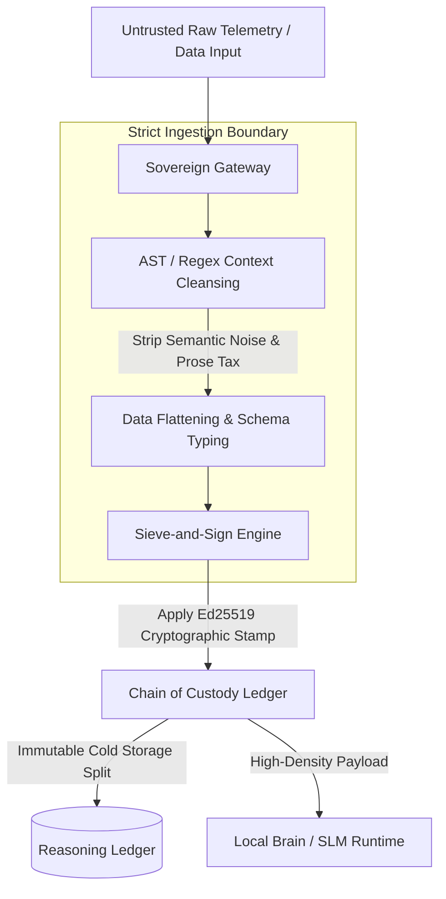
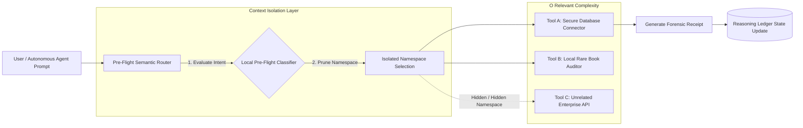
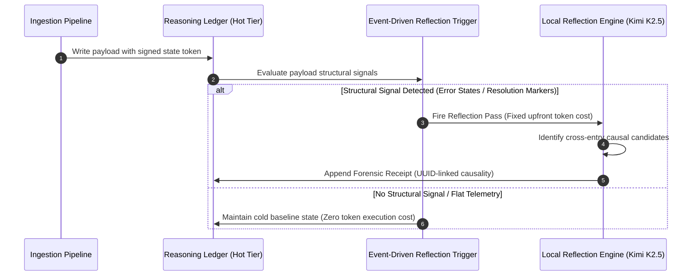

# Sovereign Systems Architecture & Execution Framework

This document outlines the core structural components and data-flow pipelines of a high-integrity, local-first Sovereign System. It establishes the concrete engineering execution layer that enforces the boundaries defined in the [Sovereign Systems Glossary](README.md).

## 1. The Local Ingestion & Content Boundary Pipeline

The primary directive of a Sovereign System is to intercept untrusted, unstructured payloads at the edge of the local system and transform them into verified, low-entropy data structures before they ever hit a storage engine or model runtime.

This diagram illustrates **The Sieve-and-Sign Pattern** executing at the **Ingestion Boundary**:

---

## 2. Pre-Flight Execution & Intent Routing

To protect the context window from tool-selection dilution and unnecessary compute costs, the system utilizes a localized semantic router to gate access to backend tools.

This diagram outlines the architecture of **Intent-Based Namespace Exposure**:

---

## 3. The Write-Time Reflection Lifecycle

Rather than continuously polling or querying an un-indexed data store at runtime, the Sovereign System relies on **Pre-Paid Retrieval Precision** powered by event-driven triggers.

