# Sovereign Systems Architecture & Execution Framework

> **Origin and Scope:**  
> The terms, patterns, and diagrams in this document were first formalized as part of the Sovereign Systems Specification by Ken W. Alger in 2026. They describe architectural approaches to local-first AI systems, deterministic context engineering, data provenance, and operator-owned computation.

This document describes the structural components, execution boundaries, and principal data flows of a Sovereign System. It is the engineering layer beneath the [Sovereign Systems Glossary](README.md) and is governed by the normative rules defined in the [Sovereign Systems Epistemic Model](EPISTEMIC_MODEL.md).

The Epistemic Model answers:

> _What is the system entitled to claim?_

This architecture answers:

> _Where are those responsibilities enforced, preserved, and evaluated?_

A Sovereign System is not defined by a particular database, model, vector store, cryptographic library, hardware platform, or orchestration framework. It is defined by explicit boundaries around observation, admission, durable state, retrieval, working state, execution, and evidence.

The architecture is local-first and operator-owned by preference, but locality does not itself create trust. Cryptography does not itself create truth. Persistence does not itself create authority. Retrieval does not itself establish entitlement.

The architecture exists to keep those distinctions observable.

---

## 1. Architectural Thesis

Most AI systems collapse several different operations into a single pipeline:

```text
input
  → store
  → retrieve
  → prompt
  → answer
```

That simplicity hides consequential decisions.

Who was authorized to write the stored state?

What evidence accompanied it?

What transformations occurred before storage?

Is the state still current?

Is it relevant but historically superseded?

Did retrieval find a candidate or establish an authoritative answer?

Which evidence actually reached the model?

What did the runtime observe when the model acted?

A Sovereign System makes those boundaries explicit.

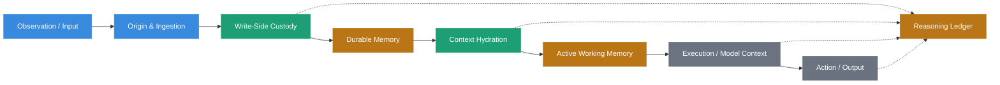
```mermaid
flowchart LR
    O["Observation / Input"] --> G["Origin & Ingestion"]
    G --> C["Write-Side Custody"]
    C --> D["Durable Memory"]
    D --> H["Context Hydration"]
    H --> W["Active Working Memory"]
    W --> X["Execution / Model Context"]
    X --> A["Action / Output"]

    C -.-> L["Reasoning Ledger"]
    H -.-> L
    X -.-> L
    A -.-> L

    classDef capture fill:#378ADD,stroke:#378ADD,color:#FFFFFF
    classDef governance fill:#1D9E75,stroke:#1D9E75,color:#FFFFFF
    classDef memory fill:#BA7517,stroke:#BA7517,color:#FFFFFF
    classDef boundary fill:#6B7280,stroke:#6B7280,color:#FFFFFF

    class O,G capture
    class C,H governance
    class D,W,L memory
    class X,A boundary
```

The central architectural principle is:

> **Sovereign Systems establishes custody during ingestion and preserves the evidence required to evaluate trust over time.**

This is not the same as declaring information trustworthy at ingestion.

Admission is governed at write time. Trust remains evaluable over time.

---

## 2. Architectural Responsibilities

The architecture separates responsibilities that are commonly conflated.

| Responsibility | Architectural question |
|---|---|
| Point of Genesis | Where can origin evidence first be captured? |
| Ingestion Boundary | Where does external information enter governed processing? |
| Sieve-and-Sign | How is candidate information transformed and bound to integrity evidence? |
| Write-Side Custody | May this proposed state become durable, and under whose authority? |
| Durable Memory | What admitted state and history survive beyond the current task? |
| Provenance | What can be established about origin, lineage, transformation, and evidence? |
| Context Hydration | Which eligible durable state may return for this task? |
| Active Working Memory | What bounded operational state is available to the current task? |
| Context Projection | What subset of working state reaches a particular inference call? |
| Execution Boundary | What may the runtime or model invoke or change? |
| Forensic Receipt | What evidence is bound to a consequential event? |
| Reasoning Ledger | What observable evidence about consequential activity survives historically? |

These responsibilities may share infrastructure. They should not silently share semantics.

---

## 3. The End-to-End Sovereign Data Flow

The complete architecture is better understood as a lifecycle than as a single linear inference pipeline.

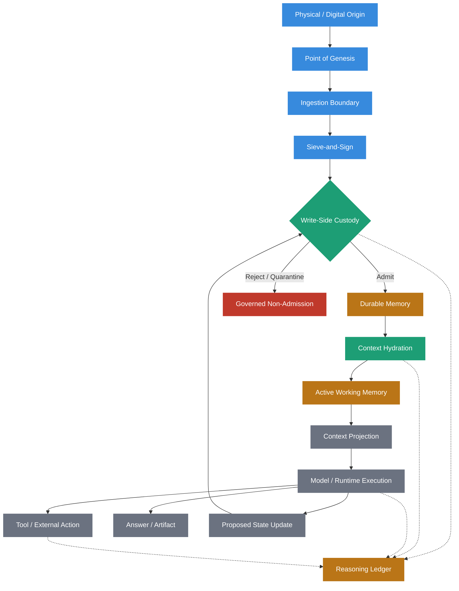
```mermaid
flowchart TD
    P["Physical / Digital Origin"] --> PG["Point of Genesis"]
    PG --> IB["Ingestion Boundary"]
    IB --> SS["Sieve-and-Sign"]
    SS --> WC{"Write-Side Custody"}

    WC -->|"Admit"| DM["Durable Memory"]
    WC -->|"Reject / Quarantine"| RJ["Governed Non-Admission"]

    DM --> CH["Context Hydration"]
    CH --> AWM["Active Working Memory"]
    AWM --> CP["Context Projection"]
    CP --> MR["Model / Runtime Execution"]

    MR --> TO["Tool / External Action"]
    MR --> AU["Answer / Artifact"]
    MR --> UW["Proposed State Update"]

    UW --> WC

    WC -.-> RL["Reasoning Ledger"]
    CH -.-> RL
    MR -.-> RL
    TO -.-> RL

    classDef capture fill:#378ADD,stroke:#378ADD,color:#FFFFFF
    classDef governance fill:#1D9E75,stroke:#1D9E75,color:#FFFFFF
    classDef memory fill:#BA7517,stroke:#BA7517,color:#FFFFFF
    classDef boundary fill:#6B7280,stroke:#6B7280,color:#FFFFFF
    classDef failure fill:#C0392B,stroke:#C0392B,color:#FFFFFF

    class P,PG,IB,SS capture
    class WC,CH governance
    class DM,AWM,RL memory
    class CP,MR,TO,AU,UW boundary
    class RJ failure
```

Two loops matter.

The **read loop** moves governed durable state back toward current reasoning:

```text
Durable Memory
    → Context Hydration
    → Active Working Memory
    → Context Projection
    → Execution
```

The **write loop** prevents current reasoning from silently becoming institutional memory:

```text
Execution
    → Proposed State Update
    → Write-Side Custody
    → Durable Memory
```

There is no implicit promotion from model output, tool output, session state, or Active Working Memory into Durable Memory.

Every consequential durable write crosses custody again.

---

## 4. Origin and Ingestion

### 4.1 Point of Genesis

The [Point of Genesis]({{site.baseurl}}/terms/point-of-genesis.md) is the earliest defensible boundary at which origin evidence can begin.

For physical sensing, this may be near the analog-to-digital transition. For already-digital events, it is the earliest point at which the originating event can be bound to evidence about its producer and execution context.


```mermaid
flowchart LR
    P["Originating Phenomenon / Event"] --> S["Capture Mechanism"]
    S --> G["Point of Genesis"]
    G --> E["Origin Evidence"]
    E --> I["Ingestion Boundary"]

    classDef capture fill:#378ADD,stroke:#378ADD,color:#FFFFFF
    classDef governance fill:#1D9E75,stroke:#1D9E75,color:#FFFFFF
    classDef boundary fill:#6B7280,stroke:#6B7280,color:#FFFFFF

    class P,S boundary
    class G,I capture
    class E governance
```

The Point of Genesis does not establish truth.

It establishes the earliest opportunity to preserve evidence about origin.

### 4.2 Ingestion Boundary

The Ingestion Boundary is where information entering the Sovereign System becomes subject to explicit processing and governance.

Incoming information should be treated as **candidate state**, not trusted memory.

That distinction applies whether the source is:

- a user
- a sensor
- an API
- a database
- a document
- another agent
- a model
- an MCP server
- a local process
- a cloud service
- a previously stored artifact

The system may know the source identity and still lack sufficient evidence, authority, or policy permission to admit the resulting claim.

---

## 5. The Sieve-and-Sign Pipeline

The [Sieve-and-Sign Pattern]({{site.baseurl}}/terms/sieve-and-sign-pattern.md) prepares candidate information for governed admission.

The original architecture treated this stage as a transformation from untrusted input into verified state. The stronger formulation separates transformation, integrity, and admission.

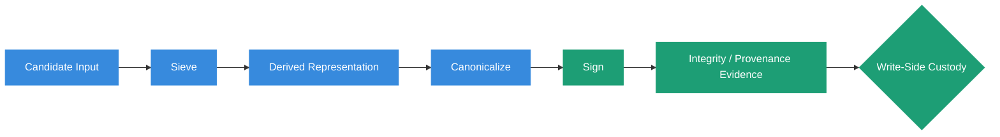
```mermaid
flowchart LR
    R["Candidate Input"] --> S["Sieve"]
    S --> T["Derived Representation"]
    T --> C["Canonicalize"]
    C --> G["Sign"]
    G --> E["Integrity / Provenance Evidence"]
    E --> W{"Write-Side Custody"}

    classDef capture fill:#378ADD,stroke:#378ADD,color:#FFFFFF
    classDef governance fill:#1D9E75,stroke:#1D9E75,color:#FFFFFF
    classDef boundary fill:#6B7280,stroke:#6B7280,color:#FFFFFF

    class R,S,T,C capture
    class G,E,W governance
```

### 5.1 Sieve

The Sieve may normalize, classify, extract, compress, deduplicate, validate structure, or remove low-value prose.

It is not epistemically neutral.

A transformation can preserve uncertainty, degrade it, or silently promote it.

A source saying:

```text
This may be the cause.
```

must not become:

```yaml
root_cause: confirmed
```

merely because a structured extractor prefers definitive fields.

> **Transformation may preserve or degrade epistemic status. It must not silently promote it.**

### 5.2 Sign

The Sign stage binds a defined representation to cryptographic integrity and identity evidence.

A valid signature may establish that a particular key signed a particular canonical representation.

It does not, by itself, establish:

- truth
- assertion authority
- corroboration
- currentness
- relevance
- admissibility

> **Cryptographic consistency is evidence. It is not universal truth.**

---

## 6. Write-Side Custody

[Write-Side Custody]({{site.baseurl}}/terms/write-side-custody.md) is the admission-control boundary for durable state.

Before a proposed write becomes durable, custody evaluates questions such as:

- Is this class of information permitted to persist?
- Who or what is asserting it?
- Is that actor authorized to assert these fields?
- What provenance is available?
- What evidence is required?
- Which transformation produced the proposed representation?
- Which lifecycle state should apply?
- Which policy governs admission?
- What evidence must survive for later revalidation?

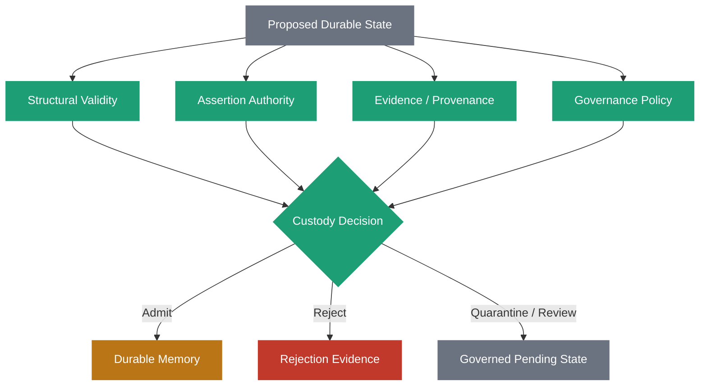
```mermaid
flowchart TD
    P["Proposed Durable State"] --> V["Structural Validity"]
    P --> A["Assertion Authority"]
    P --> E["Evidence / Provenance"]
    P --> G["Governance Policy"]

    V --> C{"Custody Decision"}
    A --> C
    E --> C
    G --> C

    C -->|"Admit"| D["Durable Memory"]
    C -->|"Reject"| R["Rejection Evidence"]
    C -->|"Quarantine / Review"| Q["Governed Pending State"]

    classDef governance fill:#1D9E75,stroke:#1D9E75,color:#FFFFFF
    classDef memory fill:#BA7517,stroke:#BA7517,color:#FFFFFF
    classDef boundary fill:#6B7280,stroke:#6B7280,color:#FFFFFF
    classDef failure fill:#C0392B,stroke:#C0392B,color:#FFFFFF

    class V,A,E,G,C governance
    class D memory
    class P,Q boundary
    class R failure
```

Admission does not mean permanent truth.

A record can be legitimately admitted and later become stale, corrected, superseded, invalidated, disputed, or unverifiable.

> **Custody governs admission. It does not declare permanent truth.**

---

## 7. Durable Memory

[Durable Memory]({{site.baseurl}}/terms/durable-memory.md) preserves governed long-term state beyond the task that created it.

It may contain:

- current claims
- historical claims
- source artifacts
- derived representations
- provenance evidence
- relationships
- corrections
- supersession events
- invalidations
- disputes
- lifecycle metadata
- dependency references

Durability and authority are different properties.

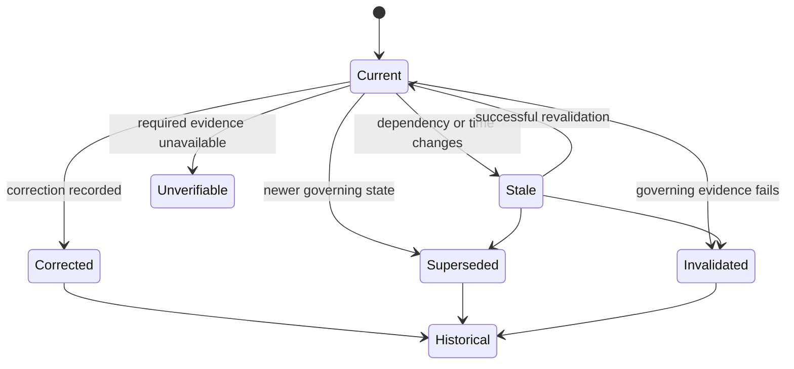
```mermaid
stateDiagram-v2
    [*] --> Current
    Current --> Stale: dependency or time changes
    Current --> Superseded: newer governing state
    Current --> Corrected: correction recorded
    Current --> Invalidated: governing evidence fails
    Current --> Unverifiable: required evidence unavailable

    Stale --> Current: successful revalidation
    Stale --> Superseded
    Stale --> Invalidated

    Corrected --> Historical
    Superseded --> Historical
    Invalidated --> Historical
```

Historical state may remain valuable without remaining operationally eligible.

> **Durability preserves history without granting history permanent authority.**

### 7.1 Indexes Are Derived State

Vector indexes, keyword indexes, graph projections, caches, summaries, and embeddings may improve discovery.

They are derived artifacts.

They do not replace the governed durable state from which they were produced.

A retrieval index can become stale independently of the underlying memory. Its lineage and refresh semantics therefore matter.

---

## 8. Revalidation and Lifecycle

A Sovereign System must expect the meaning of durable state to change without rewriting history.

Dependencies expire.

Authorities change.

Keys rotate.

Policies change.

Sources disappear.

New evidence arrives.

Corrections are issued.

A revalidation event evaluates existing state under new evidence or conditions and produces a new governing event rather than pretending the earlier history never existed.

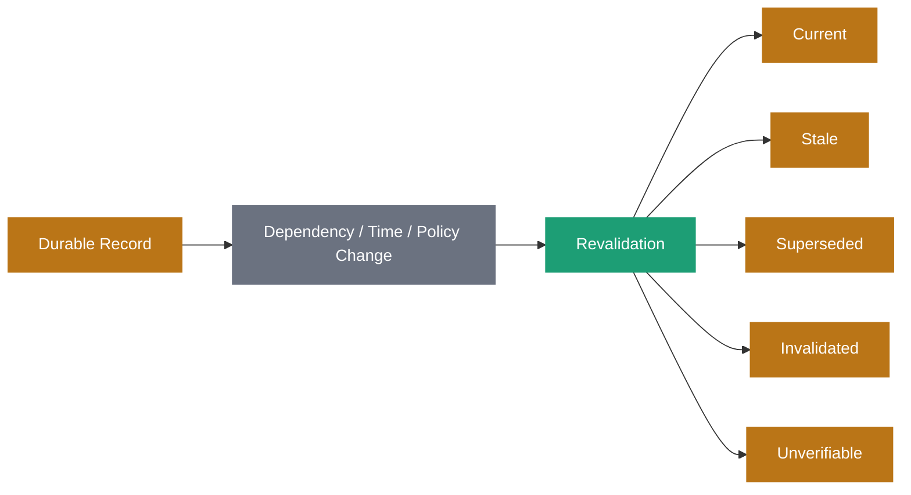
```mermaid
flowchart LR
    D["Durable Record"] --> T["Dependency / Time / Policy Change"]
    T --> R["Revalidation"]
    R --> C["Current"]
    R --> S["Stale"]
    R --> U["Superseded"]
    R --> I["Invalidated"]
    R --> V["Unverifiable"]

    classDef governance fill:#1D9E75,stroke:#1D9E75,color:#FFFFFF
    classDef memory fill:#BA7517,stroke:#BA7517,color:#FFFFFF
    classDef boundary fill:#6B7280,stroke:#6B7280,color:#FFFFFF

    class R governance
    class D,C,S,U,I,V memory
    class T boundary
```

Lifecycle state is consequential only if downstream consumers are required to honor it.

A record marked `superseded` that retrieval is free to rank first is not governed state.

---

## 9. Retrieval and Context Hydration

[Context Hydration]({{site.baseurl}}/terms/context-hydration.md) is the governed transition through which eligible durable state becomes task-specific working context.

Retrieval alone does not establish what should govern.

The read path therefore separates:

1. candidate discovery
2. known eligibility constraints
3. evidence and provenance evaluation
4. adjudication
5. ranking within a meaningful dimension
6. context assembly

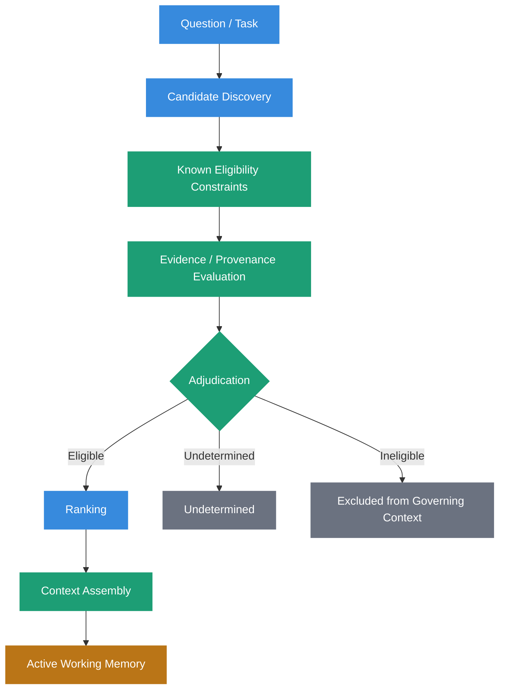
```mermaid
flowchart TD
    Q["Question / Task"] --> D["Candidate Discovery"]
    D --> E["Known Eligibility Constraints"]
    E --> P["Evidence / Provenance Evaluation"]
    P --> A{"Adjudication"}

    A -->|"Eligible"| R["Ranking"]
    A -->|"Undetermined"| U["Undetermined"]
    A -->|"Ineligible"| X["Excluded from Governing Context"]

    R --> H["Context Assembly"]
    H --> W["Active Working Memory"]

    classDef capture fill:#378ADD,stroke:#378ADD,color:#FFFFFF
    classDef governance fill:#1D9E75,stroke:#1D9E75,color:#FFFFFF
    classDef memory fill:#BA7517,stroke:#BA7517,color:#FFFFFF
    classDef boundary fill:#6B7280,stroke:#6B7280,color:#FFFFFF

    class Q,D,R capture
    class E,P,A,H governance
    class W memory
    class U,X boundary
```

The ordering is not universally fixed. Some known lifecycle or authority constraints can be applied before expensive retrieval. Evidence discovered during retrieval may require later adjudication.

The semantic distinction is mandatory even when an implementation combines stages.

> **Discovery produces candidates. Adjudication establishes what can be claimed. Ranking orders only within a dimension where ordering is meaningful.**

### 9.1 Undetermined Is Not Empty

These outcomes are different:

```text
[]
```

and:

```text
undetermined
```

The first says that the search produced no candidate result under its search semantics.

The second says the system cannot establish an entitled conclusion from the available evidence.

Likewise:

> **Absence of a result is not evidence of absence.**

Negative claims require evidence appropriate to the domain.

---

## 10. Active Working Memory

[Active Working Memory]({{site.baseurl}}/terms/active-working-memory.md) is the bounded operational state assembled for the current task.

It may contain:

- hydrated durable state
- user input
- task instructions
- tool observations
- planner state
- unresolved contradictions
- permissions
- budgets
- transient calculations
- execution state
- source and routing provenance
- lifecycle and authority qualifications

Active Working Memory is not the same as the model context window.

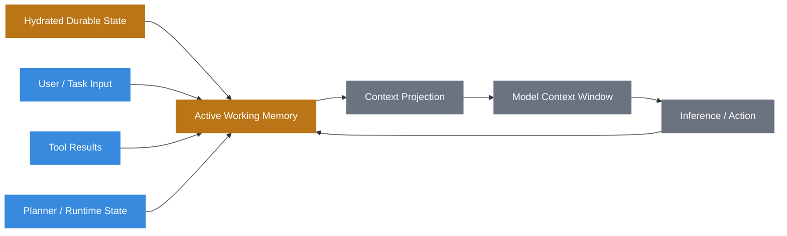
```mermaid
flowchart LR
    D["Hydrated Durable State"] --> W["Active Working Memory"]
    U["User / Task Input"] --> W
    T["Tool Results"] --> W
    P["Planner / Runtime State"] --> W

    W --> C["Context Projection"]
    C --> M["Model Context Window"]
    M --> O["Inference / Action"]
    O --> W

    classDef capture fill:#378ADD,stroke:#378ADD,color:#FFFFFF
    classDef governance fill:#1D9E75,stroke:#1D9E75,color:#FFFFFF
    classDef memory fill:#BA7517,stroke:#BA7517,color:#FFFFFF
    classDef boundary fill:#6B7280,stroke:#6B7280,color:#FFFFFF

    class U,T,P capture
    class D,W memory
    class C,M,O boundary
```

The context window is one execution surface.

Active Working Memory is the architectural working set from which that surface is projected.

> **The context window is a projection of working memory, not working memory itself.**

Presence in Active Working Memory does not make a claim authoritative.

Presence in a prompt does not make a claim authoritative.

Position in a prompt does not make a claim authoritative.

Where consequence warrants it, the runtime should preserve those semantics explicitly rather than expecting the model to infer them from prose ordering.

---

## 11. Context Projection

A task may require more working state than should be supplied to any individual inference call.

Context Projection selects the subset of Active Working Memory appropriate for a particular execution step.

Projection may consider:

- task relevance
- authority
- lifecycle state
- privacy
- tool scope
- token budget
- model capability
- latency
- provenance requirements
- unresolved contradictions
- evidence required for the next action

This boundary is where Context Tax becomes an architectural concern rather than merely a prompt-engineering concern.

The objective is not to maximize context utilization.

It is to preserve enough context for correct reasoning while excluding state the execution step does not need.

> **The cheapest token is the one the task never needed.**

---

## 12. Pre-Flight Execution and Intent Routing

Intent-Based Namespace Exposure reduces unnecessary tool and capability exposure before execution.

A local semantic router or equivalent policy mechanism may determine which tool namespaces are relevant to the current task.

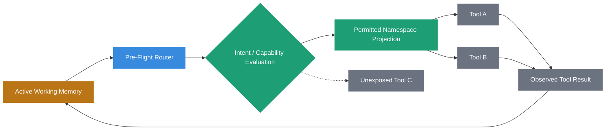
```mermaid
flowchart LR
    W["Active Working Memory"] --> R["Pre-Flight Router"]
    R --> C{"Intent / Capability Evaluation"}
    C --> N["Permitted Namespace Projection"]

    N --> A["Tool A"]
    N --> B["Tool B"]
    C -.-> X["Unexposed Tool C"]

    A --> O["Observed Tool Result"]
    B --> O
    O --> W

    classDef capture fill:#378ADD,stroke:#378ADD,color:#FFFFFF
    classDef governance fill:#1D9E75,stroke:#1D9E75,color:#FFFFFF
    classDef memory fill:#BA7517,stroke:#BA7517,color:#FFFFFF
    classDef boundary fill:#6B7280,stroke:#6B7280,color:#FFFFFF

    class R capture
    class C,N governance
    class W memory
    class A,B,O,X boundary
```

Routing and authorization are separate concerns.

A classifier can determine that a tool is relevant without being authorized to grant access to it.

Likewise, a tool can be authorized for the user while remaining irrelevant to the current task.

> **Relevance is not authority.**

Namespace exposure should therefore intersect task relevance with actual capability and policy constraints.

---

## 13. Execution and Tool Boundaries

Model inference is not itself the enforcement boundary for consequential actions.

A model may propose:

```text
delete record
send message
invoke tool
change policy
persist memory
release data
```

The runtime decides whether those actions are permitted.

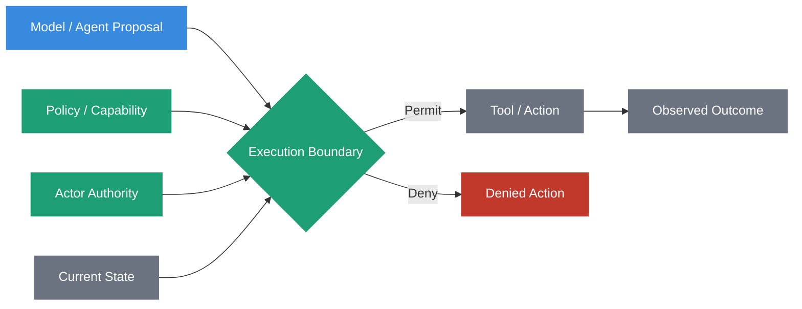
```mermaid
flowchart LR
    M["Model / Agent Proposal"] --> E{"Execution Boundary"}
    P["Policy / Capability"] --> E
    A["Actor Authority"] --> E
    S["Current State"] --> E

    E -->|"Permit"| T["Tool / Action"]
    E -->|"Deny"| D["Denied Action"]
    T --> O["Observed Outcome"]

    classDef capture fill:#378ADD,stroke:#378ADD,color:#FFFFFF
    classDef governance fill:#1D9E75,stroke:#1D9E75,color:#FFFFFF
    classDef boundary fill:#6B7280,stroke:#6B7280,color:#FFFFFF
    classDef failure fill:#C0392B,stroke:#C0392B,color:#FFFFFF

    class M capture
    class E,P,A governance
    class S,T,O boundary
    class D failure
```

The model may participate in a decision.

It should not be assumed to enforce the policy governing its own capabilities.

Consequential execution should be observable at a boundary the runtime controls.

---

## 14. Forensic Receipts

A [Forensic Receipt]({{site.baseurl}}/terms/forensic-receipt.md) is a structured evidence artifact associated with a consequential system event.

A receipt may bind:

- event identity
- actor or process
- defined payload or digest
- policy context
- authority context
- source references
- transformation references
- timestamps
- signer identity
- canonicalization version
- execution outcome
- related ledger event

A receipt is not merely a UUID.

A digest is not the receipt.

A signature is not the receipt.

The receipt is the evidence structure that gives those elements meaning.

> **A receipt preserves evidence about what happened. It does not manufacture truth about why it happened.**

---

## 15. The Reasoning Ledger

The [Reasoning Ledger]({{site.baseurl}}/terms/reasoning-ledger.md) preserves observable evidence surrounding consequential decisions and system activity.

It may record:

- triggering events
- evidence consulted
- retrieval events
- routing decisions
- policy evaluations
- authority versions
- tool calls
- approvals
- reported alternatives
- known unknowns
- disconfirming evidence
- outcomes
- receipt references
- correction or supersession relationships

It does not claim access to private model chain-of-thought.

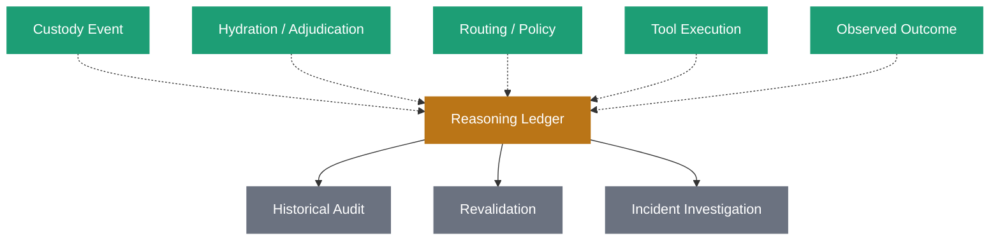
```mermaid
flowchart TD
    C["Custody Event"] -.-> L["Reasoning Ledger"]
    H["Hydration / Adjudication"] -.-> L
    R["Routing / Policy"] -.-> L
    T["Tool Execution"] -.-> L
    O["Observed Outcome"] -.-> L

    L --> A["Historical Audit"]
    L --> V["Revalidation"]
    L --> I["Incident Investigation"]

    classDef governance fill:#1D9E75,stroke:#1D9E75,color:#FFFFFF
    classDef memory fill:#BA7517,stroke:#BA7517,color:#FFFFFF
    classDef boundary fill:#6B7280,stroke:#6B7280,color:#FFFFFF

    class C,H,R,T,O governance
    class L memory
    class A,V,I boundary
```

The ledger witnesses governance.

It does not replace governance.

> **Custody enforces. The ledger witnesses.**

Observer and enforcer should remain conceptually independent even when they share implementation infrastructure.

---

## 16. Source Provenance and Routing Provenance

A Sovereign System may need to preserve two different forms of lineage.

**Source provenance** asks:

> _Where did this information come from and what transformations did it undergo?_

**Routing provenance** asks:

> _Why did this information reach this reasoning or execution step?_

A record may have excellent source provenance while poor routing decisions cause an inappropriate version to enter context.

Conversely, a retrieval system may route the correct record while the underlying record has weak source provenance.

These failures are different.

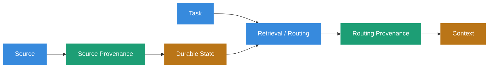
```mermaid
flowchart LR
    S["Source"] --> P["Source Provenance"]
    P --> D["Durable State"]

    Q["Task"] --> R["Retrieval / Routing"]
    D --> R
    R --> RP["Routing Provenance"]
    RP --> C["Context"]

    classDef capture fill:#378ADD,stroke:#378ADD,color:#FFFFFF
    classDef governance fill:#1D9E75,stroke:#1D9E75,color:#FFFFFF
    classDef memory fill:#BA7517,stroke:#BA7517,color:#FFFFFF

    class S,Q,R capture
    class P,RP governance
    class D,C memory
```

For consequential reasoning, both may matter.

---

## 17. Write-Time Reflection and Pre-Paid Retrieval Precision

A Sovereign System may perform selected enrichment or reflection when state changes rather than rediscovering every relationship at query time.

This is the architectural idea behind **Pre-Paid Retrieval Precision**.

The purpose is not to front-load arbitrary model reasoning.

It is to compute durable, governed structures when an event makes that work justified.

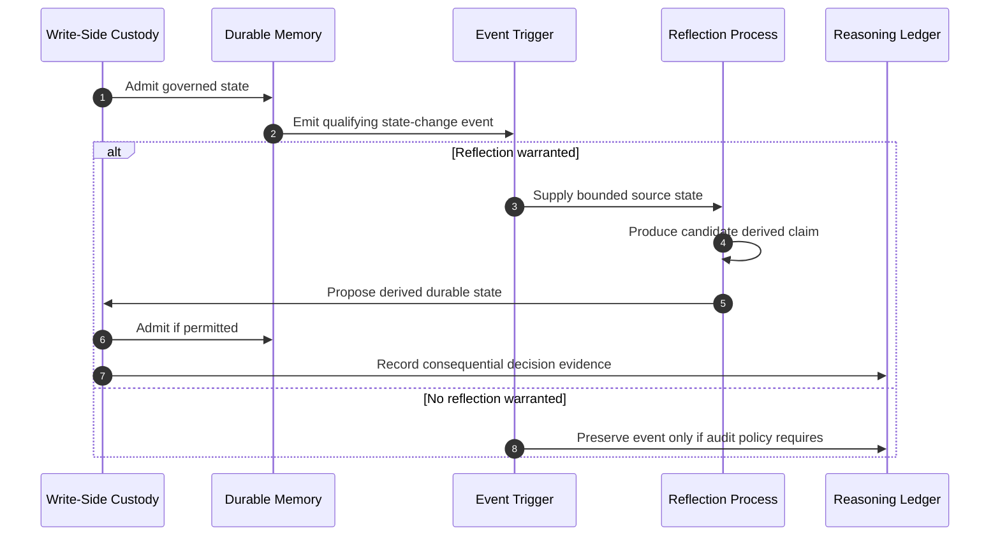
```mermaid
sequenceDiagram
    autonumber
    participant Custody as Write-Side Custody
    participant Memory as Durable Memory
    participant Trigger as Event Trigger
    participant Reflect as Reflection Process
    participant Ledger as Reasoning Ledger

    Custody->>Memory: Admit governed state
    Memory->>Trigger: Emit qualifying state-change event

    alt Reflection warranted
        Trigger->>Reflect: Supply bounded source state
        Reflect->>Reflect: Produce candidate derived claim
        Reflect->>Custody: Propose derived durable state
        Custody->>Memory: Admit if permitted
        Custody->>Ledger: Record consequential decision evidence
    else No reflection warranted
        Trigger->>Ledger: Preserve event only if audit policy requires
    end
```

The important change from a naive reflection pipeline is that model-derived relationships do not bypass custody.

Reflection produces **candidate derived state**.

If that state should become durable, it crosses the same admission boundary as other durable writes.

A reflection model does not inherit the assertion authority of the records it reads.

---

## 18. Local-First Execution and Silicon Locality

Sovereign Systems prefer local execution where it improves custody, latency, privacy, cost control, or resilience.

Locality is an architectural control surface, not a trust label.

A local model can be wrong.

A local process can be compromised.

A local database can contain weak provenance.

A local signing key can be mishandled.

The value of locality is that it can reduce the number of external custody transitions and give the operator stronger control over where computation, memory, and evidence reside.

[Silicon Locality]({{site.baseurl}}/terms/silicon-locality.md) makes that placement explicit.

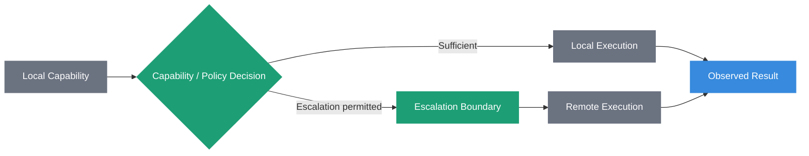
```mermaid
flowchart LR
    L["Local Capability"] --> D{"Capability / Policy Decision"}
    D -->|"Sufficient"| LE["Local Execution"]
    D -->|"Escalation permitted"| EB["Escalation Boundary"]
    EB --> RE["Remote Execution"]

    LE --> O["Observed Result"]
    RE --> O

    classDef governance fill:#1D9E75,stroke:#1D9E75,color:#FFFFFF
    classDef boundary fill:#6B7280,stroke:#6B7280,color:#FFFFFF
    classDef capture fill:#378ADD,stroke:#378ADD,color:#FFFFFF

    class D,EB governance
    class L,LE,RE boundary
    class O capture
```

Remote escalation should be explicit when it changes custody, privacy, evidence, cost, or capability semantics.

---

## 19. Capability Gradient and Escalation Boundary

Different execution tiers may provide different capabilities.

A small local model may classify or route.

A larger local model may reason over richer context.

A remote model may be permitted only for tasks that exceed local capability and satisfy escalation policy.

This forms a **Capability Gradient**.

The **Escalation Boundary** governs transitions across that gradient.

The decision should consider more than model quality. It may include:

- task sensitivity
- data classification
- operator policy
- privacy requirements
- latency
- cost
- required context
- model capability
- evidence requirements
- network availability
- retention guarantees

Escalation is therefore a governed boundary rather than an automatic fallback.

---

## 20. Evidence Across the Lifecycle

Evidence can weaken over time even when a record remains durable.

A source may disappear.

A certificate may expire.

A key may be revoked.

A calibration record may be deleted.

An external authority may become unreachable.

A model version may no longer be reproducible.

The architecture should represent that degradation rather than pretending the original verification result remains timeless.

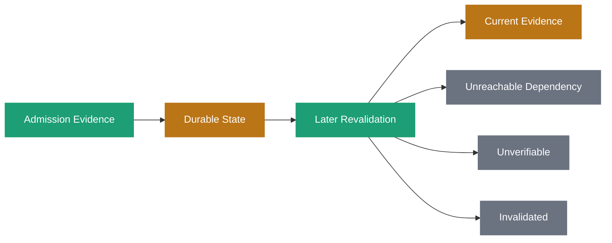
```mermaid
flowchart LR
    A["Admission Evidence"] --> D["Durable State"]
    D --> R["Later Revalidation"]
    R --> C["Current Evidence"]
    R --> U["Unreachable Dependency"]
    R --> V["Unverifiable"]
    R --> I["Invalidated"]

    classDef governance fill:#1D9E75,stroke:#1D9E75,color:#FFFFFF
    classDef memory fill:#BA7517,stroke:#BA7517,color:#FFFFFF
    classDef boundary fill:#6B7280,stroke:#6B7280,color:#FFFFFF

    class A,R governance
    class D,C memory
    class U,V,I boundary
```

This is why `verified: true` is generally too weak a long-term state model.

Verification is an event under assumptions.

Later consumers need the evidence required to interpret what that event established.

---

## 21. Retention, Redaction, and Historical Integrity

Append-only history does not require every evidence payload to remain available forever.

The architecture separates:

1. **logical event history**
2. **evidence payload retention**
3. **derived projections and indexes**

A privacy or retention policy may require source payload deletion while preserving a historical record that an event occurred.

That deletion may reduce later verification strength.

The system should represent the degradation explicitly.

```text
historical event: retained
source payload: deleted under policy
digest: retained where lawful and useful
verification state: unverifiable / partially verifiable
deletion event: appended
```

> **Immutability should apply to the history of system actions, not necessarily indefinite retention of every artifact touched.**

---

## 22. Architectural Failure Modes

### Trust-at-Ingestion

A record passes validation and is thereafter treated as permanently trusted.

**Failure:** admission is confused with permanent truth or authority.

### Signature-as-Truth

A valid signature is treated as proof that the signed claim is correct.

**Failure:** integrity evidence is confused with truth.

### Retrieval-as-Adjudication

The highest-scoring candidate is treated as the governing answer.

**Failure:** relevance ranking is confused with entitlement.

### Context-Window-as-Memory

The prompt is treated as the system's memory architecture.

**Failure:** an execution serialization surface is confused with governed state.

### Model-as-Enforcer

The model is instructed not to perform an action and is therefore assumed to enforce the policy.

**Failure:** reasoning is confused with capability control.

### Reflection Bypass

A derived model inference is written directly into Durable Memory.

**Failure:** derived state bypasses Write-Side Custody.

### Ledger-as-Enforcer

The system records that a prohibited action occurred and calls that governance.

**Failure:** observation is confused with prevention.

### Lifecycle-as-Metadata

Records are marked stale or superseded but retrieval is free to ignore those states.

**Failure:** governance metadata has no behavioral consequence.

### Locality-as-Trust

Local execution is treated as inherently trustworthy.

**Failure:** operator control is confused with epistemic reliability.

### Empty-as-Absent

No retrieval result is treated as proof that something does not exist.

**Failure:** search outcome is confused with negative evidence.

---

## 23. Architectural Invariants

A conforming implementation need not use the exact components shown in these diagrams.

It should preserve the following invariants.

### Invariant 1: Durable writes cross custody

No model, tool, reflection process, or session state becomes Durable Memory merely because it exists.

### Invariant 2: Provenance survives consequential transformation

A transformation must not silently erase the evidence required to interpret its output.

### Invariant 3: Cryptographic evidence remains semantically bounded

Signatures and digests establish only the properties their trust model and signed representation support.

### Invariant 4: Lifecycle state affects behavior

Stale, superseded, invalidated, corrected, disputed, or unverifiable state cannot be treated identically to current governing state when the distinction matters.

### Invariant 5: Discovery and adjudication remain distinct

A candidate may be relevant without being entitled to govern.

### Invariant 6: Working state and durable state remain distinct

Task-local state does not silently become institutional memory.

### Invariant 7: Model context is a projection

The context window is not the memory system.

### Invariant 8: Enforcement occurs outside model preference

Consequential capabilities are governed by runtime boundaries the model cannot simply reason around.

### Invariant 9: Historical evidence does not claim private reasoning

The architecture records observable evidence, reported rationale where useful, and runtime events without claiming access to hidden chain-of-thought.

### Invariant 10: Uncertainty can survive the pipeline

The architecture must be capable of representing `undetermined`, `unverifiable`, disagreement, and incomplete evidence without manufacturing a winner.

---

## 24. Reference Architecture

The following diagram combines the major boundaries into one reference view.

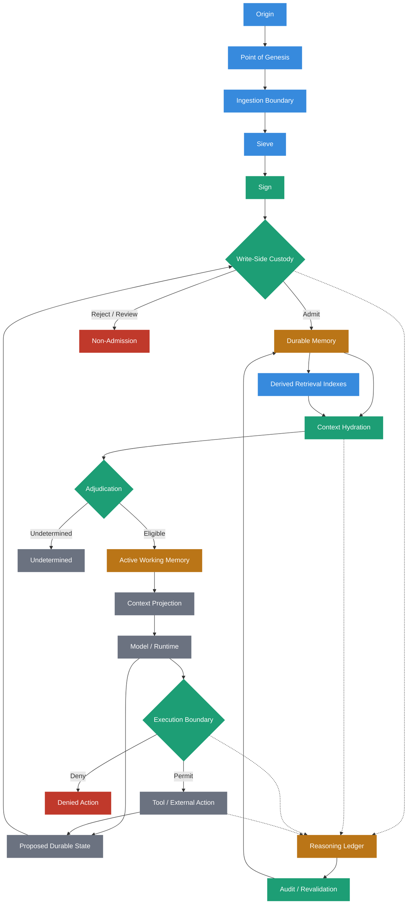
```mermaid
flowchart TD
    OR["Origin"] --> PG["Point of Genesis"]
    PG --> IB["Ingestion Boundary"]
    IB --> SV["Sieve"]
    SV --> SG["Sign"]
    SG --> WC{"Write-Side Custody"}

    WC -->|"Admit"| DM["Durable Memory"]
    WC -->|"Reject / Review"| NR["Non-Admission"]

    DM --> IX["Derived Retrieval Indexes"]
    DM --> HY["Context Hydration"]
    IX --> HY

    HY --> AD{"Adjudication"}
    AD -->|"Eligible"| AWM["Active Working Memory"]
    AD -->|"Undetermined"| UN["Undetermined"]

    AWM --> PR["Context Projection"]
    PR --> RT["Model / Runtime"]
    RT --> EX{"Execution Boundary"}

    EX -->|"Permit"| TL["Tool / External Action"]
    EX -->|"Deny"| DN["Denied Action"]

    RT --> PS["Proposed Durable State"]
    TL --> PS
    PS --> WC

    WC -.-> RL["Reasoning Ledger"]
    HY -.-> RL
    EX -.-> RL
    TL -.-> RL

    RL --> RV["Audit / Revalidation"]
    RV --> DM

    classDef capture fill:#378ADD,stroke:#378ADD,color:#FFFFFF
    classDef governance fill:#1D9E75,stroke:#1D9E75,color:#FFFFFF
    classDef memory fill:#BA7517,stroke:#BA7517,color:#FFFFFF
    classDef boundary fill:#6B7280,stroke:#6B7280,color:#FFFFFF
    classDef failure fill:#C0392B,stroke:#C0392B,color:#FFFFFF

    class OR,PG,IB,SV,IX capture
    class SG,WC,HY,AD,EX,RV governance
    class DM,AWM,RL memory
    class PR,RT,TL,PS,UN boundary
    class NR,DN failure
```

This diagram is not intended to prescribe deployment topology.

A single process may implement several boxes.

A distributed system may split one box across multiple services.

The boxes represent **architectural responsibilities and trust boundaries**, not required microservices.

---

## 25. Minimal Implementation

A minimal Sovereign System does not need every optional pattern or hardware tier.

At minimum, the architecture should be able to answer:

### At ingestion

- What is being proposed for durable storage?
- Where did it come from?
- What transformation produced it?
- Who or what is authorized to assert it?
- What evidence accompanies it?
- Which policy admits or rejects it?

### In durable state

- What is current?
- What is historical?
- What has been corrected, superseded, invalidated, or become unverifiable?
- What provenance survives?
- Which derived indexes depend on which source state?

### At retrieval

- What candidates were discovered?
- Which constraints affect eligibility?
- What evidence supports adjudication?
- Can the result legitimately be `undetermined`?
- What state actually entered working memory?

### At execution

- What context reached the model or runtime?
- Which tools or capabilities were exposed?
- Which policy controlled consequential actions?
- What outcome did the runtime observe?

### In audit

- What evidence was preserved?
- Which events can be independently verified?
- Which claims depend solely on self-report?
- What has become impossible to verify over time?

If the system cannot answer every question in every deployment, that is not automatically a failure.

The important requirement is that missing evidence remain visible as missing evidence rather than being silently replaced by certainty.

---

## 26. Architectural Principles

The architecture can be summarized by a small set of principles.

1. **Capture provenance as early as practical.**
2. **Treat incoming information as candidate state.**
3. **Separate transformation from truth.**
4. **Separate cryptographic integrity from authority.**
5. **Govern durable admission explicitly.**
6. **Preserve history without granting history permanent authority.**
7. **Treat retrieval as discovery before adjudication.**
8. **Allow `undetermined` when evidence cannot establish a winner.**
9. **Hydrate only the context required for the task.**
10. **Treat the context window as a projection, not memory itself.**
11. **Enforce consequential capabilities outside model preference.**
12. **Preserve observable decision evidence without claiming private reasoning.**
13. **Revalidate when dependencies, authority, or policy change.**
14. **Make retention-driven evidence loss explicit.**
15. **Use locality to improve custody and control, not as a synonym for trust.**

---

## 27. Relationship to the Rest of the Specification

The Sovereign Systems documentation is organized as a progression from normative semantics to implementation patterns.

```text
Sovereign Systems Glossary
        ↓
Epistemic Model
        ↓
Architecture & Execution Framework
        ↓
Sovereign Inference Patterns
        ↓
Reference Implementations / Sovereign SDK
```

The **Glossary** defines the vocabulary.

The **Epistemic Model** defines what evidence, provenance, authority, lifecycle state, retrieval, and adjudication mean.

This **Architecture & Execution Framework** identifies where those responsibilities live in the system.

The **Pattern Library** describes repeatable implementation approaches.

The **Sovereign SDK** provides concrete reference implementations for selected components.

The architecture therefore should not be read as a claim that one implementation topology is universally correct.

It is a map of responsibilities that should remain explicit even when the implementation compresses them into fewer processes.

---

## 28. Key Principle

A useful architectural heuristic is:

> **Move custody as close to origin as practical, preserve evidence as state changes, and never let convenience collapse discovery, authority, integrity, memory, and execution into the same decision.**

A Sovereign System is not one in which every record is trusted.

It is one in which the system can preserve and evaluate the evidence required to determine what each record, decision, and action is entitled to mean.
