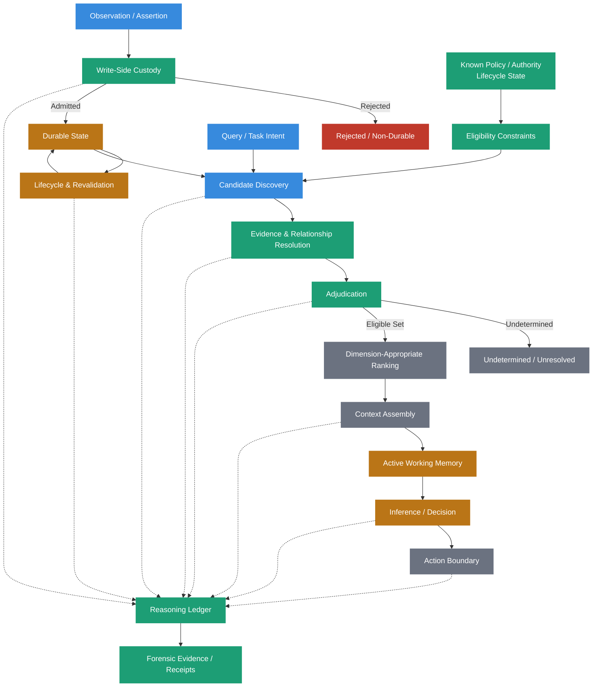
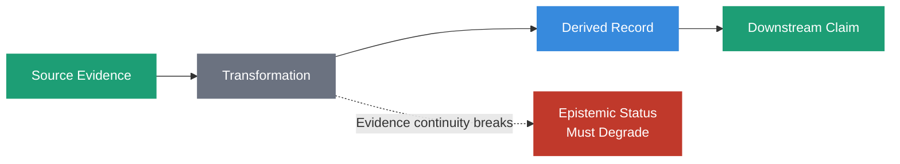
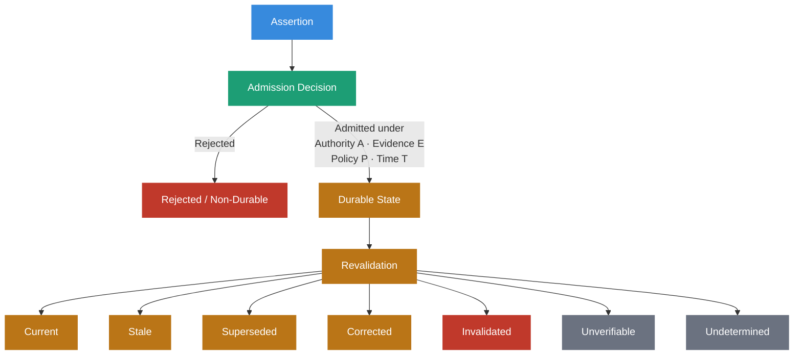
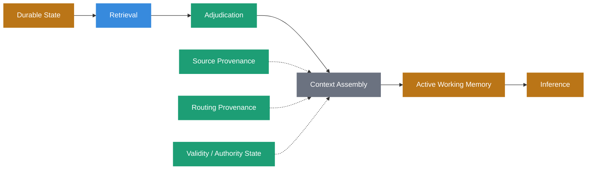
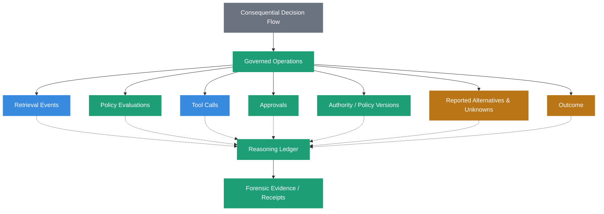
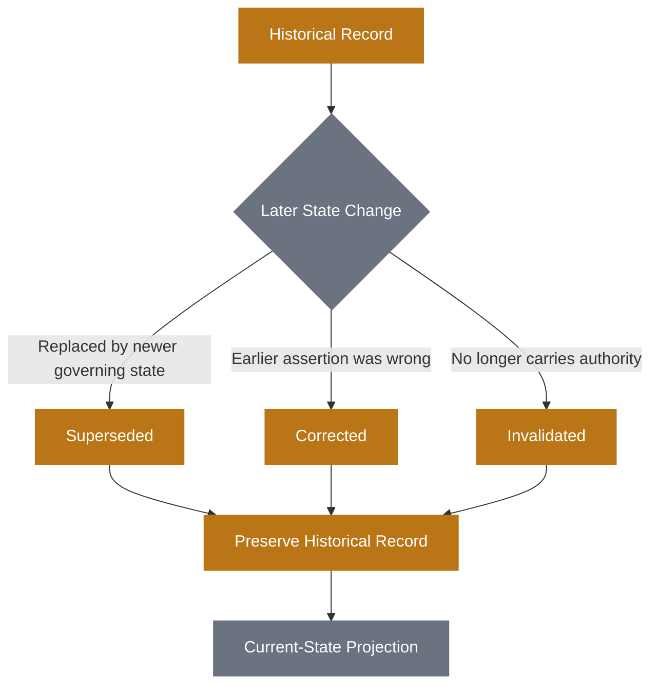
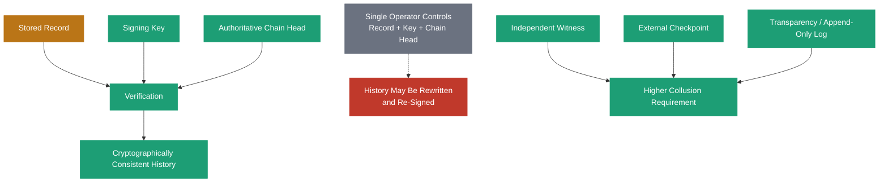
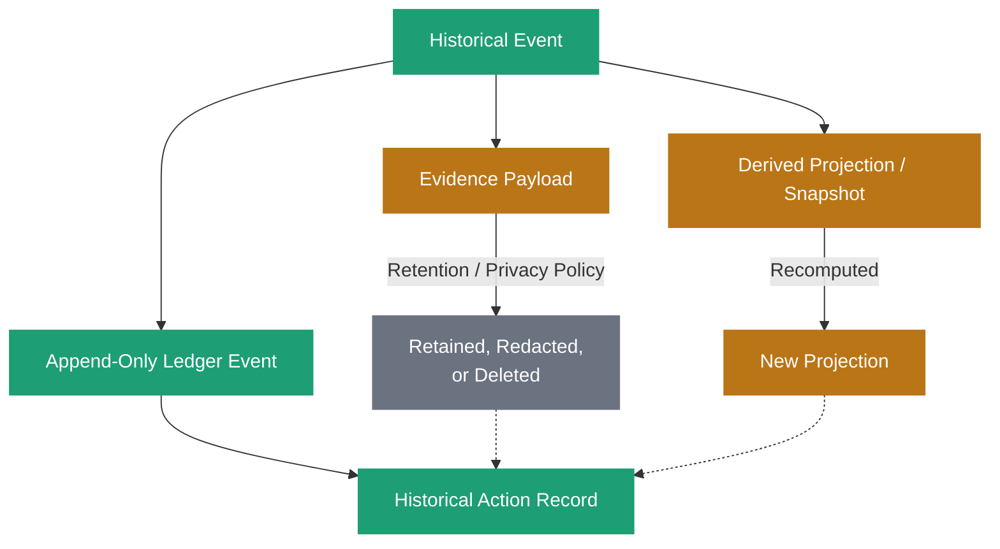

# Sovereign Systems Epistemic Model

> **Status:** Normative architectural model  
> **Scope:** Provenance, evidence, authority, admission, lifecycle state, retrieval, adjudication, and auditability within Sovereign Systems.

## Purpose

A Sovereign System must be able to distinguish what it stores from what
it knows, what it knows from what it can establish, and what it can
establish from what is currently entitled to govern a decision.

These distinctions cannot be recovered reliably after they have been
collapsed.

The Sovereign Systems Epistemic Model defines the architectural rules
used to preserve those distinctions across ingestion, durable memory,
retrieval, context assembly, inference, and action.

Its central principle is:

> **Sovereign Systems establishes custody during ingestion and preserves
> the evidence required to evaluate trust over time.**

Write-time governance remains a critical control point, but ingestion
does not permanently establish truth, authority, or validity. Sources
change. Policies are superseded. Keys rotate. Evidence disappears. New
observations contradict old ones. A record that was legitimately
admitted yesterday may no longer govern tomorrow.

A high-integrity system must preserve enough evidence to recognize those
changes rather than treating trust as a permanent property assigned at
write time.

## The Epistemic Lifecycle



This diagram describes an epistemic lifecycle, not a required
implementation topology. A conforming implementation may combine or
distribute these responsibilities differently, but it must preserve the
distinctions they represent.

## Foundational Distinctions

### Admission Is Not Truth

Write-Side Custody determines whether an assertion is permitted to
become durable state.

It does not determine whether the assertion is universally true.

Admissibility, authority, and truth are separate questions. A claim may
be factually correct while its source lacks authority to establish that
claim within a governed domain. A properly authorized source may also
make a claim that later proves incorrect.

Custody governs admission, not reality.

### Capability Is Not Authority

The ability to perform an action does not establish permission to
perform it.

A model may be technically capable of invoking a tool. An application
may possess write access to a database. A process may hold credentials
capable of reaching an API.

None of these facts establishes that the actor is authorized to perform
a particular action against a particular resource under the current
policy.

Capability describes what can be done.

Authority describes what may be done.

### Authority Is Not Evidence

Authority identifies who or what is entitled to establish a claim within
a governed domain.

Evidence supports the claim.

Observation records what a component directly witnessed.

Inference describes a conclusion derived from other information.

These properties must not be collapsed into one confidence scale.

For example:

```text
IaC declared handler X.
AWS observed deployed handler Y.
Normalization inferred that X and Y correspond.
```

These are different claims with different provenance. They are not
merely higher- and lower-confidence versions of the same fact.

### Provenance Assertion Is Not Provenance Evidence

A source can assert where information came from.

That assertion is itself a claim.

Sovereign Systems distinguish among:


Each stage can strengthen what a system is entitled to claim, but none
automatically implies the next.

A self-declared origin may be useful.

A cryptographic digest may make an artifact checkable.

An independently accessible source may make a claim verifiable.

A second independent evidence chain may corroborate it.

Those are different epistemic properties.

### Source Plurality Is Not Provenance Plurality

Many sources may repeat the same underlying claim.

Ten documents descended from one unavailable source do not constitute
ten independent evidence chains.

Sovereign Systems preserve evidentiary ancestry where it is relevant so
that repetition cannot silently become corroboration.

## Evidence Continuity

Provenance and evidentiary status do not automatically survive
transformation.

If information passes through several systems:



and one transformation cannot establish its relationship to the evidence
it consumed, downstream systems must not silently inherit the strongest
status present earlier in the chain.

A general Sovereign invariant follows:

> **Transformation may preserve or degrade epistemic status. It must not
> silently promote it.**

When evidence continuity breaks, `unknown` or `unverifiable` may be the
most accurate state.

That is not a failure of the architecture.

It is an honest description of the Evidence Boundary.

## Provenance Anchors and Verification Semantics

Recording an identifier is not sufficient to establish provenance.

Different anchors support different future claims.

A commit hash may support exact content verification.

A URL may support future retrieval but not guarantee historical content.

A label such as `policy-v7` may identify a logical artifact without
preserving its bytes.

An API endpoint may disappear.

Sovereign Systems should therefore preserve both the provenance anchor
and the verification semantics associated with it.

Relevant questions include:

- Can the artifact be independently retrieved?
- Can its exact content be verified?
- Can the original observation be reproduced?
- Can the historical state be reconstructed?
- Is the anchor merely evidence of what the system reported observing
    at the time?
- Can another independent source corroborate it?

> **Provenance requires semantics, not merely identifiers.**

## Admission and Continuing Authority

Admission establishes that a record was permitted to become durable
state under the authority, evidence, and policy available at that
moment.

It does not establish permanent authority.

Conceptually:



Write-Side Custody must therefore preserve enough information for future
consumers to evaluate whether the basis for admission still applies.

This may include:

- source identity
- artifact version
- content digest
- authority identity
- policy identity and version
- dependency relationships
- timestamps
- revocation or supersession mechanisms
- verification method

> **Admission is where a system buys the right to expire something
> later.**

Without dependency and authority information captured at admission,
later revalidation becomes guesswork.

## Durable State Is Not Governing State

Durability describes retention.

It does not describe current authority.

A Sovereign System may legitimately preserve records that are:

- historical
- superseded
- corrected
- contradicted
- invalidated
- disputed
- unverifiable

Such records may remain essential evidence even when they are no longer
permitted to govern a current decision.

A record may therefore be durable and historically retrievable while
being ineligible to govern a present-state query.

This distinction allows Sovereign Systems to preserve history without
confusing history with current truth.

## Discovery, Ranking, and Adjudication

Retrieval is not a single operation.

Candidate discovery asks:

> What information might be relevant?

Ranking asks:

> How should candidates be ordered within a meaningful dimension?

Adjudication asks:

> What is the system entitled to conclude from these candidates?

These operations must not be silently collapsed.

A record may be the highest-scoring semantic match and still be
superseded, contradicted by a more authoritative source, historically
scoped, or otherwise ineligible to govern the answer.

> **Relevance is not authority.**

Likewise, a sorting operation does not establish epistemic entitlement.

> **A winner produced by sorting is not necessarily a winner entitled to
> govern.**

Known policy, authority, and lifecycle state may constrain candidate eligibility before ranking. Relationships or evidence discovered during retrieval may require adjudication afterward. The architecture does not require one universal ordering of these responsibilities; it requires that their meanings remain distinct and that no ordering silently converts relevance into authority.

Ranking is meaningful only within dimensions where ordering makes sense.
Relevance may be ranked against relevance. Freshness may be ranked
against freshness. A defined authority policy may establish precedence
among sources.

Authority, observation, inference, evidence quality, and semantic
similarity must not be forced into a single ordinal confidence scale
merely because software can sort them.


## Permission to Return Undetermined

A Sovereign System must be capable of declining to establish a result.

`undetermined` must not be silently encoded as:

- an empty collection
- absence of an edge
- the first candidate returned
- the highest similarity score
- a low-confidence winner
- a successful result with missing evidence

These states mean different things.

A system that cannot determine which candidate governs must be able to
preserve that fact explicitly.

> **Adjudication must have permission to return `undetermined`.**

Refusal is therefore not merely an error condition. Under insufficient
evidence, it can be the highest-integrity result available.

## Consequential State Must Affect Downstream Behavior

Governance metadata that consumers are free to ignore is not effective
governance.

If a record is marked `superseded` but remains an unconstrained peer in
a current-authority retrieval operation, the state transition has not
actually been enforced.

If a relationship or qualification changes how information may be used,
it must alter downstream eligibility, routing, authority, namespace
exposure, or another machine-enforceable behavior.

> **A consequential state transition must change the behavior of the
> next consumer, not merely the metadata available to it.**

## Context Assembly Is an Epistemic Boundary

Information can remain perfectly preserved in Durable Memory and still
become misleading when assembled for inference.

Context assembly determines which evidence reaches the model and which
does not.

It may:

- select one source over another
- omit evidence
- compress a record
- summarize several records
- restore historical state
- include or exclude contradictions
- resolve authority
- use cached rather than freshly validated information

Sovereign Systems therefore treat context assembly as another epistemic
boundary.



Evidence provenance should preserve not only what a source is, but, when
consequential, how it entered the decision context.

This creates two useful dimensions:

**Source provenance** describes the artifact itself.

**Routing provenance** describes how that artifact entered a particular
decision.

For example, the same policy document may have reached a decision
through a fresh authority fetch or through a stale cache after
revalidation failed. The artifact identity is the same. The decision
evidence is not.

## Reasoning Ledger Boundary

The Reasoning Ledger preserves observable evidence surrounding
consequential decisions.

It does not claim to preserve private model reasoning.

Depending on the system and stakes, ledger evidence may include:

- the triggering event
- evidence consulted
- retrieval and routing events
- policy evaluations
- policy and authority versions
- tool calls
- approvals
- reported alternatives
- reported confidence
- disconfirming evidence
- known unknowns
- timestamps
- outcomes
- links to Forensic Receipts



A system may preserve agent-reported claims, but it must distinguish
those from events independently witnessed by the runtime or tool
boundary.

> **The subject of an audit cannot be the sole authority for the
> evidence used to audit it.**

The ledger records what happened around enforcement.

It does not grant permission.

> **Custody enforces. The ledger witnesses.**

## Historical Reconstruction

Sovereign Systems preserve historical state without rewriting earlier
events to match later knowledge.

Three common state transitions must remain distinguishable. These are legitimate lifecycle states rather than architectural failures:

**Supersession** means an earlier state governed then, but another state
governs now.

**Correction** means an earlier assertion was incorrect.

**Invalidation** means an assertion may remain factually correct but no
longer carries governing authority.



Historical reconstruction may also require two notions of time:

**Valid time** describes when a fact or state applied.

**Transaction or assertion time** describes when the system learned,
recorded, or asserted it.

This prevents later knowledge from being silently projected backward
into decisions made before that knowledge existed.

## Cryptographic Evidence

Cryptography strengthens evidence, but it does not eliminate epistemic
assumptions.

### Canonical Representation

A digest operates on bytes.

Therefore independently reproducible verification requires a defined
process for determining which bytes constitute the signed
representation.

Conceptually:


Verification semantics may therefore include canonicalization rules,
encoding, schema version, hash algorithm, and signature algorithm.

### Integrity Is Not Meaning

A matching digest establishes that the evaluated bytes match the
committed bytes.

It does not establish that:

- the record is true
- the signer had appropriate authority
- the schema was interpreted correctly
- two differently serialized records are semantically equivalent
- the evidence remains current

Cryptographic integrity is one property within the broader provenance
model.

### Trust Roots

A valid signature provides evidence that the corresponding private key produced the signed representation under the verification scheme.

It does not make the signer independently trustworthy.

If one actor controls the records, signing key, and authoritative chain
head, that actor may be able to rewrite historical records, regenerate
the chain, and re-sign the resulting history.

Cryptographic verification is therefore relative to a trust root.

Independent witnesses can change that trust model.

Examples include:

- independent counter-signatures
- externally published checkpoints
- transparency-style logs
- independently queryable append-only witnesses



A useful architectural question is:

> **How many independent parties must collude to rewrite this history
> without detection?**

Raising that number materially changes the evidence model.

### Key Authority Is Temporal

The statement:

> Key K validly signed receipt R at time T.

is different from:

> Key K is authorized to sign new receipts now.

Rotation or revocation does not automatically erase the historical
validity of legitimate earlier signatures.

Receipt verification may therefore require historical key and policy
state as well as the signature itself.

## Retention and Immutability

Append-only history does not require every evidence payload to remain
available forever.



Sovereign Systems distinguish among:

- ledger-event retention
- evidence-payload retention
- derived projection or cache retention

Sensitive evidence may be deleted or redacted under an appropriate
policy while the ledger preserves that evidence existed, what role it
played, and what action was taken concerning its retention.

Immutability applies primarily to the history of system actions, not
necessarily to indefinite retention of every artifact a system has ever
touched.

Likewise, compaction and snapshots are derived artifacts.

A compacted projection may accelerate access to current state, but it
must not silently replace the historical events from which it was
derived.

## Core Epistemic Invariants

A Sovereign System should preserve the following invariants across its
architecture:

1. Admission is not truth.
2. Capability is not authority.
3. Authority is not evidence.
4. Provenance assertion is not provenance evidence.
5. Source plurality is not provenance plurality.
6. Transformation must not silently promote epistemic status.
7. Unknown, unverifiable, unresolved, and undetermined are legitimate
    states.
8. Adjudication must be permitted to decline.
9. Relevance is not authority.
10. Ranking orders only within dimensions where ordering is meaningful.
11. Admission authority is not continuing authority.
12. Durable state is not necessarily governing state.
13. Consequential state must constrain downstream behavior.
14. Context assembly is an epistemic boundary.
15. Evidence provenance includes how consequential evidence entered
    context.
16. The subject of an audit cannot be the sole authority for its audit
    evidence.
17. Custody enforces; the ledger witnesses.
18. Historical state must not be rewritten using later knowledge.
19. Cryptographic integrity is relative to a defined representation and
    trust root.
20. Independent witnessing changes the collusion requirement.
21. Append-only history does not require indefinite retention of every
    evidence payload.

These invariants define what a Sovereign System is entitled to claim
about the information it admits, preserves, retrieves, and uses.
