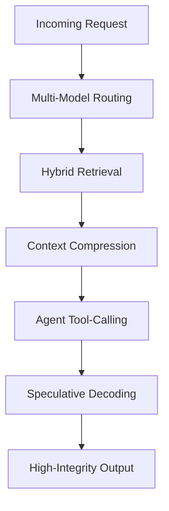
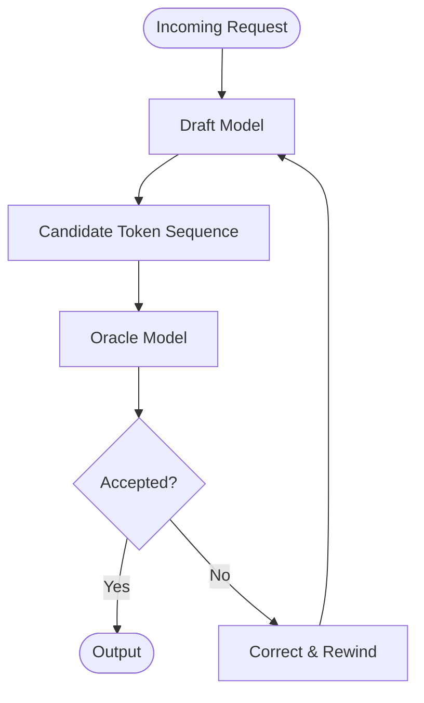
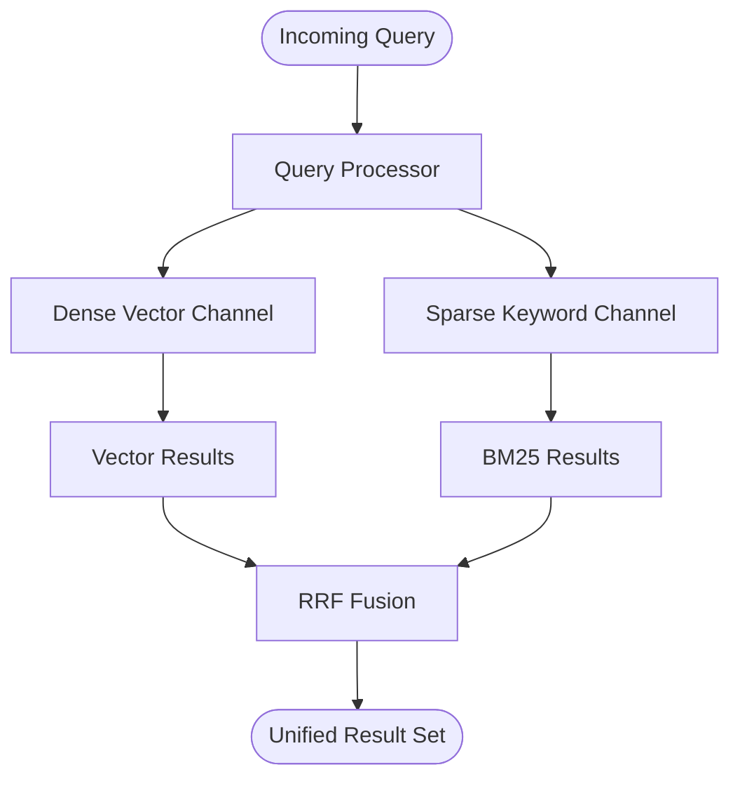
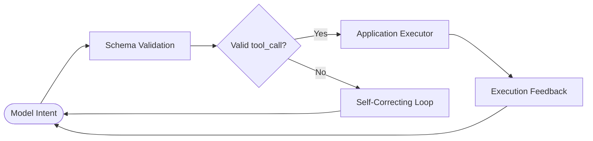

# Sovereign Inference Patterns

Inference Patterns are repeatable architectural primitives for building deterministic, cost-aware, high-integrity AI systems.

Where the Sovereign Glossary defines the operational philosophy of local-first cognitive infrastructure, these patterns define the runtime execution layer.

Together, they form the bridge between architectural governance and practical inference engineering.

---

# Pattern Domains

## Efficiency Patterns

Patterns focused on reducing token waste, minimizing latency, and optimizing inference economics.

* Speculative Decoding
* Context Compression

## Structural Retrieval Patterns

Patterns focused on improving retrieval precision, semantic grounding, and contextual reliability.

* Hybrid Retrieval

## Agentic Reliability Patterns

Patterns focused on structured orchestration, deterministic execution, and runtime governance.

* Agent Tool-Calling
* Multi-Model Routing

---

# Runtime Relationship Model

*The Sovereign runtime pipeline: route intelligently, retrieve precisely, compress aggressively, execute deterministically, infer efficiently.*

---

# Efficiency Patterns

## Speculative Decoding

### Definition

A dual-model inference strategy where a lightweight draft model predicts token sequences that are verified by a higher-reasoning oracle model.

### Solves

* Latency-Cost Trap
* Intelligence Over-Provisioning
* High-reasoning token waste

### Related Sovereign Concepts

* Fiscal Architecture
* Prose Tax
* Local Brain
* Pre-Paid Retrieval Precision

### Runtime Role

Separates token generation from token validation to reduce wall-clock inference time while preserving high-reasoning output quality.

### Trade-Off

Higher orchestration complexity and dual-model runtime management.

### Reference Architecture

### Related Article

* The Speculative Decoding Pattern

---

## Context Compression

### Definition

An inference pattern that distills large retrieval sets into their highest-signal semantic components before final synthesis.

### Solves

* Lost in the Middle
* Information Density Penalty
* Semantic Noise accumulation

### Related Sovereign Concepts

* Prose Tax
* Semantic Noise
* Information Density Penalty
* Privacy Airlock
* Sovereign Gateway

### Runtime Role

Reduces retrieval entropy by filtering irrelevant or redundant context before high-reasoning execution.

### Trade-Off

Additional retrieval-stage latency and compression-tuning overhead.

### Reference Architecture

### Related Article

* The Context Compression Pattern

---

# Structural Retrieval Patterns

## Hybrid Retrieval

### Definition

A dual-channel retrieval strategy combining semantic vector search with sparse keyword retrieval to generate high-confidence result sets.

### Solves

* Vector Hallucination
* Semantic near-miss retrieval
* Weak factual grounding

### Related Sovereign Concepts

* Reasoning Ledger
* Deterministic Identity
* Forensic Receipt
* Chain of Custody Ledger

### Runtime Role

Combines semantic intuition with literal precision to produce grounded retrieval pipelines.

### Trade-Off

Dual-index maintenance complexity and ranking-weight tuning overhead.

### Reference Architecture

### Related Article

* The Hybrid Retrieval Pattern

---

# Agentic Reliability Patterns

## Agent Tool-Calling

### Definition

An inference pattern where models generate structured tool invocations against validated executable schemas rather than relying on free-form natural language execution.

### Solves

* Handoff Hallucination
* Invalid JSON generation
* Runtime contract drift

### Related Sovereign Concepts

* Policy Contract
* Intent-Based Namespace Exposure
* Sovereign Gateway
* Forensic Receipt

### Runtime Role

Transforms probabilistic language generation into deterministic executable workflows.

### Trade-Off

Increased schema governance complexity and larger system surface area.

### Reference Architecture

### Related Article

* The Agent Tool-Calling Pattern

---

## Multi-Model Routing

### Definition

An inference governance pattern where a lightweight classifier routes requests to the most cost-effective model capable of completing the task.

### Solves

* Intelligence Over-Provisioning
* Inference cost sprawl
* Unbounded frontier-model usage

### Related Sovereign Concepts

* Fiscal Architecture
* Sovereign Gateway
* Intent-Based Namespace Exposure
* Local Brain

### Runtime Role

Acts as the economic governance layer for inference orchestration.

### Trade-Off

Additional routing latency and model-evaluation maintenance requirements.

### Reference Architecture

### Related Article

* The Multi-Model Routing Pattern

---

# Architectural Principles

The Sovereign Inference Pattern framework operates under six foundational principles:

1. Context is infrastructure.
2. Token space is a financial resource.
3. Retrieval precision is a governance problem.
4. Runtime orchestration is a security boundary.
5. Deterministic execution beats probabilistic improvisation.
6. High-integrity AI systems are engineered, not prompted.

---

# Relationship to the Sovereign System

The Sovereign System is composed of three structural layers:

| Layer        | Purpose                                                               |
| ------------ | --------------------------------------------------------------------- |
| Glossary     | Defines the operational vocabulary and governance philosophy          |
| Architecture | Defines the structural execution boundaries and runtime flows         |
| Patterns     | Defines the repeatable runtime primitives for inference orchestration |

Together, these layers establish a high-integrity framework for local-first cognitive infrastructure.

---

# Future Expansion Areas

Potential future pattern domains include:

* Reflection & Memory Patterns
* Local-First Inference Patterns
* Provenance & Auditability Patterns
* Privacy Boundary Patterns
* Autonomous Workflow Recovery Patterns
* Deterministic Agent Governance Patterns

---

# Status

This document is an active architectural reference and will evolve alongside the Sovereign SDK and related runtime implementations.
