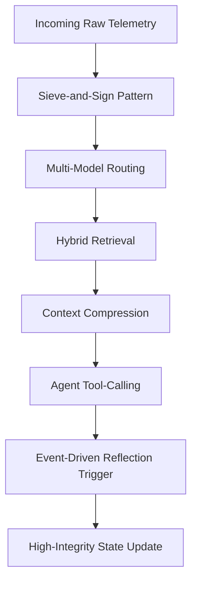
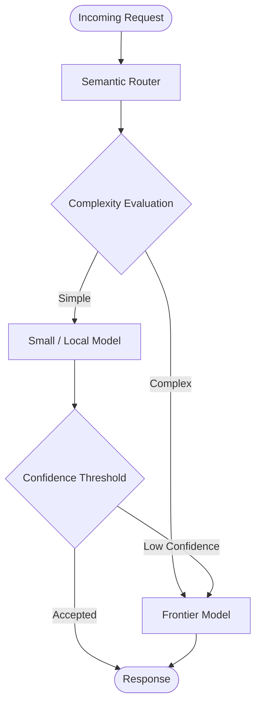
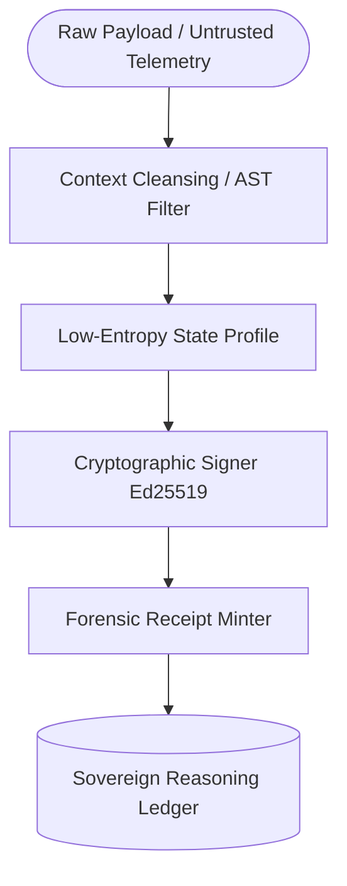
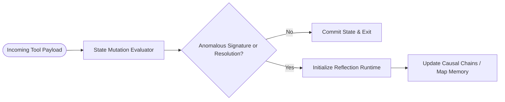

# Sovereign Inference Patterns

> **Origin and Scope:**  
> The terms, patterns, and diagrams in this document were first formalized as part of the Sovereign Systems Specification by Ken W. Alger in 2026. They describe architectural approaches to local-first AI systems, deterministic context engineering, data provenance, and operator-owned computation.

[Inference Patterns](https://www.kenwalger.com/blog/ai-engineering/inference-patterns-renaissance-vibe-coding-to-engineering/) are repeatable architectural primitives for building deterministic, cost-aware, high-integrity AI systems.

Where the Sovereign Glossary defines the operational philosophy of local-first cognitive infrastructure, these patterns define the runtime execution layer.

Together, they form the bridge between architectural governance and practical inference engineering.

---

# Pattern Domains

## Efficiency Patterns

Patterns focused on reducing token waste, minimizing latency, and optimizing inference economics.

* Speculative Decoding
* Context Compression

## Structural Retrieval Patterns

Patterns focused on improving retrieval precision, semantic grounding, and contextual reliability.

* Hybrid Retrieval

## Agentic Reliability Patterns

Patterns focused on structured orchestration, deterministic execution, and runtime governance.

* Agent Tool-Calling
* Multi-Model Routing

## State Integrity & Provenance Patterns

Patterns focused on front-gate data governance, runtime security perimeters, and cryptographic lineage.

* The Sieve-and-Sign Pattern
* Event-Driven Reflection Trigger

---

# Runtime Relationship Model



*The Sovereign runtime pipeline: route intelligently, retrieve precisely, compress aggressively, execute deterministically, infer efficiently.*

---

# Efficiency Patterns

## Speculative Decoding

### Definition

A dual-model inference strategy where a lightweight draft model predicts token sequences that are verified by a higher-reasoning oracle model.

### Solves

* Latency-Cost Trap
* Intelligence Over-Provisioning
* High-reasoning token waste

### Related Sovereign Concepts

* Fiscal Architecture
* Prose Tax
* Local Brain
* Pre-Paid Retrieval Precision

### Runtime Role

Separates token generation from token validation to reduce wall-clock inference time while preserving high-reasoning output quality.

### Trade-Off

Higher orchestration complexity and dual-model runtime management.

### Reference Architecture


### Related Article

* [The Speculative Decoding Pattern](https://www.kenwalger.com/blog/ai-engineering/inference-patterns-speculative-decoding-latency-cost-trap/)

---

## Context Compression

### Definition

An inference pattern that distills large retrieval sets into their highest-signal semantic components before final synthesis.

### Solves

* Lost in the Middle
* Information Density Penalty
* Semantic Noise accumulation

### Related Sovereign Concepts

* Prose Tax
* Semantic Noise
* Information Density Penalty
* Privacy Airlock
* Sovereign Gateway

### Runtime Role

Reduces retrieval entropy by filtering irrelevant or redundant context before high-reasoning execution.

### Trade-Off

Additional retrieval-stage latency and compression-tuning overhead.

### Reference Architecture


### Related Article

* The Context Compression Pattern

---

# Structural Retrieval Patterns

## Hybrid Retrieval

### Definition

A dual-channel retrieval strategy combining semantic vector search with sparse keyword retrieval to generate high-confidence result sets.

### Solves

* Vector Hallucination
* Semantic near-miss retrieval
* Weak factual grounding

### Related Sovereign Concepts

* Reasoning Ledger
* Deterministic Identity
* Forensic Receipt
* Chain of Custody Ledger

### Runtime Role

Combines semantic intuition with literal precision to produce grounded retrieval pipelines.

### Trade-Off

Dual-index maintenance complexity and ranking-weight tuning overhead.

### Reference Architecture


### Related Article

* The Hybrid Retrieval Pattern

---

# Agentic Reliability Patterns

## Agent Tool-Calling

### Definition

An inference pattern where models generate structured tool invocations against validated executable schemas rather than relying on free-form natural language execution.

### Solves

* Handoff Hallucination
* Invalid JSON generation
* Runtime contract drift

### Related Sovereign Concepts

* Policy Contract
* Intent-Based Namespace Exposure
* Sovereign Gateway
* Forensic Receipt

### Runtime Role

Transforms probabilistic language generation into deterministic executable workflows.

### Trade-Off

Increased schema governance complexity and larger system surface area.

### Reference Architecture


### Related Article

* The Agent Tool-Calling Pattern

---

## Multi-Model Routing

### Definition

An inference governance pattern where a lightweight classifier routes requests to the most cost-effective model capable of completing the task.

### Solves

* Intelligence Over-Provisioning
* Inference cost sprawl
* Unbounded frontier-model usage

### Related Sovereign Concepts

* Fiscal Architecture
* Sovereign Gateway
* Intent-Based Namespace Exposure
* Local Brain

### Runtime Role

Acts as the economic governance layer for inference orchestration.

### Trade-Off

Additional routing latency and model-evaluation maintenance requirements.

### Reference Architecture



### Related Article

* The Multi-Model Routing Pattern

---

---

# State Integrity & Provenance Patterns

## The Sieve-and-Sign Pattern

### Definition
A dual-stage ingestion pipeline pattern where raw, unstructured text is programmatically stripped of semantic noise on local silicon (the sieve) and immediately stamped with a local cryptographic signature (the sign) before committing to a long-term data store.

### Solves
* Write-Side Data Corruption
* The Prose Tax
* Ambient Context Fluidity
* Third-party data-leakage risks

### Related Sovereign Concepts
* Write-Side Custody
* Ingestion Boundary
* Context Cleansing
* Chain of Custody Ledger

### Runtime Role
Enforces strict front-gate data sanitation, guaranteeing that downstream models retrieve cryptographically sealed, low-entropy states rather than raw, ambient conversational noise.

### Trade-Off
Slightly higher local ingestion latency and key-management infrastructure overhead.

### Reference Architecture


## Event-Driven Reflection Trigger
### Definition
An optimization pattern that gates complex, secondary context-processing workloads (such as causal indexing, memory linking, or summary synthesis) to execute only when specific, deterministic structural markers or system error states cross the boundary.

### Solves
- Continuous reflection token waste
- Context Inflation Tax
- Delayed asynchronous context gaps

### Related Sovereign Concepts
- Observer's Tax
- Pre-Paid Retrieval Precision
- Convergence Gate

### Runtime Role
Replaces expensive, continuous scheduler polling or ambient background processing with localized, signal-based memory orchestration.

### Trade-Off
Requires rigid structural exception handling and deterministic error-signature design.

### Reference Architecture

## Intent-Based Namespace Exposure (Pre-Flight Tool Gating)

An optimization and security pattern that interceptively restricts an autonomous agent’s available tool infrastructure to a deterministic, token-scoped namespace based on pre-evaluated session intent, rather than exposing an open-ended capabilities list to the active context window.

### The Problem
Traditional agent architectures expose a comprehensive, unified list of available tools ($O(N)$ context overhead) directly to the prompt or system contract. In long-running or multi-turn sessions, this creates two severe failure modes:
1. **Context Window Dilution:** The model wastes precious token overhead continuously parsing system tool definitions it does not require for the immediate operational step.
2. **The CLAIM-23 Vague-Query Vulnerability:** Under adversarial prompt injection or conversational drift ("vague queries"), a probabilistic agent can be manipulated into invoking powerful write or storage primitives on restricted vault segments because the tool surface remains continuously exposed and active.

### The Mechanism
Instead of allowing the agent to view its entire operational universe, a lightweight, local-first **Pre-Flight Classifier** evaluates the incoming user payload *before* any tools are initialized or passed to the long-context background model[cite: 1, 2]. 

```text
 User Payload / Stream Intercept
               ↓
     [Pre-Flight Classifier]
               ↓
  [Dynamic Namespace Isolation]
    ├── Authorized: Session Scope (Exposed)
    └── Restricted: Vault Admin / Direct Writes (Blinded)
               ↓
    Active Inference Context Window
```
The classifier matches the session's state boundary against an immutable permissions matrix, dynamically generating a targeted, temporary namespace ($O(\text{relevant})$). If a tool primitive (such as an append or overwrite execution) is not explicitly required by the current session token scope, it is entirely scrubbed from the agent's namespace before inference.

## The Sovereign Benefit
- **Upstream Authority Enforcement:** It solves the write-time authority problem by blinding the agent to the existence of unauthorized tools. If the agent does not know a tool exists, there is no surface area to exploit or hijack.  
- **Token Optimization:** Minimizes the Context Tax and Prose Tax by stripping out hundreds of lines of irrelevant tool definitions from the system scaffolding on every conversational turn.
- **Deterministic Containment:** Forces a probabilistic agent to operate within strict, predictable execution rails without requiring a heavy, high-latency cloud-reliant authorization server on the hot inference path.  


---

# Architectural Principles

The Sovereign Inference Pattern framework operates under six foundational principles:

1. Context is infrastructure.
2. Token space is a financial resource.
3. Retrieval precision is a governance problem.
4. Runtime orchestration is a security boundary.
5. Deterministic execution beats probabilistic improvisation.
6. High-integrity AI systems are engineered, not prompted.

---

# Relationship to the Sovereign System

The Sovereign System is composed of three structural layers:

| Layer        | Purpose                                                               |
| ------------ | --------------------------------------------------------------------- |
| Glossary     | Defines the operational vocabulary and governance philosophy          |
| Architecture | Defines the structural execution boundaries and runtime flows         |
| Patterns     | Defines the repeatable runtime primitives for inference orchestration |

Together, these layers establish a high-integrity framework for local-first cognitive infrastructure.

---

# Future Expansion Areas

Potential future pattern domains include:

* Reflection & Memory Patterns
* Local-First Inference Patterns
* Provenance & Auditability Patterns
* Privacy Boundary Patterns
* Autonomous Workflow Recovery Patterns
* Deterministic Agent Governance Patterns

---

# Status

This document is an active architectural reference and will evolve alongside the Sovereign SDK and related runtime implementations.


---

# Verbiage to Pattern Mapping

| Field Verbiage | Related Pattern | Related Sovereign Concept | Architectural Interpretation |
|---|---|---|---|
| Prose Tax | Context Compression | Fiscal Architecture | Reduce unnecessary token spend before inference. |
| Ingestion Boundary | Sieve-and-Sign | Sovereign Gateway | Validate and structure data before storage or inference. |
| Hot/Cold Audit Split | Reasoning Ledger | Chain of Custody Ledger | Separate active reasoning state from immutable archival records. |
| Append Previous Messages and Hope | Context Compression | Digital Attic | Anti-pattern where transcript replay replaces structured memory. |
| Memory as Infrastructure | Hybrid Retrieval / Reasoning Ledger | Cognitive Estate | Treat memory as governed, queryable infrastructure. |
| Pre-Paying for Retrieval Precision | Pre-Paid Retrieval Precision | Fiscal Architecture | Move semantic cost to ingestion to avoid repeated runtime misses. |
| Forensic Ledger | Hybrid Retrieval / Reasoning Ledger | Forensic Receipt | Preserve causal lineage for retrieval and agent decisions. |
| Federated Gateway | Multi-Model Routing / Sovereign Gateway | Boundary Deflection | Route across controlled local domains without collapsing trust boundaries. |
| Convergence Gate | Event-Driven Reflection | Reasoning Ledger | Reconcile async reasoning paths before state promotion. |
| Sift/Sieve Tiering | Context Compression / Sieve-and-Sign | Semantic Noise | Layer cheap filtering before expensive semantic analysis. |