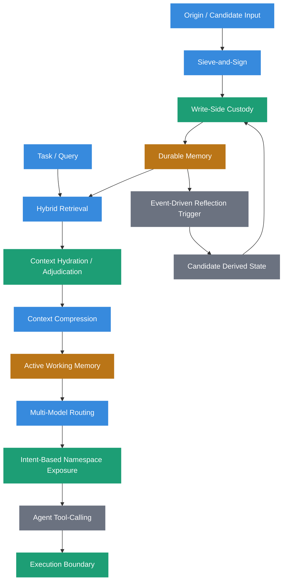
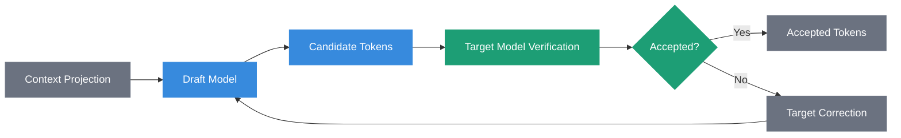
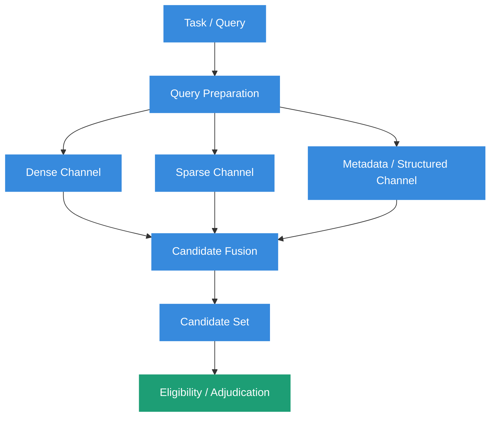
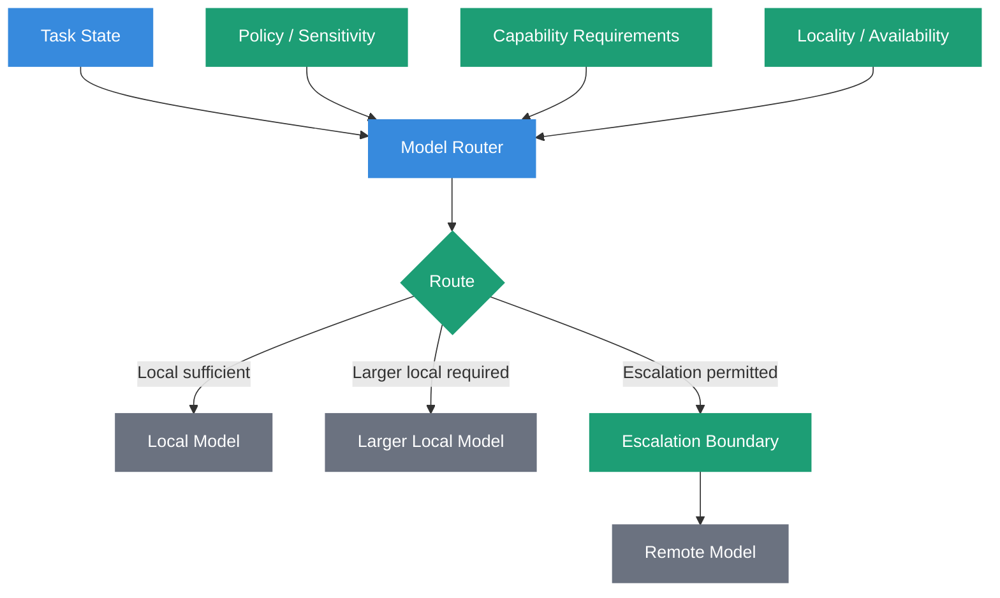
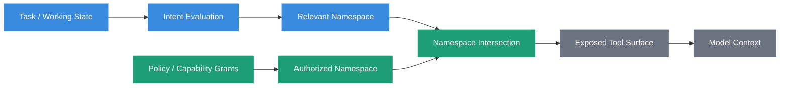
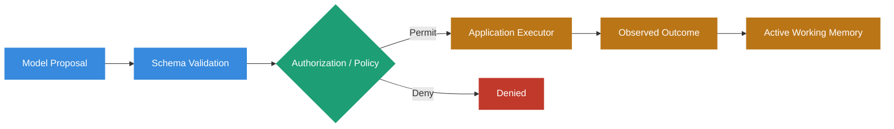
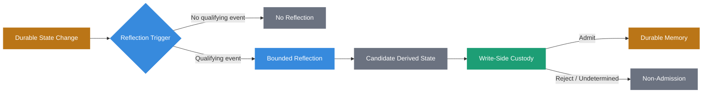

# Sovereign Inference Patterns

> **Origin and Scope:**  
> The terms, patterns, and diagrams in this document were first formalized as part of the Sovereign Systems Specification by Ken W. Alger in 2026. They describe architectural approaches to local-first AI systems, deterministic context engineering, data provenance, and operator-owned computation.

[Inference Patterns](https://www.kenwalger.com/blog/ai-engineering/inference-patterns-renaissance-vibe-coding-to-engineering/) are repeatable architectural approaches for implementing specific responsibilities within a Sovereign System.

The [Sovereign Systems Epistemic Model](EPISTEMIC_MODEL.md) defines what the system is entitled to claim.

The [Architecture & Execution Framework](ARCHITECTURE.md) defines where those responsibilities are enforced.

This document describes repeatable patterns that can realize those responsibilities in concrete systems.

Patterns are not architectural laws. An implementation may use several patterns together, substitute an equivalent mechanism, or omit a pattern entirely when its problem does not exist.

What matters is preserving the architectural semantics.

> **Patterns implement responsibilities. They do not redefine them.**

---

# 1. Pattern Domains

The pattern library is organized around the responsibility each pattern primarily serves.

## Efficiency & Context Patterns

Patterns focused on reducing unnecessary inference work while preserving the semantics required for correct reasoning.

- Speculative Decoding
- Context Compression

## Discovery & Retrieval Patterns

Patterns focused on candidate discovery and retrieval precision without confusing ranking with adjudication.

- Hybrid Retrieval

## Execution & Capability Patterns

Patterns focused on model selection, tool exposure, runtime enforcement, and bounded execution.

- Multi-Model Routing
- Intent-Based Namespace Exposure
- Agent Tool-Calling

## State Integrity & Provenance Patterns

Patterns focused on transformation, integrity evidence, governed durable admission, and source lineage.

- Sieve-and-Sign

## Reflection & Memory Patterns

Patterns focused on event-triggered derived state, memory enrichment, and avoiding continuous background inference.

- Event-Driven Reflection Trigger

These domains overlap.

For example, Intent-Based Namespace Exposure reduces Context Tax while also reducing capability exposure. Sieve-and-Sign can reduce Prose Tax while also preserving transformation evidence. Hybrid Retrieval can improve discovery while still requiring separate adjudication before a result is allowed to govern.

The domain identifies the pattern's primary architectural purpose, not every benefit it may provide.

---

# 2. Pattern Relationship Model

The patterns do not form one mandatory linear pipeline.

They appear at different boundaries and may be invoked at different times.


```mermaid
flowchart TD
    O["Origin / Candidate Input"] --> SS["Sieve-and-Sign"]
    SS --> WC["Write-Side Custody"]
    WC --> DM["Durable Memory"]

    Q["Task / Query"] --> HR["Hybrid Retrieval"]
    DM --> HR
    HR --> CH["Context Hydration / Adjudication"]
    CH --> CC["Context Compression"]
    CC --> AWM["Active Working Memory"]

    AWM --> MM["Multi-Model Routing"]
    MM --> NS["Intent-Based Namespace Exposure"]
    NS --> AT["Agent Tool-Calling"]
    AT --> EX["Execution Boundary"]

    DM --> ER["Event-Driven Reflection Trigger"]
    ER --> DR["Candidate Derived State"]
    DR --> WC

    classDef capture fill:#378ADD,stroke:#378ADD,color:#FFFFFF
    classDef governance fill:#1D9E75,stroke:#1D9E75,color:#FFFFFF
    classDef memory fill:#BA7517,stroke:#BA7517,color:#FFFFFF
    classDef boundary fill:#6B7280,stroke:#6B7280,color:#FFFFFF

    class O,Q,SS,HR,CC,MM capture
    class WC,CH,NS,EX governance
    class DM,AWM memory
    class AT,ER,DR boundary
```

This diagram illustrates relationships, not a required execution order.

Speculative Decoding, for example, may operate entirely inside a model runtime. Context Compression may occur during hydration, during working-memory maintenance, or immediately before a context projection. Tool gating may occur before model invocation and be reevaluated before execution.

The architectural boundaries remain more important than the diagram topology.

---

# 3. Pattern Contract

Every Sovereign inference pattern should be describable in terms of a small contract.

## Problem

What recurring architectural failure or inefficiency does the pattern address?

## Boundary

At which architectural boundary does the pattern operate?

## Inputs

What state, evidence, or capability enters the pattern?

## Transformation

What does the pattern change, select, derive, expose, or protect?

## Outputs

What does the pattern produce?

## Evidence

What evidence should survive if the pattern's behavior becomes consequential?

## Non-Claims

What does successful execution of the pattern **not** establish?

## Trade-Off

What cost or complexity does the pattern introduce?

This contract is especially important for AI systems because an optimization can otherwise acquire accidental epistemic meaning.

A high retrieval score can become "truth."

A valid signature can become "trusted."

A successful classifier can become "authorized."

A model confidence score can become "permission."

Patterns should prevent those semantic promotions rather than institutionalize them.

---

# 4. Efficiency & Context Patterns

## 4.1 Speculative Decoding

### Definition

**Speculative Decoding** is an inference optimization in which a smaller or faster draft model proposes token sequences that a target model verifies before accepting them.

The pattern separates candidate token generation from authoritative token acceptance within the decoding algorithm.

### Problem

High-capability autoregressive generation can incur unnecessary latency when every token must be generated sequentially by the target model.

Speculative Decoding attempts to reduce wall-clock generation time without changing which target model ultimately determines the accepted output distribution.

### Architectural Boundary

Speculative Decoding operates primarily inside the **model execution boundary**.

It does not determine:

- which durable state is authoritative
- which context should be hydrated
- which tools are permitted
- whether model output may become durable state
- whether a generated claim is true

It is an inference optimization.

### Solves

- generation latency
- underutilized parallel compute
- unnecessary target-model decoding work
- selected forms of intelligence over-provisioning during token generation

### Runtime Role


```mermaid
flowchart LR
    C["Context Projection"] --> D["Draft Model"]
    D --> T["Candidate Tokens"]
    T --> V["Target Model Verification"]
    V --> A{"Accepted?"}
    A -->|"Yes"| O["Accepted Tokens"]
    A -->|"No"| R["Target Correction"]
    R --> D

    classDef capture fill:#378ADD,stroke:#378ADD,color:#FFFFFF
    classDef governance fill:#1D9E75,stroke:#1D9E75,color:#FFFFFF
    classDef boundary fill:#6B7280,stroke:#6B7280,color:#FFFFFF

    class D,T capture
    class V,A governance
    class C,O,R boundary
```

The target model remains the verifier for token acceptance under the decoding scheme.

That use of the word **verification** is algorithmic. It should not be confused with epistemic verification of the claims contained in the resulting text.

### Evidence

Speculative Decoding normally requires little additional provenance at the Sovereign architecture level unless:

- model identity affects auditability
- model routing is policy-sensitive
- execution cost is consequential
- a regulated workflow requires model-version evidence
- different model deployments have different custody semantics

Where required, execution evidence may preserve:

```yaml
inference:
  target_model: "model-a"
  draft_model: "model-b"
  decoding_strategy: "speculative"
  runtime_version: "..."
```

### Non-Claims

Successful speculative decoding does not establish that:

- the output is factually correct
- the output is authoritative
- the draft model was independently correct
- the target model's claims are verified evidence
- the result may bypass normal execution or custody policy

### Trade-Off

The pattern introduces:

- dual-model orchestration
- compatibility requirements
- runtime complexity
- tuning overhead
- hardware and memory considerations

It is useful when measured latency improvement justifies that complexity.

### Related Sovereign Concepts

- Fiscal Architecture
- Context Tax
- Local Brain
- Capability Gradient
- Silicon Locality

### Related Article

- [The Speculative Decoding Pattern](https://www.kenwalger.com/blog/ai-engineering/inference-patterns-speculative-decoding-latency-cost-trap/)

---

## 4.2 Context Compression

### Definition

**Context Compression** is a pattern that reduces the representation of task-relevant state while attempting to preserve the evidence, qualifications, constraints, and relationships required for the current reasoning step.

Compression may operate over:

- retrieval results
- tool output
- conversation state
- documents
- planner state
- provenance metadata
- Active Working Memory

The objective is not maximum token reduction.

It is **semantic preservation under a smaller representation budget**.

### Problem

Large working sets can create:

- Context Tax
- low signal density
- duplicated evidence
- lost-in-the-middle effects
- increased latency
- unnecessary inference cost
- instruction dilution
- Agentic Thrashing

Naive compression creates a second problem: the compressor may remove exactly the qualifications that made the source interpretable.

### Architectural Boundary

Context Compression most commonly operates during:

- Context Hydration
- context assembly
- Active Working Memory maintenance
- Context Projection

It may also operate at ingestion when the system deliberately creates a derived representation, but durable compression then becomes a write-side transformation and should preserve transformation evidence.

### Runtime Role


```mermaid
flowchart LR
    I["Eligible Task State"] --> C["Compression"]
    C --> P["Preserved Semantics"]
    C --> X["Excluded / Deferred Detail"]
    P --> W["Working Memory / Context Projection"]

    classDef capture fill:#378ADD,stroke:#378ADD,color:#FFFFFF
    classDef governance fill:#1D9E75,stroke:#1D9E75,color:#FFFFFF
    classDef memory fill:#BA7517,stroke:#BA7517,color:#FFFFFF
    classDef boundary fill:#6B7280,stroke:#6B7280,color:#FFFFFF

    class I,C capture
    class P governance
    class W memory
    class X boundary
```

### Preserve Epistemic Qualification

Consider:

```text
The migration may have caused the outage, but the incident review has not
established a root cause.
```

Compression to:

```text
Migration caused outage.
```

is not compression.

It is semantic promotion.

A faithful compressed representation might be:

```yaml
suspected_cause: migration
root_cause_status: undetermined
source: incident_discussion
```

The compression step should preserve distinctions such as:

- observed vs. inferred
- current vs. historical
- governing vs. contextual
- confirmed vs. disputed
- eligible vs. unresolved
- source evidence vs. derived interpretation

> **Compression may remove representation. It must not silently strengthen the claim.**

### Deferred Expansion

Compression need not permanently discard detail.

A useful pattern is to preserve a compact representation plus references that allow later expansion.

```text
Full eligible state
      ↓
Compact representation + source references
      ↓
Current context
      ↓
Expand on demand if needed
```

This allows the system to reduce Context Tax without severing the relationship to the underlying evidence.

### Evidence

For consequential compression, useful evidence may include:

- source references
- compression method
- compressor version
- whether compression was deterministic or probabilistic
- omitted-content policy
- provenance references
- ability to rehydrate source detail

### Non-Claims

A compressed representation does not become:

- more authoritative because it is concise
- more current because it was regenerated
- more truthful because a model summarized it
- independent corroboration of its source

### Trade-Off

Context Compression introduces:

- additional latency
- transformation risk
- tuning complexity
- possible loss of nuance
- possible need for source re-expansion

The optimization is justified only when the reduced context cost exceeds the cost and risk of compression.

### Related Sovereign Concepts

- Active Working Memory
- Context Hydration
- Context Tax
- Prose Tax
- Semantic Noise
- Information Density Penalty
- Agentic Thrashing

### Related Article

- The Context Compression Pattern

---

# 5. Discovery & Retrieval Patterns

## 5.1 Hybrid Retrieval

### Definition

**Hybrid Retrieval** is a candidate-discovery pattern that combines multiple retrieval channels, commonly dense semantic retrieval and sparse lexical retrieval, to improve discovery coverage and precision.

A typical implementation may combine:

- vector similarity
- BM25 or keyword search
- metadata filtering
- graph traversal
- exact identifier lookup
- temporal constraints

The retrieved result set remains a **candidate set**.

### Problem

No single retrieval method is optimal for every query.

Dense retrieval can find semantically related material while missing exact identifiers.

Sparse retrieval can find exact terminology while missing conceptual similarity.

A hybrid strategy can improve discovery.

It does not eliminate the need for adjudication.

### Architectural Boundary

Hybrid Retrieval operates primarily in **candidate discovery** within Context Hydration.


```mermaid
flowchart TD
    Q["Task / Query"] --> P["Query Preparation"]
    P --> D["Dense Channel"]
    P --> S["Sparse Channel"]
    P --> M["Metadata / Structured Channel"]

    D --> F["Candidate Fusion"]
    S --> F
    M --> F

    F --> C["Candidate Set"]
    C --> A["Eligibility / Adjudication"]

    classDef capture fill:#378ADD,stroke:#378ADD,color:#FFFFFF
    classDef governance fill:#1D9E75,stroke:#1D9E75,color:#FFFFFF
    classDef boundary fill:#6B7280,stroke:#6B7280,color:#FFFFFF

    class Q,P,D,S,M,F,C capture
    class A governance
```

### Fusion Is Ranking, Not Authority

Reciprocal Rank Fusion, weighted scoring, reranking, or other fusion strategies can order candidates.

They cannot determine whether the highest-ranked candidate is entitled to govern the task unless the governing semantics are actually part of that evaluation.

For example:

```text
Candidate A
relevance: 0.94
state: superseded

Candidate B
relevance: 0.87
state: current
```

A retrieval-only system may rank A first.

A governed hydration system may correctly exclude A from governing current-state context while still retaining it for historical comparison.

> **Retrieval finds candidates. It does not manufacture authority.**

### Source Plurality Is Not Provenance Plurality

Hybrid Retrieval may find the same claim through several indexes or documents.

That does not automatically constitute corroboration.

Three search results may all derive from one original source.

The retrieval layer should not count duplicated ancestry as independent evidence merely because several retrieval channels found it.

### Empty Results

A hybrid query that returns:

```text
[]
```

has established only that no candidates were returned under the search configuration.

It has not established that the requested thing does not exist.

Negative claims require appropriate evidence.

### Evidence

Where retrieval behavior is consequential, routing provenance may preserve:

- query or task identity
- retrieval channels used
- index versions
- filters
- candidate identifiers
- ranking or fusion method
- lifecycle exclusions
- adjudication references
- material unavailable sources

The architecture does not require logging every score for every query.

It requires enough observability to investigate consequential routing decisions.

### Non-Claims

A high hybrid-retrieval score does not establish:

- truth
- authority
- currentness
- corroboration
- eligibility
- completeness
- absence when no result is found

### Trade-Off

Hybrid Retrieval introduces:

- multiple index maintenance
- fusion tuning
- increased query complexity
- possible latency
- lineage requirements across derived indexes

### Related Sovereign Concepts

- Context Hydration
- Durable Memory
- Provenance
- Retrieval Tax
- Routing Provenance
- Active Working Memory

### Related Article

- The Hybrid Retrieval Pattern

---

# 6. Execution & Capability Patterns

## 6.1 Multi-Model Routing

### Definition

**Multi-Model Routing** is an execution pattern in which a routing mechanism selects among available model capabilities based on task requirements and governing constraints.

Selection may consider:

- capability
- locality
- sensitivity
- privacy
- latency
- cost
- context requirements
- availability
- policy
- evidence requirements

Cost can be one factor.

It should not be the only factor.

### Problem

Sending every task to the largest available model creates:

- intelligence over-provisioning
- unnecessary cost
- latency
- avoidable remote-data exposure
- weak locality control
- dependency concentration

Conversely, forcing every task onto a small local model can create capability failure.

### Architectural Boundary

Multi-Model Routing operates at the execution boundary and often interacts with the **Capability Gradient** and **Escalation Boundary**.


```mermaid
flowchart TD
    T["Task State"] --> R["Model Router"]
    P["Policy / Sensitivity"] --> R
    C["Capability Requirements"] --> R
    L["Locality / Availability"] --> R

    R --> S{"Route"}
    S -->|"Local sufficient"| LM["Local Model"]
    S -->|"Larger local required"| LL["Larger Local Model"]
    S -->|"Escalation permitted"| EB["Escalation Boundary"]
    EB --> RM["Remote Model"]

    classDef capture fill:#378ADD,stroke:#378ADD,color:#FFFFFF
    classDef governance fill:#1D9E75,stroke:#1D9E75,color:#FFFFFF
    classDef boundary fill:#6B7280,stroke:#6B7280,color:#FFFFFF

    class T,R capture
    class P,C,L,S,EB governance
    class LM,LL,RM boundary
```

### Routing Is Not Authorization

A classifier may conclude:

```text
This task would benefit from Model X.
```

That does not establish:

```text
The system is permitted to send this data to Model X.
```

The routing decision must remain subject to actual policy and capability constraints.

> **Capability fit is not permission.**

### Confidence-Based Escalation

A common routing strategy invokes a smaller model first and escalates when confidence falls below a threshold.

This can be useful, but model self-reported confidence should not automatically be treated as calibrated evidence.

Escalation can instead be based on combinations of:

- deterministic task class
- validator failure
- unresolved evidence
- schema failure
- known model capability limits
- policy-defined uncertainty
- external evaluation

### Evidence

Consequential routing may preserve:

- task class
- selected model
- model version
- route policy version
- escalation reason
- locality transition
- data classification
- relevant authorization decision

### Non-Claims

Selecting a more capable model does not establish:

- factual correctness
- authority
- permission to expose all working state
- permission to persist its output
- calibrated confidence

### Trade-Off

Multi-Model Routing introduces:

- classifier maintenance
- capability evaluation
- routing latency
- model-version drift
- more complex observability
- escalation-policy design

### Related Sovereign Concepts

- Capability Gradient
- Escalation Boundary
- Silicon Locality
- Fiscal Architecture
- Sovereign Gateway
- Local Brain
- Context Tax

### Related Article

- The Multi-Model Routing Pattern

---

## 6.2 Intent-Based Namespace Exposure

### Definition

**Intent-Based Namespace Exposure** is a pre-flight capability-minimization pattern that exposes only the subset of tools or tool namespaces relevant to the current task and permitted by governing policy.

The pattern reduces both context overhead and unnecessary capability exposure.

It does **not** replace execution-time authorization.

### Problem

Traditional agent architectures may expose a comprehensive tool catalog to every inference call.

That creates two distinct costs.

First, the model repeatedly consumes tool definitions it does not need.

Second, unnecessary capability exposure increases the surface available to prompt injection, mistaken invocation, or orchestration error.

### Architectural Boundary

The pattern operates before or during Context Projection and tool-schema construction.


```mermaid
flowchart LR
    T["Task / Working State"] --> I["Intent Evaluation"]
    I --> R["Relevant Namespace"]
    P["Policy / Capability Grants"] --> A["Authorized Namespace"]
    R --> X["Namespace Intersection"]
    A --> X
    X --> E["Exposed Tool Surface"]
    E --> M["Model Context"]

    classDef capture fill:#378ADD,stroke:#378ADD,color:#FFFFFF
    classDef governance fill:#1D9E75,stroke:#1D9E75,color:#FFFFFF
    classDef memory fill:#BA7517,stroke:#BA7517,color:#FFFFFF
    classDef boundary fill:#6B7280,stroke:#6B7280,color:#FFFFFF

    class T,I,R capture
    class P,A,X governance
    class E,M boundary
```

The critical operation is the intersection:

```text
relevant tools
      ∩
authorized tools
      =
exposed tools
```

A tool can be authorized but irrelevant.

A tool can be relevant but unauthorized.

Only the intersection should be exposed.

### Exposure Is Defense in Depth

The earlier version of this pattern treated hiding an unauthorized tool as upstream authority enforcement.

That overstates what namespace isolation can guarantee.

If an execution endpoint remains callable through another path, hiding its schema from the model has not removed the capability.

Namespace exposure is therefore **capability minimization and defense in depth**.

The actual execution boundary must still validate:

- actor authority
- current policy
- arguments
- resource scope
- state
- consequence

> **A hidden tool is harder for the model to invoke. An enforced boundary is what makes the invocation impermissible.**

### Context Benefit

Tool definitions can be expensive.

Reducing:

```text
O(all available tools)
```

toward:

```text
O(relevant and permitted tools)
```

can reduce Context Tax and tool-selection ambiguity.

The exact computational complexity depends on the implementation, so the notation should be understood as a conceptual reduction in exposed namespace size rather than a universal asymptotic guarantee.

### Prompt Injection

Namespace minimization can reduce the tools available to an injected instruction.

It cannot make prompt injection impossible.

A malicious instruction may still attempt to misuse an exposed tool.

Execution-time policy remains necessary.

### Evidence

Consequential namespace selection may preserve:

- task classification
- namespace policy version
- exposed tool identifiers
- excluded capability classes
- actor/session scope
- reason for exceptional exposure

### Non-Claims

Namespace exposure does not establish that:

- every exposed tool call is authorized
- the classifier cannot be manipulated
- hidden tools are unreachable through all other paths
- the model will use exposed tools correctly
- the tool result is trustworthy

### Trade-Off

The pattern introduces:

- classifier or rule maintenance
- namespace generation
- possible false exclusion
- schema caching complexity
- need for execution-time enforcement anyway

### Related Sovereign Concepts

- Context Projection
- Context Tax
- Sovereign Gateway
- Policy Contract
- Capability Gradient
- Escalation Boundary

---

## 6.3 Agent Tool-Calling

### Definition

**Agent Tool-Calling** is an execution pattern in which a model proposes structured tool invocations against defined schemas, while an external runtime validates and authorizes those proposals before execution.

The model proposes.

The runtime enforces.

### Problem

Free-form natural-language execution creates ambiguity between:

```text
what the model intended
```

and:

```text
what the application actually executed
```

Structured tool calls reduce that ambiguity.

They do not eliminate authorization, validation, or semantic risk.

### Architectural Boundary

Agent Tool-Calling spans the model/runtime boundary.


```mermaid
flowchart LR
    M["Model Proposal"] --> S["Schema Validation"]
    S --> A{"Authorization / Policy"}
    A -->|"Permit"| E["Application Executor"]
    A -->|"Deny"| D["Denied"]
    E --> O["Observed Outcome"]
    O --> W["Active Working Memory"]

    classDef capture fill:#378ADD,stroke:#378ADD,color:#FFFFFF
    classDef governance fill:#1D9E75,stroke:#1D9E75,color:#FFFFFF
    classDef memory fill:#BA7517,stroke:#BA7517,color:#FFFFFF
    classDef failure fill:#C0392B,stroke:#C0392B,color:#FFFFFF

    class M,S capture
    class A governance
    class E,O memory
    class W memory
    class D failure
```

### Schema Validity Is Not Authorization

A tool call can be perfectly valid JSON and still be impermissible.

For example:

```json
{
  "tool": "delete_customer",
  "customer_id": "123"
}
```

may satisfy the schema.

The runtime still needs to determine:

- whether the actor may delete customers
- whether customer `123` is within scope
- whether deletion is permitted in the current state
- whether additional approval is required
- whether the action should be logged or receipted

> **A schema can validate shape. It cannot grant authority.**

### Self-Correction

A model may be allowed to repair malformed arguments and retry.

That loop should distinguish:

```text
syntactic failure
```

from:

```text
policy denial
```

A policy denial should not automatically become an invitation for the model to keep reformulating the request until it passes.

### Observed Outcomes

The tool's returned value and the runtime-observed outcome may differ.

For consequential operations, the architecture should prefer evidence observed at a controlled boundary.

For example:

```text
model requested email send
tool returned success
runtime observed provider message ID
```

The provider or runtime evidence may be stronger than the model's statement that the message was sent.

### Durable State

Tool output may enter Active Working Memory immediately.

It does not automatically become Durable Memory.

If a tool result should become durable institutional state, it should cross Write-Side Custody.

### Evidence

A consequential tool event may warrant a Forensic Receipt or Reasoning Ledger entry containing:

- proposed tool
- validated arguments or digest
- actor/session identity
- policy decision
- tool version
- execution result
- runtime-observed outcome
- error state
- receipt references

### Non-Claims

A successful tool call does not establish that:

- the tool's external data is true
- the action was wise
- the model's rationale was correct
- the result should become durable memory
- a valid schema implied permission

### Trade-Off

Agent Tool-Calling introduces:

- schema governance
- runtime validation
- authorization logic
- error handling
- receipt/audit complexity
- tool-version compatibility

### Related Sovereign Concepts

- Execution Boundary
- Policy Contract
- Intent-Based Namespace Exposure
- Sovereign Gateway
- Forensic Receipt
- Reasoning Ledger
- Active Working Memory

### Related Article

- The Agent Tool-Calling Pattern

---

# 7. State Integrity & Provenance Patterns

## 7.1 Sieve-and-Sign

### Definition

The **Sieve-and-Sign Pattern** is an ingestion pattern in which candidate information is reduced and structured into a defined representation, then bound to integrity and provenance evidence before governed admission to durable state.

The Sieve transforms.

The Sign protects a defined representation.

Write-Side Custody decides whether the result may survive.

### Problem

Raw or unstructured information may contain:

- conversational scaffolding
- irrelevant prose
- duplicated state
- ambiguous fields
- inconsistent schemas
- uncertain claims
- unbound source relationships

Direct persistence can create a Digital Attic.

Naive transformation creates a different risk: the transformation may silently change what the source actually established.

### Architectural Boundary

Sieve-and-Sign operates inside the ingestion path before Write-Side Custody.


```mermaid
flowchart LR
    R["Candidate Input"] --> S["Sieve"]
    S --> T["Derived Representation"]
    T --> C["Canonicalize"]
    C --> G["Sign"]
    G --> E["Integrity / Provenance Evidence"]
    E --> W["Write-Side Custody"]

    classDef capture fill:#378ADD,stroke:#378ADD,color:#FFFFFF
    classDef governance fill:#1D9E75,stroke:#1D9E75,color:#FFFFFF

    class R,S,T,C capture
    class G,E,W governance
```

### Sieve

The Sieve may perform:

- normalization
- extraction
- classification
- noise reduction
- segmentation
- schema typing
- deduplication
- deterministic transformation
- probabilistic transformation

The Sieve is a claim-producing boundary.

If a probabilistic extractor turns:

```text
This may have caused the failure.
```

into:

```yaml
root_cause: confirmed
```

the epistemic failure occurred before signing.

### Sign

The Sign stage binds a defined canonical representation to cryptographic integrity and identity evidence.

The signed preimage should include consequential metadata when changing that metadata would change how the claim should be interpreted.

Potential protected fields include:

```yaml
payload:
source_reference:
transformation:
asserted_by:
authority:
lifecycle_state:
schema_version:
```

### Non-Claims

A successful Sieve-and-Sign operation does not establish:

- truth
- assertion authority
- corroboration
- currentness
- durable admissibility
- independent provenance
- semantic fidelity unless transformation evidence supports it

> **Sieve for meaning. Sign for integrity. Preserve enough evidence to know the difference.**

### Trade-Off

The pattern introduces:

- ingestion latency
- transformation governance
- canonicalization requirements
- key management
- source-reference retention
- possible revalidation cost

### Related Sovereign Concepts

- Write-Side Custody
- Ingestion Boundary
- Provenance
- Point of Genesis
- Forensic Receipt
- Prose Tax
- Durable Memory

### Reference Implementation

The Sieve stage is implemented in the standalone Python package `sovereign-sieve`.

```bash
pip install sovereign-sieve
```

```python
from sovereign_sieve import sieve_with_metrics

result = sieve_with_metrics(
    "Hi! I hope this helps. Please just run the pipeline."
)

print(result.text)
print(result.raw_token_count)
print(result.optimized_token_count)
print(result.tax_savings_percentage)
```

The reference implementation demonstrates one implementation of the pattern.

It does not define the architectural semantics.

---

# 8. Reflection & Memory Patterns

## 8.1 Event-Driven Reflection Trigger

### Definition

**Event-Driven Reflection Trigger** is a memory-enrichment pattern in which selected state changes trigger bounded secondary analysis only when explicit structural, lifecycle, error, or resolution conditions justify the work.

The pattern replaces continuous ambient reflection with event-scoped reflection.

### Problem

Continuously asking a model to reconsider all accumulated state creates:

- repeated token cost
- redundant derived claims
- background inference noise
- repeated causal speculation
- unnecessary latency
- Agentic Thrashing
- difficult-to-audit state mutation

Event-driven reflection moves the decision to perform enrichment onto explicit state transitions.

### Architectural Boundary

The trigger observes governed state changes.

The reflection process produces **candidate derived state**.

It does not write directly into Durable Memory.


```mermaid
flowchart LR
    D["Durable State Change"] --> T{"Reflection Trigger"}
    T -->|"No qualifying event"| X["No Reflection"]
    T -->|"Qualifying event"| R["Bounded Reflection"]
    R --> C["Candidate Derived State"]
    C --> W["Write-Side Custody"]
    W -->|"Admit"| M["Durable Memory"]
    W -->|"Reject / Undetermined"| N["Non-Admission"]

    classDef capture fill:#378ADD,stroke:#378ADD,color:#FFFFFF
    classDef governance fill:#1D9E75,stroke:#1D9E75,color:#FFFFFF
    classDef memory fill:#BA7517,stroke:#BA7517,color:#FFFFFF
    classDef boundary fill:#6B7280,stroke:#6B7280,color:#FFFFFF

    class T,R capture
    class W governance
    class D,M memory
    class X,C,N boundary
```

### Trigger Conditions

A reflection trigger may respond to explicit conditions such as:

- error-state transition
- incident resolution
- lifecycle transition
- new contradictory evidence
- dependency change
- threshold crossing
- completed workflow
- corrected source state
- new authoritative artifact
- repeated operational failure

The trigger should be observable and reproducible enough for the consequence involved.

Not every trigger must be a simple deterministic rule.

The important distinction is that **triggering reflection** and **accepting the reflection's conclusions** are separate decisions.

### Reflection Produces Derived Claims

Suppose an incident closes and the reflection process infers:

```yaml
derived_claim:
  relationship: "deployment preceded outage"
  possible_cause: "credential expiration"
```

That derived state does not inherit the authority of the incident records it read.

The reflection engine is a new assertion source.

If the result should become durable, Write-Side Custody evaluates:

- who or what produced it
- which sources it used
- whether the derivation is permitted
- what uncertainty survives
- whether the claim is eligible for admission
- how it should be classified

> **A derived claim does not inherit authority merely because it was derived from authoritative sources.**

### Causality Requires Care

Reflection systems are especially vulnerable to manufacturing causal language.

Temporal sequence:

```text
A happened before B.
```

does not automatically establish:

```text
A caused B.
```

A reflection pattern should distinguish:

- temporal relationship
- correlation
- reported causality
- inferred causality
- adjudicated causal conclusion

The Reasoning Ledger may preserve that a reflection engine proposed a relationship.

That does not make the relationship true.

### Pre-Paid Retrieval Precision

Event-driven reflection can support **Pre-Paid Retrieval Precision** by computing useful derived structures when state changes rather than repeatedly rediscovering them at query time.

Examples include:

- relationship indexes
- normalized entity links
- bounded summaries
- dependency maps
- lifecycle projections
- candidate causal links
- retrieval hints

These are derived artifacts.

Their lineage should remain connected to the source state that produced them.

### Evidence

A consequential reflection event may preserve:

- triggering event
- trigger rule or policy
- source-state references
- reflection engine/version
- derived claim
- uncertainty
- custody decision
- receipt or ledger references

### Non-Claims

A reflection result does not establish that:

- correlation is causation
- model inference is direct observation
- derived state inherits source authority
- a trigger condition proves the inferred explanation
- reflection output may bypass custody

### Trade-Off

The pattern introduces:

- trigger design
- derived-state governance
- model execution cost
- possible missed reflections
- possible excessive triggering
- dependency tracking
- revalidation requirements

### Related Sovereign Concepts

- Pre-Paid Retrieval Precision
- Reasoning Ledger
- Durable Memory
- Write-Side Custody
- Provenance
- Observer Tax
- Convergence Gate
- Agentic Thrashing

---

# 9. Pattern Composition

Patterns become more useful when their boundaries remain intact during composition.

## 9.1 Retrieval + Compression

A common composition is:

```text
Hybrid Retrieval
    ↓
Adjudication
    ↓
Context Compression
    ↓
Active Working Memory
```

The order matters semantically.

Compressing a mixed set of current and superseded records before lifecycle qualification can erase the distinction required for adjudication.

A safer implementation either adjudicates first or ensures the compressor preserves all qualification required for later adjudication.

## 9.2 Routing + Namespace Exposure + Tool Calling

A common agent execution composition is:

```text
Multi-Model Routing
    ↓
Intent-Based Namespace Exposure
    ↓
Model Tool Proposal
    ↓
Execution-Time Authorization
    ↓
Tool Execution
```

Each stage answers a different question.

| Stage | Question |
|---|---|
| Model routing | Which model is appropriate and permitted? |
| Namespace exposure | Which relevant and permitted tool schemas should the model see? |
| Tool proposal | What action does the model propose? |
| Execution boundary | Is this concrete invocation permitted now? |
| Tool execution | What actually happened? |

Collapsing these stages creates security and audit ambiguity.

## 9.3 Sieve-and-Sign + Reflection

Sieve-and-Sign may admit a structured source record.

A later event may trigger reflection over that record.

The reflection output is not a continuation of the original source's authority.


```mermaid
flowchart LR
    S["Source"] --> SS["Sieve-and-Sign"]
    SS --> C1["Custody"]
    C1 --> D["Durable Source State"]

    D --> R["Reflection"]
    R --> DC["Derived Claim"]
    DC --> C2["Custody"]
    C2 --> DD["Durable Derived State"]

    classDef capture fill:#378ADD,stroke:#378ADD,color:#FFFFFF
    classDef governance fill:#1D9E75,stroke:#1D9E75,color:#FFFFFF
    classDef memory fill:#BA7517,stroke:#BA7517,color:#FFFFFF

    class S,SS,R,DC capture
    class C1,C2 governance
    class D,DD memory
```

The second custody decision matters because the assertion source has changed.

---

# 10. Common Pattern Anti-Patterns

## Pattern-as-Authority

**Failure:** Because a recognized pattern produced the result, the result is treated as authoritative.

**Correction:** Patterns structure processing. Authority comes from governance semantics.

## Signature-as-Truth

**Failure:** A Sieve-and-Sign result is called verified or trusted because its signature validates.

**Correction:** The signature establishes bounded integrity and identity evidence.

## Ranking-as-Adjudication

**Failure:** Hybrid Retrieval returns the highest-scoring record and the system treats it as governing.

**Correction:** Ranking orders candidates. Eligibility and authority remain separate.

## Classifier-as-Authorization

**Failure:** A routing or intent classifier says a tool or model is appropriate, so the system treats it as permitted.

**Correction:** Relevance and capability fit are inputs to policy, not replacements for it.

## Schema-as-Permission

**Failure:** A tool call validates structurally and therefore executes.

**Correction:** Schema validation and authorization are distinct.

## Compression-as-Fact Extraction

**Failure:** A compressor removes uncertainty and stores a definitive claim.

**Correction:** Compression must preserve epistemic qualification.

## Reflection-as-Memory

**Failure:** Model-derived reflection output is written directly into Durable Memory.

**Correction:** Reflection produces candidate derived state that crosses Write-Side Custody.

## Local-as-Trusted

**Failure:** A local model, tool, or store is assumed trustworthy because it is local.

**Correction:** Locality improves operator control. It does not establish epistemic reliability.

## Hidden-as-Enforced

**Failure:** A tool is omitted from the model's namespace and therefore considered inaccessible.

**Correction:** Namespace minimization is defense in depth. The execution boundary enforces access.

## Empty-as-Negative-Evidence

**Failure:** Hybrid Retrieval returns no candidate and the system concludes the thing does not exist.

**Correction:** Search failure and evidence of absence are different epistemic states.

---

# 11. Architectural Principles

The Sovereign Inference Pattern framework operates under the following principles.

1. **Patterns implement architectural responsibilities; they do not redefine them.**
2. **Context is infrastructure.**
3. **Token space is a financial and architectural resource.**
4. **Transformation must not silently promote epistemic status.**
5. **Retrieval precision is not the same as authority.**
6. **Runtime orchestration is a security and governance boundary.**
7. **Structured execution reduces ambiguity but does not eliminate authorization.**
8. **Cryptographic integrity is evidence, not truth.**
9. **Derived state must preserve its derivation and cross custody before durable admission.**
10. **Locality improves custody and control without becoming a trust label.**
11. **Deterministic mechanisms should govern what can be deterministic; uncertainty should remain explicit where it cannot.**
12. **High-integrity AI systems are engineered, not prompted.**

The earlier shorthand:

> _route intelligently, retrieve precisely, compress aggressively, execute deterministically_

remains useful as an optimization intuition, but it is incomplete as a governance model.

A more precise formulation is:

> **Route under policy, retrieve candidates, adjudicate evidence, compress without semantic promotion, execute behind enforced boundaries, and preserve evidence about consequential state changes.**

---

# 12. Relationship to the Sovereign System

The Sovereign Systems documentation is organized as a progression from vocabulary and normative semantics toward implementation.

| Layer | Purpose |
|---|---|
| Glossary | Defines the operational vocabulary |
| Epistemic Model | Defines provenance, evidence, authority, lifecycle, retrieval, and adjudication semantics |
| Architecture | Defines where those responsibilities are enforced and preserved |
| Patterns | Defines repeatable implementation approaches |
| Sovereign SDK | Provides reference implementations for selected components |

```text
Glossary
   ↓
Epistemic Model
   ↓
Architecture
   ↓
Patterns
   ↓
Reference Implementations
```

The Pattern Library should therefore be interpreted in the context of the layers above it.

If a pattern description appears to grant authority that the Epistemic Model does not grant, the pattern description is wrong.

If a pattern bypasses an architectural boundary such as Write-Side Custody or the Execution Boundary, the implementation is not conforming merely because it uses Sovereign terminology.

---

# 13. Pattern Selection

A Sovereign System does not need every pattern.

Pattern selection should begin with the architectural problem.

## Use Speculative Decoding when:

- generation latency is material
- the runtime supports compatible draft/target execution
- measured performance justifies added complexity

## Use Context Compression when:

- working state exceeds useful context density
- repeated verbose state increases Context Tax
- semantic qualification can be preserved
- source detail can remain recoverable where needed

## Use Hybrid Retrieval when:

- one discovery channel misses important candidate classes
- exact and semantic matching are both important
- index lineage and fusion complexity are manageable

## Use Multi-Model Routing when:

- tasks have materially different capability requirements
- locality, privacy, latency, or cost differ among models
- escalation can be governed explicitly

## Use Intent-Based Namespace Exposure when:

- the total tool surface is substantially larger than the task-relevant surface
- unnecessary schemas materially increase Context Tax
- reducing capability exposure provides defense in depth

## Use Agent Tool-Calling when:

- models need to propose executable operations
- schemas can define the invocation contract
- the runtime can enforce policy outside the model

## Use Sieve-and-Sign when:

- incoming state requires transformation before durable admission
- integrity evidence matters
- source and transformation lineage can be preserved

## Use Event-Driven Reflection when:

- useful derived state can be computed at meaningful state transitions
- continuous reflection would waste inference budget
- derived claims can cross custody before persistence

A pattern should earn its operational complexity.

The existence of a pattern in this specification is not a recommendation to deploy it everywhere.

---

# 14. Future Expansion Areas

The pattern library can expand as additional implementation approaches stabilize.

Potential domains include:

- provenance-aware revalidation
- retrieval adjudication
- contradiction-preserving context assembly
- local-first inference
- privacy boundary enforcement
- autonomous workflow recovery
- capability escalation
- memory compaction
- evidence-preserving redaction
- multi-agent custody
- checkpointed audit evidence
- sovereign mesh coordination

New patterns should satisfy the same contract used here:

```text
Problem
Boundary
Inputs
Transformation
Outputs
Evidence
Non-Claims
Trade-Off
```

This helps prevent a useful implementation technique from becoming an ambiguous architectural slogan.

---

# 15. Status

This document is an active architectural reference and will evolve alongside the Sovereign Systems Specification, Sovereign SDK, and related runtime implementations.

Patterns may move between domains as the architecture matures.

Pattern names may also be retired when a concept proves to be a general architectural responsibility rather than a repeatable implementation pattern.

The stability target is semantic rather than taxonomic:

> **A pattern may evolve. The evidence and governance responsibilities it implements should remain explicit.**

---

# 16. Verbiage to Pattern Mapping

The following mapping connects recurring Sovereign Systems terminology to the patterns most likely to implement or interact with it.

| Field Verbiage | Related Pattern | Related Sovereign Concept | Architectural Interpretation |
|---|---|---|---|
| Prose Tax | Context Compression / Sieve-and-Sign | Context Tax | Reduce low-value representation without silently removing epistemic qualification. |
| Ingestion Boundary | Sieve-and-Sign | Write-Side Custody | Transform candidate state and preserve integrity/provenance evidence before governed durable admission. |
| Hot/Cold Audit Split | Event-Driven Reflection / Ledger policy | Reasoning Ledger | Separate current operational state from retained historical evidence without equating the ledger with working memory. |
| Append Previous Messages and Hope | Context Compression | Digital Attic / Active Working Memory | Anti-pattern where transcript replay replaces governed task state. |
| Memory as Infrastructure | Hybrid Retrieval / Context Compression | Durable Memory / Context Hydration | Treat memory as governed state with explicit read-side semantics rather than prompt accumulation. |
| Pre-Paying for Retrieval Precision | Event-Driven Reflection | Durable Memory | Compute useful derived structures at meaningful state transitions while preserving lineage and custody. |
| Forensic Ledger | Agent Tool-Calling / Sieve-and-Sign | Forensic Receipt / Reasoning Ledger | Preserve observable evidence about consequential transformations and actions. |
| Federated Gateway | Multi-Model Routing | Escalation Boundary / Sovereign Gateway | Route across controlled execution domains without collapsing custody or policy boundaries. |
| Convergence Gate | Event-Driven Reflection | Write-Side Custody / Reasoning Ledger | Reconcile or evaluate asynchronous candidate state before durable promotion. |
| Sift/Sieve Tiering | Context Compression / Sieve-and-Sign | Semantic Noise / Prose Tax | Apply cheaper transformations before expensive semantic work while preserving evidence needed downstream. |
| Tool Surface Reduction | Intent-Based Namespace Exposure | Context Projection / Execution Boundary | Expose only relevant and permitted tool schemas while retaining execution-time authorization. |
| Model Escalation | Multi-Model Routing | Capability Gradient / Escalation Boundary | Move across model tiers only when capability need and policy permit. |
| Candidate Discovery | Hybrid Retrieval | Context Hydration | Improve recall and precision without treating retrieval rank as adjudication. |
| Derived Memory | Event-Driven Reflection | Write-Side Custody / Durable Memory | Treat inferred relationships as new assertions that require provenance and admission. |
| Signed State | Sieve-and-Sign | Provenance / Forensic Receipt | Bind a defined representation to integrity evidence without claiming truth or permanent authority. |

---

# 17. Pattern Summary

| Pattern | Primary Boundary | Produces | Must Not Be Confused With |
|---|---|---|---|
| Speculative Decoding | Model execution | Faster accepted token generation | Factual verification |
| Context Compression | Hydration / working memory / projection | Smaller semantic representation | Truth extraction |
| Hybrid Retrieval | Candidate discovery | Ranked candidate set | Adjudication |
| Multi-Model Routing | Execution routing | Model selection | Authorization or correctness |
| Intent-Based Namespace Exposure | Context / capability projection | Reduced tool surface | Execution enforcement |
| Agent Tool-Calling | Model/runtime boundary | Structured action proposal and observed execution | Permission from schema validity |
| Sieve-and-Sign | Ingestion | Transformed candidate + integrity evidence | Trusted durable memory |
| Event-Driven Reflection Trigger | Durable-state change | Candidate derived state | Direct durable truth |

---

# 18. Key Principle

The Pattern Library exists to make useful engineering techniques repeatable without allowing their implementation shortcuts to redefine the system's epistemic rules.

> **Use patterns to structure computation. Use architecture to enforce boundaries. Use the epistemic model to determine what the resulting evidence is entitled to mean.**
