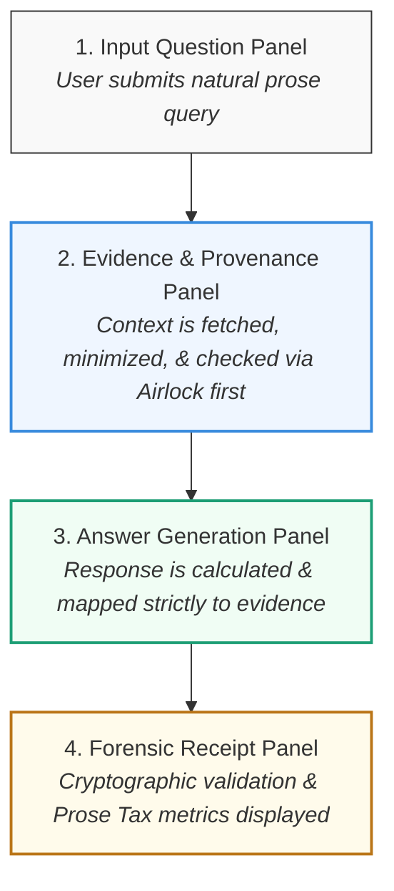
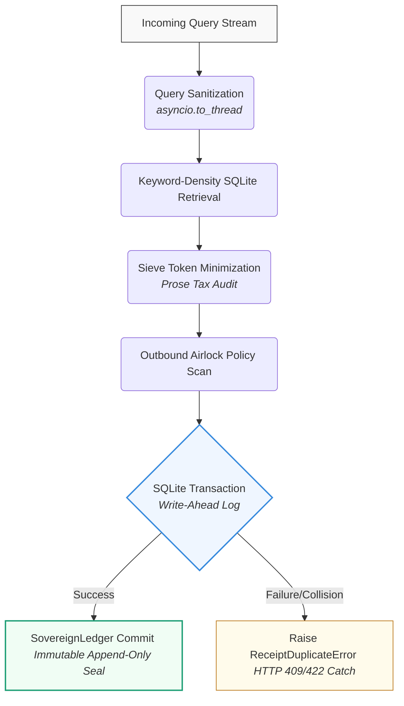

# Sovereign Memory Demo
## Reference Implementation

The Sovereign Memory Demo is the flagship reference implementation of the Sovereign Systems Specification, built to establish an immutable boundary between probabilistic AI generation and deterministic data auditing. 

It demonstrates a simple, foundational thesis:

> Information without provenance is just gossip.

---

## Ecosystem Coverage

### SDK Components (Memory Demo Boundary) 

| Component | Status | Role in Demo |
| :--- | :---: | :--- |
| `sovereign-sdk-sensor` | ❌ | Not applicable (uses static file-based dataset service) |
| `sovereign-sdk-edge` | ❌ | Not applicable for bounded local-first memory store |
| `sovereign-sdk-sieve` | ✅ | Context minimization and conversational token reduction |
| `sovereign-sdk-ledger` | ✅ | Append-only forensic receipt sequence tracking |
| `sovereign-sdk-airlock` | ✅ | Outbound data governance and policy rule compilation |
| `sovereign-sdk-vault` | ❌ | Excluded from initial memory release track |

---

### Specification Concepts Demonstrated
- **Memory as Infrastructure:** Decoupling lookups from trust.
- **Digital Attic:** Managing historic records with pristine, immutable structures.
- **Forensic Receipt:** Generating tamper-evident SHA-256 validation envelopes.
- **Write-Side Custody:** Ensuring records are cryptographically bound to their ingestion points.
- **Prose Tax:** Quantifying token minimization efficiency on long-context operations.
- **Institutional Memory:** Creating a permanent, repeatable audit trail of data execution.

---

### User Experience Lifecycle

The four-panel React front-end workspace structures the developer interaction flow to make data custody completely transparent:

Every response guarantees traceability, showing a reviewer exactly how a conclusion was arrived at, what raw data blocks were extracted, and the precise token tracking savings scored.

### Hardened SDK Execution Flow
To ensure high-performance concurrent request processing and maintain a complete audit guarantee, the backend architecture handles data sequentially via a strict, non-blocking execution chain:

*Note: The local database state must flush and commit successfully before appending to the external ledger, completely preventing orphaned ledger blocks in concurrent write environments.*

## Interactive Onboarding Queries
Visitors can experience the twin narrative paths of the demo—historical accuracy and token minimization metrics—using these recommended prompts:
 1. **Pinpoint Entity Verification:** *“Who is Fido?”*
 2. **Contextual Traceability:** *“What evidence connects Fido to the Miller family?”*
 3. **Long-Context Optimization Analysis:** *“Summarize all real estate transactions and properties for the John Miller household in 1908.”*

## Repository Target
The full source code, virtual environment tooling (uv), automated pytest suites, and configuration invariants are available at:
https://github.com/kenwalger/sovereign-memory-demo
