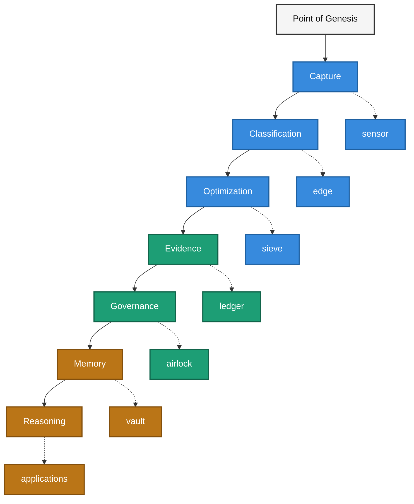

# Sovereign SDK

The Sovereign SDK is the primary implementation ecosystem of the Sovereign Systems Specification.

Its purpose is to transform observations into trustworthy, governable, and auditable memory.

Rather than serving as a general-purpose AI framework, the Sovereign SDK focuses on provenance, accountability, governance, and long-term custody throughout the information lifecycle.

---

## What Problems Does The SDK Solve?

The Sovereign SDK helps developers build systems that require:

- Provenance-aware AI workflows
- Evidence-backed answers
- Governance over outbound AI interactions
- Long-term institutional memory
- Auditable reasoning chains

---

## The Information Lifecycle

The Sovereign SDK is organized around a simple progression:

**Color Legend**

- 🔵 **Blue** — Phase 1: Local Context & Speed Optimization
- 🟢 **Green** — Phase 2: Context Engineering & Deterministic Ingestion
- 🟠 **Copper** — Phase 3: Connected Orchestration & Legacy Run-Loops

Each SDK package is responsible for a specific boundary within that lifecycle.

This separation of responsibilities helps preserve provenance, reduce architectural drift, and maintain explainability throughout the system.

---

## Ecosystem Components

| Layer          | Package               | Status                                         | Purpose                                      |
| -------------- | --------------------- |------------------------------------------------|----------------------------------------------|
| Capture        | sovereign-sdk-sensor  | Active                                         | Capture observations at the Point of Genesis |
| Classification | sovereign-sdk-edge    | Active                                         | Route, classify, and preserve locality       |
| Optimization   | sovereign-sdk-sieve   | Active                                         | Reduce Prose Tax while preserving meaning    |
| Evidence       | sovereign-sdk-ledger  | Active                                         | Generate immutable Forensic Receipts         |
| Governance     | sovereign-sdk-airlock | Active                                         | Govern outbound boundary crossings           |
| Memory         | sovereign-sdk-vault   | Planned | Long-term memory custody and retention       |

---

## Architectural Principles

The SDK is guided by several core principles.

### Information Without Provenance Is Just Gossip

Every significant system output should be traceable to its origin.

Trust requires evidence.

---

### Memory Begins Before Retrieval

Trustworthy memory is established during ingestion, not during retrieval.

By the time a question is asked, provenance should already exist.

---

### Deterministic Before Probabilistic

Validation, governance, classification, and evidence generation should be deterministic whenever possible.

Language models may augment reasoning but should not replace system controls.

---

### Local First

The SDK is designed around local-first execution, explicit boundaries, and user-controlled custody.

Cloud services may be integrated when required but are not assumed.

---

## Reference Implementations

The Sovereign SDK is demonstrated through a growing collection of reference implementations.

### Sovereign Memory Demo

The flagship reference implementation of the Sovereign Systems Specification.

Demonstrates:

* Memory as Infrastructure
* Digital Attic
* Forensic Receipt
* Write-Side Custody
* Prose Tax
* Institutional Memory

View Demo:

[Sovereign Memory Demo]({{ site.baseurl }}/demos/sovereign-memory-demo/)

Repository:

- [https://github.com/kenwalger/sovereign-memory-demo](https://github.com/kenwalger/sovereign-memory-demo)

---

# Related Concepts

* [Point of Genesis]({{ site.baseurl }}/terms/point-of-genesis.html)
* [Memory as Infrastructure]({{ site.baseurl }}/terms/memory-as-infrastructure.html)
* [Write-Side Custody]({{ site.baseurl }}/terms/write-side-custody.html)
* [Ingestion Boundary]({{ site.baseurl }}/terms/ingestion-boundary.html)
* [Forensic Receipt]({{ site.baseurl }}/terms/forensic-receipt.html)
* [Prose Tax]({{ site.baseurl }}/terms/prose-tax.html)
* [Digital Attic]({{ site.baseurl }}/terms/digital-attic.html)

---

# Repository

GitHub Repository:

[https://github.com/kenwalger/sovereign-sdk](https://github.com/kenwalger/sovereign-sdk)

---

# Looking Ahead

The long-term vision of the Sovereign SDK is not simply to provide reusable software packages.

The goal is to establish a practical implementation framework for trustworthy institutional memory, provenance-aware reasoning, and accountable AI systems.

The SDK exists to turn the principles of the Sovereign Systems Specification into working software.
