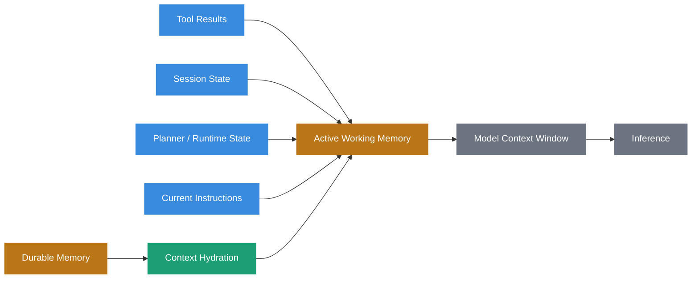
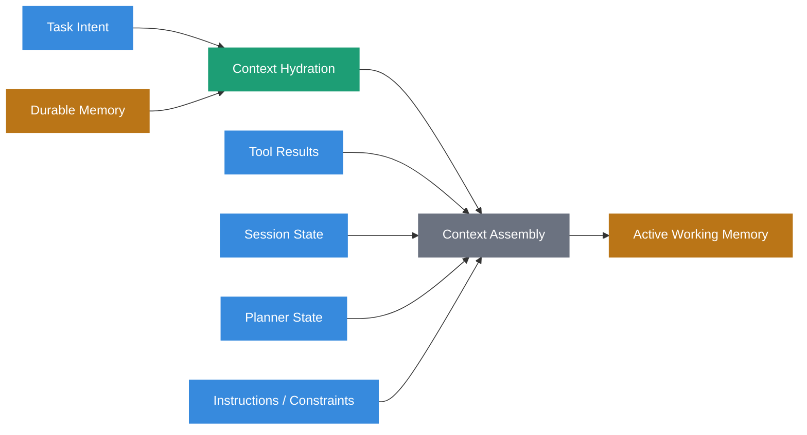
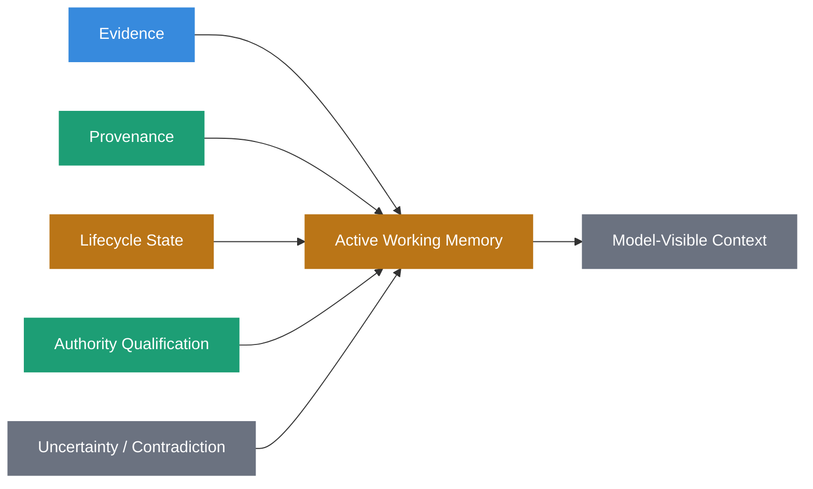
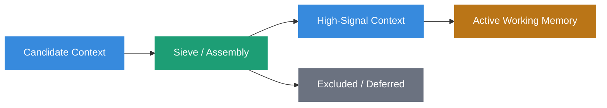
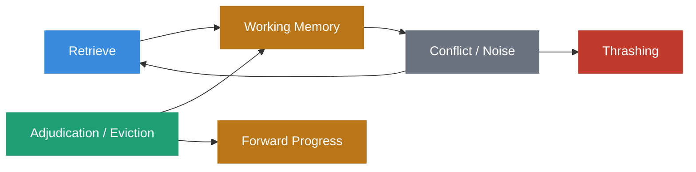

# Active Working Memory

  

## Definition

**Active Working Memory** is the assembled execution state that supports a single task. It sits between durable state and the model's context window, gathering hydrated records, current instructions, tool responses, session state, planner output, unresolved questions, and the provenance and qualification needed to interpret them.

If the context window is the CPU cache of an AI system and durable storage is its filesystem, Active Working Memory is the RAM: temporary, task-scoped, and assembled deliberately rather than persisted as long-term state.

Within Sovereign Systems, Active Working Memory is treated as an explicit architectural layer, not as incidental prompt construction.

The governing principle is:

> **What belongs in working memory is determined by whether it contributes to the task, not by whether it fits.**

## Origin

The term **Active Working Memory** was first formalized as part of the Sovereign Systems Specification by Ken W. Alger in 2026.

## Why It Matters

The context window does not begin the reasoning process. It receives the result of earlier architectural decisions.

By the time a model sees its first token, the surrounding system has already determined which sources were discovered, which records were eligible to participate, which evidence was preserved, which tool calls completed, which state was restored, which contradictions remained unresolved, and which material was excluded.

The resulting task-scoped state is Active Working Memory.

Its quality sets a ceiling on the quality of the inference that follows.

Two systems can share the same model, the same context-window size, and the same underlying Durable Memory while producing very different results. The model is identical. The working state presented to it is not.

This reframes a broad class of failures.

When a superseded record enters current context, a governing constraint is omitted, contradictory evidence is flattened into one answer, provenance disappears during summarization, or the window is flooded with loosely related prose, the model is often blamed for the result.

Those are frequently memory-architecture failures that occurred before inference began.



## Active Working Memory Is State, Not a Store

Active Working Memory is not another persistence layer.

It is a bounded, ephemeral representation of what the current execution needs.

Its contents may originate from persistent systems, but the assembled working set exists for the task.

When the task ends, the working set may disappear.

That does not mean every event surrounding the task disappears. Consequential decisions, tool activity, or outcomes may independently produce durable evidence in the [Reasoning Ledger]({{ site.baseurl }}/terms/reasoning-ledger.html), [Forensic Receipts]({{ site.baseurl }}/terms/forensic-receipt.html), or application state.

The distinction is architectural:

```text
Durable Memory
    persists across tasks

Active Working Memory
    exists for this task

Context Window
    is the model-visible representation used during inference
```

Working memory may be larger or richer than the exact prompt sent to a model. It can include structured state that an orchestrator uses to decide what should enter the next inference call.

## Context Assembly

**Context Assembly** is the process that constructs Active Working Memory from task-relevant inputs.

[Context Hydration]({{ site.baseurl }}/terms/context-hydration.html) governs the read-side transition by which durable state is discovered, evaluated, resolved, and reconstructed for present use. Context Assembly combines the result of that process with ephemeral task state such as tool responses, instructions, planner state, and current interaction state.

This distinction matters.

Context Assembly should not casually manufacture authority because a retrieved record ranked highly.

Authority, provenance, lifecycle state, and eligibility should already have been evaluated to the extent required by the task and governing policy.

Assembly then decides how eligible and appropriately qualified information should be represented in the working set.



Search finds candidates.

Hydration determines what durable state is eligible and useful to return.

Context Assembly builds the task state.

Active Working Memory is the result.

## What Belongs in Working Memory

Working memory should hold enough to perform the current task well, and no more.

A task-appropriate working set may include:

- current instructions and constraints
- hydrated records from Durable Memory
- recent session state
- relevant tool responses
- planner or supervisor output
- temporary calculations
- unresolved questions
- contradictory or disputed evidence where consequential
- provenance needed to interpret evidence
- lifecycle and authority qualification
- known blind spots or unavailable dependencies
- task-specific exclusion or routing state where consequential

What belongs there is not decided by whether something fits.

It is decided by whether it contributes to the task and whether the system is entitled to use it in the way the task requires.

## Working Memory Can Contain Uncertainty

Active Working Memory does not need to contain only resolved facts.

A system that requires every working-memory element to collapse into a single asserted truth before inference can erase exactly the uncertainty the model needs to reason correctly.

Working memory may legitimately contain:

```yaml
deployment_region:
  status: disputed
  claims:
    - value: "us-west-2"
      source: "inventory-service"
    - value: "us-east-1"
      source: "runtime-observation"
```

It may also contain:

```yaml
authority_resolution:
  status: undetermined
  reason: "governing source unavailable"
```

or:

```yaml
source_state:
  status: unverifiable
  historical_value: "approval-required"
```

These are not malformed working states.

They are faithful representations of what the system can currently establish.

> **Working memory should preserve uncertainty when certainty has not been earned.**

## Provenance-Bearing Context

Provenance that mattered during adjudication may still matter during inference.

Suppose hydration produces two statements:

```text
Production policy v7 requires the automated risk gate.

Historical policy v6 required human approval.
```

If the context window receives only:

```text
Human approval is required.
The automated risk gate is required.
```

the system has destroyed the distinction that made the information usable.

Active Working Memory should therefore preserve consequential qualification alongside the evidence it qualifies.

That may include:

- source identity
- authority role
- lifecycle state
- temporal validity
- evidence state
- retrieval route
- revalidation state
- contradiction relationships
- receipt references

Not every token of provenance must be sent verbatim to the model.

The requirement is that compression or transformation must not erase semantics necessary for correct reasoning.



## Context Provenance

Provenance normally describes the ancestry and evidence surrounding information.

Active Working Memory introduces an additional question:

> _Why is this information in the working set?_

For consequential tasks, the system may need to preserve enough **context provenance** to answer questions such as:

- which durable record supplied this statement?
- was the record current, historical, stale, or disputed?
- which retrieval route found it?
- was it revalidated?
- which policy permitted it to participate?
- was the representation compressed?
- which contradictory evidence was also available?
- was a source excluded because of authority, access, or token constraints?

Context provenance does not require logging every ranking score or every discarded chunk.

It means that consequential context-selection decisions remain observable enough to investigate later.

This is especially important because the model can reason only over the context it receives.

> **What the model did not receive can matter as much as what it did.**

## Example

Consider an agent asked to update one section of a technical specification.

### The durable state

```text
- every specification section
- the full glossary and its revision history
- complete Git history
- all prior conversations retained under policy
- every open and closed issue
- current and historical Architecture Decision Records
```

### Hydration result

```text
- retry-policy section v4
    state: current
    authority: specification
- retry-policy section v3
    state: superseded
    historical relevance: high
- ADR-0017
    state: current
    relationship: governs retry behavior
- ADR-0009
    state: superseded
- glossary definitions referenced by v4
- open issue #241
    status: unresolved
    claim: v4 may conflict with current runtime behavior
```

### Active Working Memory

```text
TASK
Update the retry-policy section without changing its governing semantics.

CURRENT GOVERNING STATE
- retry-policy v4
- ADR-0017
- current glossary definitions

OPEN CONTRADICTION
- issue #241 reports that deployed runtime behavior may differ from v4
- runtime state has not yet been independently verified

HISTORICAL CONTEXT
- v3 and ADR-0009 are superseded and should not govern the edit

CURRENT TOOL STATE
- repository branch: docs/retry-policy
- working tree: clean
```

The working set does not contain everything that was retrieved.

It contains what the task needs, with enough qualification to prevent historical or unresolved information from silently masquerading as current governing state.

## Relationship to Context Tax

Every unnecessary artifact in the working set increases [Context Tax]({{ site.baseurl }}/terms/context-tax.html).

Verbose tool responses consume attention.

Duplicate facts compete with more important evidence.

Historical state can distract from current state when its role is not explicit.

Large provenance payloads can consume tokens without improving the decision.

Disciplined assembly is therefore a compression problem as well as a governance problem.

The objective is not maximum context.

It is maximum useful signal under a bounded reasoning budget.



The cheapest context is context the task never needed.

## Relationship to Durable Memory and Context Hydration

[Durable Memory]({{ site.baseurl }}/terms/durable-memory.html) preserves governed long-term state.

[Context Hydration]({{ site.baseurl }}/terms/context-hydration.html) determines which durable state is eligible and useful to return for the present task.

Active Working Memory is the task-scoped state that results after hydrated durable state is combined with ephemeral execution state.

```text
Durable Memory
      ↓
Context Hydration
      ↓
Context Assembly
      ↓
Active Working Memory
      ↓
Model-Visible Context
```

Durable Memory may preserve current, historical, superseded, corrected, disputed, stale, invalidated, or unverifiable state.

Hydration determines how that state may participate now.

Active Working Memory preserves the resulting task-relevant distinctions long enough for the current execution to use them.

Working memory is therefore the destination of hydration, not a durable store in its own right.

## Relationship to the Reasoning Ledger

The [Reasoning Ledger]({{ site.baseurl }}/terms/reasoning-ledger.html) preserves observable evidence surrounding consequential decisions and system activity.

Active Working Memory is ephemeral.

The ledger is historical.

A consequential ledger event may record evidence about the working state used for a decision without attempting to preserve every token of the prompt or any private model chain-of-thought.

Depending on policy and consequence, it may preserve:

- references to hydrated records
- governing policy versions
- authority resolution
- relevant tool results
- known unknowns
- contradiction state
- material exclusions
- context assembly version
- resulting action or decision

> **Working memory supports the decision. The ledger preserves evidence about the decision.**

## Relationship to Forensic Receipts

A [Forensic Receipt]({{ site.baseurl }}/terms/forensic-receipt.html) may bind defined evidence to a consequential context artifact, tool event, or resulting action.

A receipt can provide integrity evidence for a representation of working state.

It does not prove that:

- every relevant source was included
- every included source was true
- the model interpreted the context correctly
- the selected evidence was authoritative
- the resulting decision was correct

Those claims require broader provenance, governance, and audit semantics.

## Relationship to Context Hydration

Context Hydration is a governed transition.

Active Working Memory is a state.

This distinction prevents the two concepts from collapsing into one another.

Hydration asks:

> _What durable state should return, and with what qualification?_

Active Working Memory asks:

> _What does this task currently have available to reason and act with?_

Hydration can fail, defer, qualify, or return `undetermined`.

Those results may themselves become part of Active Working Memory when they matter to the task.

## Relationship to the Context Window

Active Working Memory and the context window are not necessarily identical.

An orchestrator may maintain working state in structured memory while exposing only selected portions to a model during each inference call.

For example:

```text
Active Working Memory
├── task plan
├── current constraints
├── hydrated evidence
├── tool state
├── unresolved questions
└── execution metadata
        ↓
Model-visible projection
├── current step
├── relevant evidence
├── necessary constraints
└── required uncertainty
```

This allows a system to preserve task state without repeatedly injecting every detail into every model call.

The context window is therefore one consumer or projection of Active Working Memory.

It is not the architectural definition of working memory itself.

## Key Failure Mode: Agentic Thrashing

In classical operating systems, **thrashing** occurs when a system spends more time swapping pages between RAM and virtual memory than executing useful process cycles.

In agentic architectures, [Agentic Thrashing]({{ site.baseurl }}/terms/agentic-thrashing.html) occurs when the system repeatedly loads, evicts, rehydrates, or reconciles working state without making useful progress.

This can happen when:

- stale and current state are mixed without lifecycle qualification
- contradictory constraints are repeatedly reintroduced without adjudication
- tool output grows faster than it is summarized or evicted
- retrieval repeatedly returns the same unresolved candidates
- planner state and execution state diverge
- the system repeatedly rehydrates information it already has
- low-signal material displaces governing constraints
- unresolved evidence is treated as something ranking can fix



### Symptoms of Agentic Thrashing

- **Contradictory Output Loops:** The model repeatedly vacillates among unresolved or incorrectly assembled constraints.
- **Context Tax Inflation:** Token cost grows without a corresponding increase in task completion quality.
- **Instruction Drift:** Governing instructions lose salience as the working set accumulates low-signal material.
- **Repeated Retrieval:** The same evidence is rediscovered because the working state does not preserve what has already been established.
- **False Resolution:** Ranking repeatedly chooses a candidate even though the underlying authority or contradiction remains unresolved.

Active Working Memory reduces agentic thrashing by making context sieving, lifecycle qualification, working-set eviction, unresolved-state preservation, and task-state management explicit orchestration responsibilities.

The goal is not to eliminate contradiction.

Some contradictions are real.

The goal is to prevent the system from repeatedly rediscovering or accidentally manufacturing contradictions because its working state is poorly governed.

## Expiration and Eviction

Active Working Memory is intentionally temporary.

Information should leave the working set when:

- the task no longer needs it
- a later tool result replaces an ephemeral value
- a subtask completes
- the state has been safely summarized
- the context budget requires eviction
- the execution terminates

Eviction from Active Working Memory is not deletion from Durable Memory.

Likewise, a durable correction or supersession does not automatically rewrite an already-running task's working state unless the architecture rehydrates or updates that state.

Long-running tasks therefore need explicit policies for:

- refresh
- invalidation
- rehydration
- dependency change
- authority change
- policy change

A working set assembled correctly at T1 can become stale at T2.

## The Sovereign Approach

Sovereign Systems treat Active Working Memory as a first-class execution layer by:

- assembling the working set deliberately for each task
- distinguishing durable state from ephemeral task state
- consuming the result of governed Context Hydration rather than treating retrieval rank as authority
- preserving provenance alongside the evidence it qualifies
- preserving lifecycle and authority qualification where consequential
- allowing disputed, unverifiable, and `undetermined` state to remain explicit
- retaining contradiction when the evidence does not justify resolution
- preserving enough context provenance to investigate consequential selection decisions
- controlling Context Tax through compression, exclusion, and deferred expansion
- treating the context window as a projection of working state rather than the entirety of working memory
- applying explicit refresh, invalidation, and eviction policies
- preventing stale or superseded state from silently governing a task
- allowing the working set to expire when the task completes
- recording consequential decision evidence separately rather than making working memory permanent by default

The objective is not to gather everything that might be relevant.

The objective is to assemble the smallest task state that preserves the evidence, constraints, uncertainty, and governing semantics required to reason correctly.

## Key Principle

A useful heuristic remains:

> **What belongs in working memory is determined by whether it contributes to the task, not by whether it fits.**

A computer does not load its entire storage device into memory to open a text editor.

An agentic system should not hydrate its entire knowledge store into a prompt for the same reason.

Capacity is not relevance.

And relevance, by itself, is not authority.

## Related Terms

- [Memory as Infrastructure]({{ site.baseurl }}/terms/memory-as-infrastructure.html)
- [Durable Memory]({{ site.baseurl }}/terms/durable-memory.html)
- [Context Hydration]({{ site.baseurl }}/terms/context-hydration.html)
- [Context Tax]({{ site.baseurl }}/terms/context-tax.html)
- [Retrieval Tax]({{ site.baseurl }}/terms/retrieval-tax.html)
- [Digital Attic]({{ site.baseurl }}/terms/digital-attic.html)
- [Agentic Thrashing]({{ site.baseurl }}/terms/agentic-thrashing.html)
- [Provenance]({{ site.baseurl }}/terms/provenance.html)
- [Reasoning Ledger]({{ site.baseurl }}/terms/reasoning-ledger.html)
- [Forensic Receipt]({{ site.baseurl }}/terms/forensic-receipt.html)

## References

- Sovereign Systems Specification
- Sovereign Systems Epistemic Model
- Architecture & Execution Framework
- Sovereign Inference Patterns
