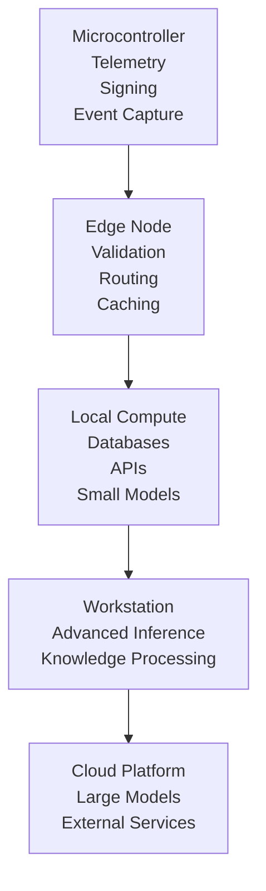

# Capability Gradient

## Definition

Capability Gradient is the ordered hierarchy of computational resources available within a system, ranging from constrained local devices to high-capability reasoning environments.

Within Sovereign Systems, workloads should execute at the lowest capable layer and ascend the gradient only when additional resources are required.

The Capability Gradient provides the architectural framework that governs how computation is distributed across a sovereign computing environment.

## Origin

The term **Capability Gradient** was first formalized as part of the Sovereign Systems Specification by Ken W. Alger in 2026.

## Why It Matters

Not all workloads require the same level of computational capability.

A microcontroller can seal telemetry.

A Raspberry Pi can validate signatures and route requests.

A local workstation can host language models and vector indexes.

A cloud platform can provide large-scale reasoning and specialized capabilities.

Treating every task as if it requires the highest available tier introduces unnecessary cost, latency, complexity, and dependency.

The Capability Gradient ensures that each workload executes on the most appropriate computational layer.

## Example

A typical sovereign deployment may consist of multiple capability tiers.

Each layer provides capabilities unavailable to the layer beneath it.

The objective is not to move workloads upward by default.

The objective is to keep workloads as low on the gradient as possible.

## Relationship to Silicon Locality

Silicon Locality determines where computation should begin.

Capability Gradient defines where computation may proceed when additional capability becomes necessary.

Together, these concepts ensure that systems remain efficient, resilient, and locally governed.

## Relationship to Escalation Boundaries

Capability Gradients describe available computational tiers.

Escalation Boundaries determine when movement between those tiers occurs.

Every escalation represents a transition from one capability layer to another.

## The Sovereign Approach

Sovereign Systems apply Capability Gradients by:

* Matching workloads to appropriate hardware
* Preserving local execution whenever possible
* Minimizing unnecessary escalation
* Reducing operational costs
* Maintaining custody of data and computation
* Treating higher-capability resources as exceptional rather than default

The goal is proportional computation.

The most powerful resource is not always the most appropriate resource.

## Related Terms

* [Silicon Locality]({{ site.baseurl}}/terms/silicon-locality.html)
* [Escalation Boundary]({{ site.baseurl}}/terms/escalation-boundary.html)
* Point of Genesis
* Edge Node
* [Sovereign Node]({{ site.baseurl}}/terms/sovereign-node.html)
* Cognitive Appliance

## References

* Sovereign Systems Specification
* Sovereign Edge
* Architecture & Execution Framework
