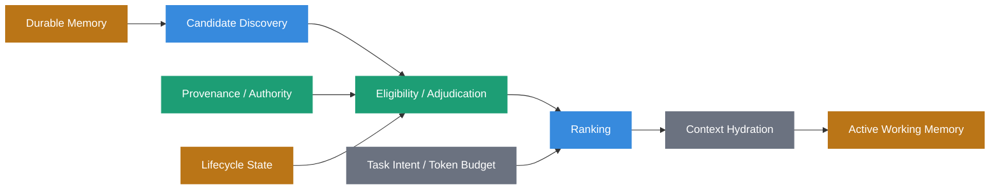
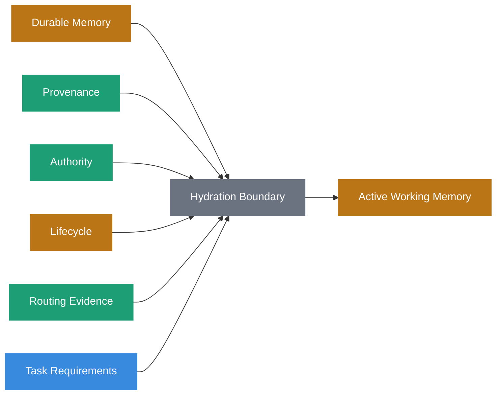
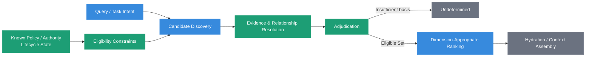
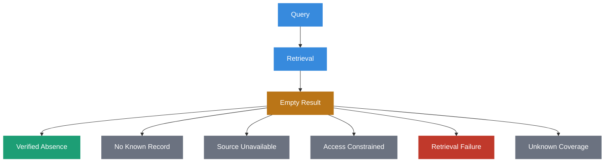
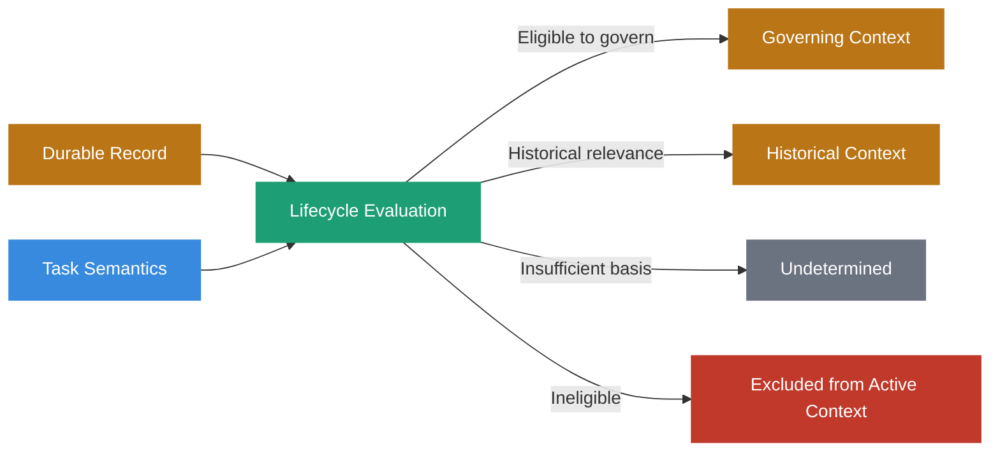
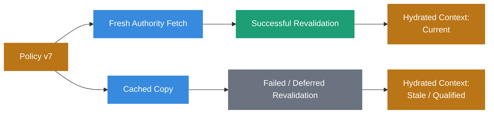
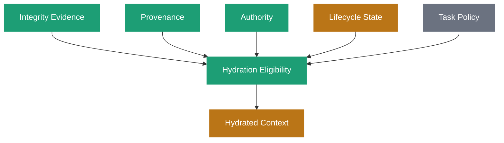
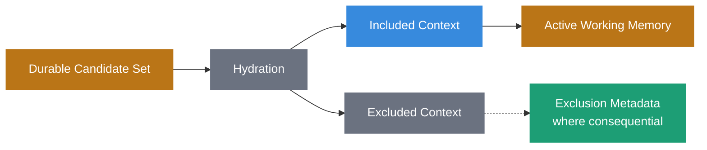

# Context Hydration



## Definition

**Context Hydration** is the governed transition through which eligible durable state is selected, resolved, evaluated, and reconstructed into task-specific [Active Working Memory](active-working-memory.html).

It is the return path of memory.

Where [Write-Side Custody](write-side-custody.html) governs what may become durable state and [Durable Memory](durable-memory.html) preserves that state over time, Context Hydration governs what portion of that memory is entitled and useful to re-enter active reasoning for a particular task.

Hydration may include:

- candidate discovery
- reference resolution
- evidence retrieval
- lifecycle evaluation
- authority resolution
- provenance evaluation
- dependency revalidation
- contradiction handling
- task-specific ranking
- representation expansion
- token-budget decisions
- context assembly

The governing principle is:

> **Retrieval finds candidates. Hydration determines what becomes context.**

## Origin

The term **Context Hydration** was first formalized as part of the Sovereign Systems Specification by Ken W. Alger in 2026.

## Why It Matters

Durable memory is useful only when relevant portions of it can return to active reasoning.

Preservation and restoration are different problems.

A system can preserve state correctly and still fail when that state must influence a present decision.

The failure can happen because the system:

- retrieves a superseded record
- ranks relevance above authority
- loses provenance during expansion
- ignores a failed revalidation
- treats a signature as proof of truth
- strips lifecycle state before inference
- confuses an empty result with evidence of absence
- expands too much information into the context window
- excludes contradictory evidence that should have remained visible
- silently chooses a winner when the evidence supports `undetermined`

Context Hydration is where durable state becomes decision context.

That makes it an epistemic boundary, not merely a serialization step.



Hydration is deliberate reconstruction.

It is not a bulk export from storage into a prompt.

## Hydration Is More Than Retrieval

Traditional retrieval often asks:

> _Which records are most relevant to this query?_

Context Hydration asks a broader question:

> **Which state is eligible, relevant, and useful enough to consume active reasoning capacity for this task?**

Those questions overlap, but they are not equivalent.

Retrieval can identify candidates.

It does not necessarily establish:

- whether a candidate is current
- whether it has been superseded
- whether its source is authoritative for the claim
- whether its evidence remains verifiable
- whether contradictory evidence exists
- whether it is eligible under current policy
- whether the system has enough evidence to select a governing record

A highly relevant record may still be ineligible to govern.

A less semantically similar record may be the current authoritative state.

> **Relevance is not authority.**

## The Hydration Boundary

The **Hydration Boundary** is the transition where durable state is evaluated and reconstructed for entry into Active Working Memory.

It separates long-lived governed state from the volatile, task-specific context used during execution.



The boundary does not require every candidate to be independently verified.

Different tasks and policies may permit different evidentiary states.

The requirement is that the state crossing the boundary retains the semantics needed to understand what can and cannot be claimed about it.

A historical record may be appropriate for a historical question.

An unverifiable record may be appropriate when the task explicitly asks what was previously asserted.

A superseded policy may be appropriate when reconstructing a past decision.

Those same records may be ineligible to govern a current operational action.

Hydration therefore evaluates information relative to the task, policy, and epistemic state rather than applying one universal `verified = true` gate.

## Discovery, Adjudication, and Ranking

Context Hydration keeps three responsibilities distinct.

### Discovery

Discovery identifies plausible candidates.

It may use:

- vector similarity
- sparse retrieval
- keyword search
- graph traversal
- namespace lookup
- metadata filtering
- relational queries
- explicit identifiers
- combinations of these

Discovery is allowed to be broad.

Its job is to find possibilities.

### Adjudication

Adjudication evaluates what can be claimed about those candidates.

It may consider:

- authority
- provenance
- lifecycle state
- temporal validity
- supersession
- correction
- contradiction
- evidence quality
- current policy
- dependency state

Adjudication may determine that one candidate governs.

It may also determine that the available evidence is insufficient.

### Ranking

Ranking orders candidates within a dimension where ordering is meaningful.

Examples include:

- semantic relevance
- recency
- specificity
- task fit
- cost
- source preference

Ranking should not manufacture authority that adjudication did not establish.



Known policy, authority, and lifecycle state may constrain eligibility before discovery or ranking.

Relationships discovered during retrieval may require additional adjudication afterward.

The architecture does not require one universal ordering of these responsibilities.

It requires their meanings to remain distinct.

> **A winner does not become authoritative merely because a sort completed.**

## `Undetermined` Is a Legitimate Result

Hydration must be allowed to conclude that the system cannot establish a governing answer.

Consider two durable records:

```text
Candidate A
    current state: unknown
    source authority: unresolved
    relevance: 0.94

Candidate B
    current state: unknown
    source authority: unresolved
    relevance: 0.87
```

Sorting produces Candidate A first.

That does not establish that Candidate A governs.

If the evidence required to adjudicate authority is unavailable, the correct state may be:

```yaml
adjudication:
  status: undetermined
  candidates:
    - candidate_a
    - candidate_b
  reason: authority_unresolved
```

`undetermined` is not a retrieval failure.

It is an epistemically meaningful result.

> **A system that cannot say “I cannot establish a winner” will eventually manufacture one.**

## An Empty Result Is Not Evidence of Absence

Hydration must also distinguish an empty candidate set from a verified negative claim.

An empty result may mean:

- no matching record exists
- no matching record exists in the searched namespace
- the relevant source was never ingested
- access policy withheld a source
- a dependency is unavailable
- retrieval failed
- the query was too narrow
- the relevant information lies outside the system's knowledge boundary

Those states are not equivalent.



The hydrated context should preserve the distinction when it matters to the task.

> **Absence is itself a provenance category.**

## Lifecycle State Constrains Hydration

Durable Memory may legitimately preserve:

- current
- historical
- stale
- superseded
- corrected
- invalidated
- disputed
- unverifiable
- undetermined

Hydration determines how those states may participate in the present task.

For a current-policy question, a superseded policy may be excluded from the governing set while remaining available as historical evidence.

For an audit of a decision made six months ago, that same superseded policy may be exactly the state the task requires.



Lifecycle state must therefore influence behavior.

A `superseded` field that retrieval and ranking are free to ignore is not governance.

## Authority Is Task-Relative

Authority is not a universal scalar attached permanently to a document.

A source may be authoritative for one class of claim and irrelevant to another.

For example:

```text
Vendor documentation
    authoritative for: documented product behavior
    not authoritative for: internal security approval

Internal security policy
    authoritative for: organizational security requirements
    not authoritative for: vendor implementation details
```

Hydration should therefore evaluate authority relative to the claim and task.

This is one reason a global `trust_score` or `confidence` field is insufficient.

The system may need to preserve:

- who asserted the claim
- what claim class it belongs to
- what authority governs that class
- whether the authority was valid at the relevant time
- whether current policy permits the claim to govern

> **Authority is not evidence. Evidence is not authority.**

## Provenance Must Survive Hydration

A system can preserve excellent provenance in Durable Memory and still discard it at the moment of use.

For example, this durable state:

```yaml
claim:
  value: "human approval required"
  source: "production-deployment-policy/v6"
  state: "superseded"
  valid_until: "2026-03-01T00:00:00Z"
  receipt_ref: "fr_01J..."
```

should not become:

```text
Human approval is required.
```

without qualification when the task asks about current policy.

That transformation strips the very evidence needed to interpret the claim.

A more faithful hydrated representation might be:

```text
Historical policy v6 required human approval.
It was superseded on 2026-03-01.
Current governing policy must be resolved separately.
```

Hydration may change representation.

It should not silently erase consequential provenance, lifecycle, authority, or uncertainty.

## Source Provenance and Routing Provenance

The identity of a source is only part of the evidence surrounding its use.

The route by which it reached the present decision may also matter.

Consider the same policy artifact:

```text
Policy v7
    → fresh authority fetch
    → hydrated as current governing state

Policy v7
    → stale cache after failed revalidation
    → hydrated with stale-state qualification
```

The source provenance is the same.

The routing provenance is different.



For consequential tasks, hydrated context should preserve routing evidence when the route affects what can be claimed.

## Cryptographic Verification Is One Input

A valid signature or content digest can establish useful integrity properties.

It does not establish:

- that the underlying claim is true
- that the signer was authoritative for the claim
- that the information remains current
- that the evidence is independently corroborated
- that the artifact is eligible for the present task

Hydration should therefore avoid transformations such as:

```text
Signature valid → information verified → safe to hydrate
```

The stronger model is:

```text
Integrity evidence
        +
Provenance
        +
Authority
        +
Lifecycle state
        +
Task policy
        ↓
Hydration eligibility
```



A [Forensic Receipt](forensic-receipt.html) may provide strong evidence about the integrity and historical context of a record.

Hydration interprets that evidence within the broader governance model.

## Revalidation at the Read Boundary

Some durable state can be used directly.

Other state may require revalidation before it is allowed to govern.

Revalidation may check:

- current authority
- current policy
- source availability
- key state
- supersession
- revocation
- evidence continuity
- dependency state
- freshness requirements

The result may be:

- current
- stale
- superseded
- invalidated
- unreachable
- unverifiable
- undetermined

Revalidation does not rewrite the historical record.

It establishes a present evaluation of that record.

Where consequential, that evaluation should itself be available to the [Reasoning Ledger](reasoning-ledger.html).

## Contradiction Should Survive Assembly

Hydration should not hide meaningful disagreement merely to produce a cleaner prompt.

Suppose two eligible sources disagree:

```text
Source A: service is deployed in us-west-2
Source B: service is deployed in us-east-1
```

If neither source has sufficient authority to resolve the contradiction, hydration should not select whichever source has the higher semantic score and present it as settled fact.

It may instead hydrate:

```yaml
deployment_region:
  status: disputed
  claims:
    - value: us-west-2
      source: source_a
    - value: us-east-1
      source: source_b
```

or:

```text
The deployment region is disputed.
Source A reports us-west-2.
Source B reports us-east-1.
The available evidence does not establish which claim governs.
```

The exact representation can vary.

The epistemic state should not.

## Hydration Is Necessarily Lossy

Active Working Memory is bounded.

Durable Memory is not expected to fit inside it.

Hydration therefore selects.

Selection means some information is excluded.

That makes hydration a lossy epistemic boundary.



Not every exclusion needs to be logged.

But consequential exclusions may need to remain observable.

Examples include:

- contradictory evidence omitted because of token limits
- an authority source excluded because it was unreachable
- historical state intentionally excluded from a current-state answer
- a lower-authority source removed after adjudication
- a source withheld by access policy

This makes later investigation possible without requiring the system to retain every rejected token candidate forever.

> **What the model did not receive can matter as much as what it did.**

## Fidelity Means Preserving Semantics

The original idea behind Context Hydration emphasized expanding compressed or content-addressed state back into readable language.

That remains useful, but fidelity is broader than textual reconstruction.

A hydrated representation should preserve the semantics needed by the task.

For example, this durable record:

```yaml
policy:
  id: "production-deployment"
  version: 7
  state: "current"
  requires_automated_risk_gate: true
  authority: "platform-operations"
```

might hydrate to:

```text
Current production-deployment policy v7, issued under Platform Operations authority,
requires the automated risk gate.
```

The representation changed.

The consequential semantics survived.

Fidelity therefore means preserving meaning, qualification, and governance state, not reproducing identical bytes.

## Token Cost Is a Governance Constraint

Hydration consumes a scarce resource: active context.

Every additional artifact competes for model attention and contributes to the [Context Tax](context-tax.html).

Good hydration therefore balances:

- task relevance
- governing authority
- evidentiary value
- contradiction coverage
- representation fidelity
- token cost
- latency

A useful candidate should not automatically be expanded at full fidelity.

The system may use:

- structured summaries
- compact references
- extracted fields
- graph relationships
- scoped quotations
- deferred expansion
- hierarchical context

provided that compression does not silently erase consequential provenance or qualification.

> **The cheapest token is the one the task never needed.**

## Hydration Latency

**Hydration Latency** is the read-side delay introduced while preparing durable state for active reasoning.

It may include:

- retrieval
- reference resolution
- evidence lookup
- revalidation
- signature verification
- authority resolution
- contradiction analysis
- ranking
- representation expansion
- serialization

Some of this work may be cached or moved off the critical path.

That optimization must not erase the distinction between:

- a cached evaluation
- a fresh evaluation
- a failed revalidation
- an unreachable dependency

Latency optimization changes routing provenance.

It should not silently change epistemic state.

## Example

Consider a question:

> _Does the current production deployment policy require human approval?_

Durable Memory contains:

```yaml
policies:
  - id: "production-deployment"
    version: 6
    requires_human_approval: true
    state: "superseded"
    valid_until: "2026-03-01T00:00:00Z"

  - id: "production-deployment"
    version: 7
    requires_human_approval: false
    requires_automated_risk_gate: true
    state: "current"
    valid_from: "2026-03-01T00:00:00Z"
```

A similarity-based retriever might rank version 6 first because it contains the exact phrase `human approval`.

Hydration should not treat that ranking as authority.

The process may instead be:

```text
1. Discover v6 and v7 as candidates.
2. Resolve their lifecycle relationship.
3. Determine that v7 supersedes v6.
4. Confirm that v7 is eligible to govern the current-policy question.
5. Preserve v6 as historical evidence if useful.
6. Hydrate the governing answer from v7.
```

The resulting Active Working Memory might contain:

```text
Current production-deployment policy v7 does not require human approval.
It requires the automated risk gate.

Historical note: v6 required human approval and was superseded on 2026-03-01.
```

The model receives enough context to answer correctly without losing the history that explains why an older record may have appeared during retrieval.

## Relationship to Durable Memory

[Durable Memory](durable-memory.html) preserves governed long-term state.

Context Hydration determines which portion of that state becomes active for a task.

Durable Memory may preserve records that are historical, superseded, disputed, or unverifiable because those states remain meaningful.

Hydration decides how those records participate in the present task.

> **Durable Memory answers what survived. Context Hydration answers what returns.**

## Relationship to Active Working Memory

[Active Working Memory](active-working-memory.html) is the task-specific execution state produced by context assembly.

Context Hydration is the transition that helps construct it.

Hydration resolves and evaluates durable state.

Active Working Memory contains the resulting bounded context alongside other task state such as:

- current user input
- tool results
- planner state
- session state
- execution constraints

Hydration is therefore an arrow rather than another storage layer.

## Relationship to Write-Side Custody

[Write-Side Custody](write-side-custody.html) governs admission to Durable Memory.

Context Hydration governs read-side re-entry into active reasoning.

They are complementary boundaries, but they do not provide one permanent guarantee.

Custody preserves the evidence and dependencies needed for future evaluation.

Hydration uses that evidence to determine what is eligible and appropriate now.

A record legitimately admitted at T1 may be stale, superseded, invalidated, or otherwise constrained at T2.

> **Custody governs what may survive. Hydration governs what may return.**

## Relationship to Provenance

[Provenance](provenance.html) provides the evidence ancestry and verification semantics needed to interpret durable state.

Hydration consumes that provenance when evaluating eligibility and should preserve consequential provenance in the resulting context.

If provenance is preserved in storage but stripped before inference, it has not been preserved across the decision boundary.

## Relationship to Forensic Receipts

A [Forensic Receipt](forensic-receipt.html) can provide integrity and historical evidence about a durable artifact or event.

Hydration may verify or consult a receipt before using the associated state.

A valid receipt does not automatically make the state:

- true
- current
- authoritative
- independently corroborated
- eligible for the present task

Receipt evidence participates in adjudication.

It does not replace it.

## Relationship to the Reasoning Ledger

The [Reasoning Ledger](reasoning-ledger.html) may preserve observable evidence about consequential hydration decisions.

Depending on the consequence, that may include:

- candidate sources
- retrieval route
- revalidation outcome
- policy used
- authority resolution
- contradiction state
- exclusions
- adjudication result
- hydrated representation

The ledger should not record every routine retrieval event merely because it can.

It should preserve enough evidence where later investigation of the decision would materially benefit from knowing what context was assembled and why.

## Relationship to Context Tax

Hydration is where [Context Tax](context-tax.html) is either paid or avoided.

Expanding every available record into every inference window recreates the problem structured memory was intended to solve.

Disciplined hydration seeks the smallest context that preserves the evidence, authority, contradiction, and state necessary for the task.

Hydrate too much, and signal density falls while cost rises.

Hydrate too little, and the model reasons without information it needed.

Hydrate the wrong state, and the model may reason confidently from evidence that was never entitled to govern.

## The Sovereign Approach

Sovereign Systems treat Context Hydration as a governed read-side transition rather than a retrieval convenience.

A conforming design should:

- distinguish candidate discovery from adjudication and ranking
- prevent relevance scores from silently establishing authority
- permit `undetermined` when the available evidence cannot establish a governing result
- distinguish an empty result from verified absence
- evaluate lifecycle state relative to the task
- resolve authority relative to the claim being made
- preserve source provenance across the hydration boundary
- preserve routing provenance where the retrieval path affects what can be claimed
- treat cryptographic verification as integrity evidence rather than proof of truth or authority
- revalidate dependencies when present policy requires it
- preserve contradiction when adjudication cannot resolve it
- treat hydration as a lossy epistemic boundary
- preserve consequential exclusions where later investigation requires them
- maintain semantic fidelity when expanding or compressing representations
- optimize token cost without stripping consequential qualification
- distinguish cached evaluation from fresh evaluation
- preserve enough evidence for consequential hydration decisions to be audited
- hydrate only the state relevant and eligible for the present task

The objective is not to restore everything the system remembers.

The objective is to construct the smallest defensible working context that preserves what the task needs to know, what the system can establish about it, and the qualifications that determine how that information may be used.

## Key Principle

A useful heuristic is:

> **Hydrate the smallest context that preserves the evidence required to reason correctly.**

The best hydrated context is not necessarily the largest, most recent, most similar, or most cryptographically decorated context.

It is the context whose contents are relevant to the task, eligible under the governing semantics, and sufficiently qualified for the model to use without being misled about what the system actually knows.

## Related Terms

- [Durable Memory](durable-memory.html)
- [Active Working Memory](active-working-memory.html)
- [Write-Side Custody](write-side-custody.html)
- [Provenance](provenance.html)
- [Forensic Receipt](forensic-receipt.html)
- [Reasoning Ledger](reasoning-ledger.html)
- [Context Tax](context-tax.html)
- [Observer Tax](observer-tax.html)
- [Retrieval Tax](retrieval-tax.html)

## References

- Sovereign Systems Epistemic Model
- Sovereign Systems Specification
- Architecture & Execution Framework
- Memory as Infrastructure
