# Durable Memory



## Definition

Durable Memory is the governed long-term state of a Sovereign System.

It preserves information that has been intentionally admitted beyond the task, session, or inference that produced or encountered it.

Durable Memory may contain:

- current knowledge
- historical knowledge
- policies
- specifications
- user preferences
- observations
- claims
- evidence
- structured domain state
- relationships
- Architecture Decision Records
- references to Forensic Receipts
- lifecycle and authority state
- historical interactions where retention is justified

Durability means the information is intentionally preserved.

It does not mean the information is permanently true, current, authoritative, independently verified, or eligible to govern every future decision.

The governing principle is:

> **Persistence preserves state. Governance determines what that state is entitled to do.**

## Origin

The term **Durable Memory**, as defined within the Sovereign Systems Specification, was formalized by Ken W. Alger in 2026 as part of the specification's layered memory architecture.

The broader idea of persistent or long-term memory is established industry terminology. The Sovereign Systems definition specifically distinguishes governed durable state from storage, retrieval indexes, transient working memory, and current authority.

## Why It Matters

A vector database can persist embeddings.

A relational database can persist rows.

An object store can persist files.

A filesystem can persist bytes.

None of those mechanisms, by themselves, define what the information means, why it was retained, who asserted it, what evidence supports it, whether it remains current, or whether it is entitled to govern a present decision.

That is the architectural distinction between storage and Durable Memory.

Storage asks:

> _Can we keep this?_

Durable Memory asks:

> _What state has the system intentionally preserved, and what does that state mean now?_

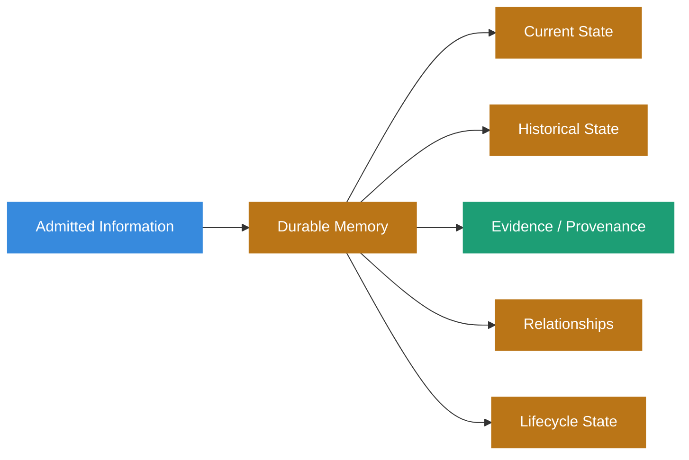

Durable Memory is therefore not a database product or storage technology.

It is an architectural responsibility.

## Durable Does Not Mean Authoritative

An earlier formulation of Durable Memory can be tempting:

> _Keep only what is authoritative and verified._

That rule is too narrow for a system that must preserve history, disagreement, uncertainty, and changing authority.

A durable record may legitimately be:

- current
- historical
- asserted
- corroborated
- contradicted
- disputed
- stale
- superseded
- corrected
- invalidated
- unverifiable
- undetermined

Those states do not make the record unworthy of preservation.

They determine how the record may participate in future decisions.

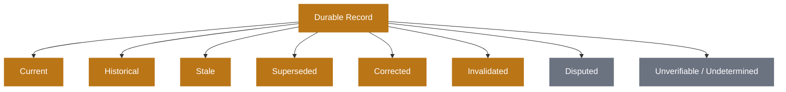

A superseded policy may be essential for reconstructing a historical decision.

A contradicted observation may be essential for understanding why an investigation changed direction.

An unverifiable record may still be historically important.

A corrected claim should not disappear merely because the system now knows better.

> **Durability preserves history without granting history permanent authority.**

## Admission Precedes Durable State

Durable Memory does not decide its own admission policy.

That responsibility belongs to [Write-Side Custody](write-side-custody.html).

A proposed write crosses a governed boundary before becoming durable state.

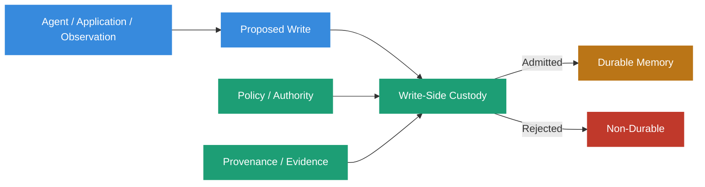

Custody may evaluate:

- structural validity
- assertion authority
- provenance requirements
- evidence requirements
- admission policy
- classification
- retention requirements
- integrity mechanisms

Once admitted, Durable Memory preserves the resulting state and the dependencies required to interpret it later.

Admission therefore means:

> _This information was permitted to become durable state under the evidence, authority, and policy available at the time._

It does not mean:

> _This information must govern forever._

## What Deserves to Survive

Not everything that participates in a task deserves durable retention.

Temporary context may include:

- scratch calculations
- intermediate transformations
- transient tool output
- duplicate information
- temporary retrieval candidates
- short-lived planner state
- ephemeral session context

Those artifacts may be operationally useful without becoming institutional memory.

Durable candidates are information whose value extends beyond the task that created or retrieved them.

Examples include:

- an accepted policy
- a user preference with appropriate scope
- an observed system state
- a source artifact
- a structured claim
- a decision record
- a correction
- an authority relationship
- a historical state transition
- evidence needed for later audit or revalidation

The question is not whether an artifact was useful.

The question is whether the system has a reason to preserve it beyond the immediate task.

> **Every durable write is a commitment to future interpretation.**

## Durable Memory Is Structured State

Durable Memory should preserve meaning in forms appropriate to the domain.

That may include:

- documents
- structured records
- graphs
- event streams
- relational state
- content-addressed artifacts
- append-only histories
- object storage
- indexes
- combinations of these

A Sovereign System does not require one universal storage engine.

It requires durable state to preserve enough structure that future consumers do not need to infer every consequential relationship from prose or embedding similarity.

For example:

```yaml
claim:
  id: "claim_1842"
  subject: "deployment-policy"
  predicate: "requires_approval"
  object: true

  lifecycle:
    state: "superseded"
    superseded_by: "claim_2014"

  authority:
    source: "platform-operations"
    policy_version: "6"

  provenance:
    source_ref: "policy:production-deployment/v6"
    receipt_ref: "fr_01J..."

  temporal:
    valid_from: "2026-01-01T00:00:00Z"
    valid_until: "2026-03-01T00:00:00Z"
    recorded_at: "2026-01-02T11:42:03Z"
```

The exact schema is implementation-specific.

The architectural requirement is that consequential semantics remain explicit enough to govern later use.

## Source Artifacts and Derived State

Durable Memory often contains both source artifacts and state derived from them.

Those should remain distinguishable.

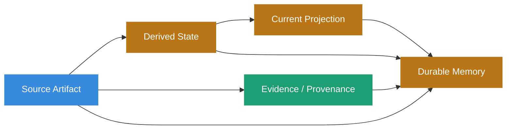

A projection may make current-state access efficient.

It should not silently replace the evidence or history from which it was derived.

For example, a system may maintain:

```yaml
current_policy:
  production_deployment: "v7"
```

for fast access.

The historical state may separately preserve:

```text
v5 → superseded by v6
v6 → superseded by v7
v7 → current
```

The projection answers what governs now.

The history answers how the system arrived there.

Both may be durable.

They are not interchangeable.

## Provenance Survives with the Memory

Durable Memory should not detach a claim from the evidence required to interpret it.

Relevant [Provenance](provenance.html) may include:

- source identity
- source artifact
- assertion identity
- authority identity
- evidence references
- verification anchors
- transformation history
- policy version
- dependency relationships
- temporal state
- Forensic Receipt references

This does not require every durable record to embed every evidence payload.

References may be sufficient where they remain resolvable and their verification semantics are explicit.

The important requirement is that the system does not preserve a claim while discarding the information needed to understand why that claim was admitted or what it was based on.

> **Information without provenance is just gossip.**

## Evidence Can Degrade While Memory Survives

Durability and verifiability have different lifecycles.

A record may remain in Durable Memory even when:

- its source becomes unreachable
- an external authority disappears
- a verification endpoint is retired
- a signing key is revoked
- an evidence payload is deleted under retention policy
- a referenced artifact is corrupted
- a dependency can no longer be independently checked

The correct response is not necessarily to delete the record.

The system may instead change what can be claimed about it.

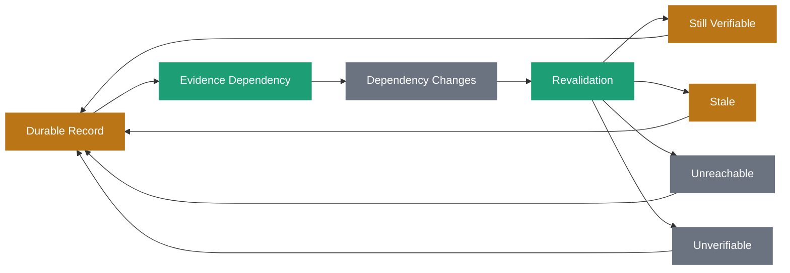

The historical record can remain useful while its present evidentiary status changes.

A system that deletes every record whose evidence later weakens loses history.

A system that ignores evidence degradation overstates what it knows.

Durable Memory must support the distinction.

## Current State and Historical State

A Sovereign System should distinguish:

> _What was believed, asserted, or authoritative then?_

from:

> _What governs now?_

These questions require historical state rather than destructive replacement.

Three common transitions are:

**Supersession**  
An earlier state governed at the time, but a later state now governs.

**Correction**  
An earlier assertion was wrong and a later assertion corrects it.

**Invalidation**  
An earlier assertion may remain factually meaningful, but its authority or eligibility to govern has been withdrawn.

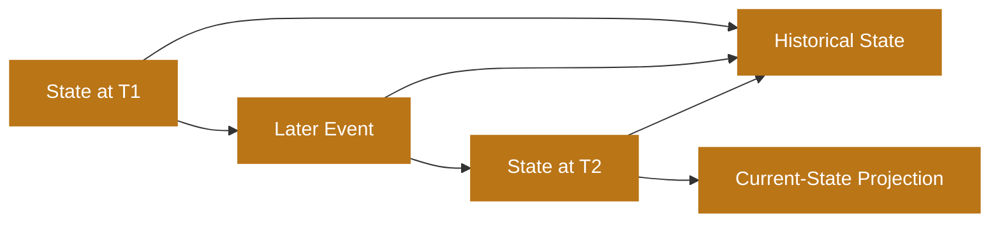

The architecture should not rewrite T1 to look as though T2 had always been known.

That would destroy the ability to reconstruct decisions made under earlier knowledge.

## Two Notions of Time

Historical memory may require at least two notions of time.

**Valid time** describes when a fact, state, authority, or policy applied.

**Transaction or assertion time** describes when the system learned, observed, or recorded it.

For example:

```yaml
observation:
  value: "service-degraded"
  valid_at: "2026-04-12T10:02:00Z"
  recorded_at: "2026-04-12T10:07:31Z"
```

The distinction matters because a system may learn something after the period in which it was true.

Without separate temporal semantics, later knowledge can be projected backward into historical reconstruction.

Durable Memory should preserve the temporal information required by the domain rather than assuming one timestamp answers every question.

## Revalidation Changes Governing State, Not History

Admission is a historical decision.

Continuing authority is a present governance question.

A record admitted under valid authority may later require revalidation because:

- policy changed
- authority changed
- evidence changed
- dependencies changed
- time passed
- a source was corrected
- contradictory evidence appeared
- a signing key changed state

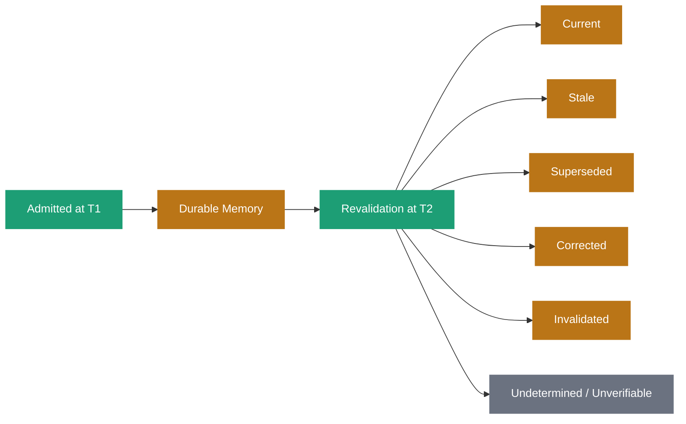

The revalidation result should affect current eligibility.

It should not erase the fact that the record was legitimately admitted under the earlier state.

> **A memory can remain historically valid while becoming operationally ineligible.**

## Consequential State Must Constrain Retrieval

Lifecycle state is not decorative metadata.

If a durable record is:

- superseded
- invalidated
- stale
- disputed
- unverifiable
- outside its valid-time interval

that state may need to constrain whether and how it enters a present decision.

A retrieval system that ranks an invalidated record above the current governing record because its text is more semantically similar has not solved the governance problem.

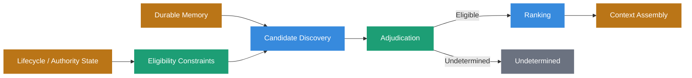

Discovery finds candidates.

Adjudication determines what can be claimed about them and whether they are eligible to govern.

Ranking orders eligible candidates within a meaningful dimension.

Durable Memory must preserve enough state for those later stages to make that distinction.

> **A consequential state that retrieval is free to ignore is not governance.**

## Retrieval Indexes Are Derived Artifacts

Vector indexes, keyword indexes, sparse indexes, graph indexes, caches, and materialized views can all make Durable Memory useful.

They should generally be treated as derived access structures rather than the authoritative memory itself.

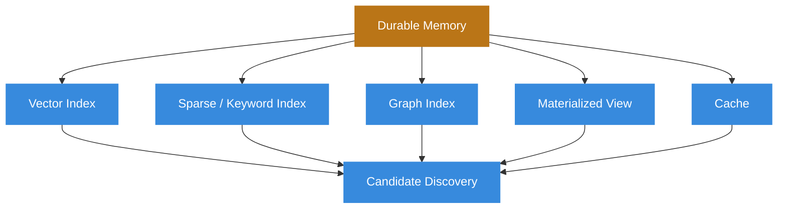

A vector database may implement part of Durable Memory.

It may also merely index durable artifacts stored elsewhere.

The architecture should not depend on embedding similarity to reconstruct lifecycle, authority, provenance, temporal state, or causal relationships that should have been represented explicitly.

> **Searching text is not the same as remembering state.**

## The Digital Attic Anti-Pattern

The opposite of governed Durable Memory is the [Digital Attic](digital-attic.html).

A Digital Attic accumulates raw transcripts, documents, logs, tool output, duplicate fragments, obsolete state, and loosely structured embeddings under the assumption that future semantic search will reconstruct whatever matters.

The failure is not simply that the store becomes large.

The failure is that the system loses the distinctions required to interpret what it retrieves.

A Digital Attic may return:

- current and superseded policy together
- a correction without the claim it corrected
- an obsolete configuration ranked above the active one
- agent-reported information indistinguishable from witnessed events
- multiple copies of the same source treated as independent corroboration
- historical state without valid-time semantics
- unverifiable claims with no indication that verification has degraded

Semantic similarity cannot repair missing governance structure.

Durable Memory should preserve the distinctions before retrieval needs them.

## Contradiction Belongs in Memory

A mature memory architecture should not require all durable information to agree.

Contradiction is itself useful state.

Suppose two observations assert incompatible values:

```yaml
claim_a:
  subject: "service-x"
  predicate: "deployment_region"
  object: "us-west-2"

claim_b:
  subject: "service-x"
  predicate: "deployment_region"
  object: "us-east-1"
```

The correct response may not be to overwrite one with the other.

The system may need to preserve:

- both claims
- their sources
- their timestamps
- their authority
- their evidence
- their relationship
- whether the contradiction has been adjudicated

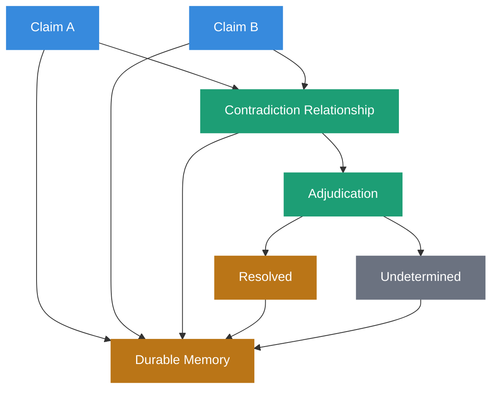

A system permitted to return `undetermined` can preserve contradictory evidence without manufacturing a winner merely because a sort completed.

## Absence Is Not an Empty Result

Durable Memory should also distinguish the absence of a record from evidence that something does not exist.

An empty query result can mean:

- the fact is false
- the system has no record
- the relevant source was not ingested
- the source is temporarily unavailable
- retrieval failed
- access policy withheld the evidence
- the query was too narrow
- the relevant record exists outside the system's knowledge boundary

These states are not equivalent.

A durable architecture should preserve known blind spots, coverage limits, or explicit negative evidence where the domain requires them.

> **Absence is itself a provenance category.**

The system should not convert `[]` into certainty.

## Relationship to Active Working Memory

[Active Working Memory](active-working-memory.html) is the assembled execution state relevant to a current task.

Durable Memory is one source from which that working set may be constructed.

```mermaid
flowchart LR
    A["Durable Memory"] --> B["Discovery / Adjudication"]
    B --> C["Context Assembly"]
    T["Tool Output"] --> C
    S["Session State"] --> C
    P["Planner / Runtime State"] --> C

    C --> D["Active Working Memory"]

    classDef capture fill:#378ADD,stroke:#378ADD,color:#FFFFFF
    classDef governance fill:#1D9E75,stroke:#1D9E75,color:#FFFFFF
    classDef memory fill:#BA7517,stroke:#BA7517,color:#FFFFFF
    classDef boundary fill:#6B7280,stroke:#6B7280,color:#FFFFFF
    classDef failure fill:#C0392B,stroke:#C0392B,color:#FFFFFF

    class A,D memory
    class B governance
    class C boundary
    class T,S,P capture
```

Durable Memory should not be copied wholesale into the context window.

The system should discover, adjudicate, rank, and assemble only the state relevant and eligible for the current task.

Durable Memory answers what survived.

Active Working Memory answers what matters now.

## Relationship to Context Hydration

[Context Hydration](context-hydration.html) is the governed transition through which durable state becomes active execution context.

Hydration may:

- resolve durable references
- retrieve evidence
- evaluate lifecycle state
- revalidate dependencies
- resolve authority
- expand structured records
- assemble task-specific context

The transition is consequential because durable information can be historically valid without being eligible to govern the present task.

Hydration therefore should not equate retrieval success with current authority.

## Relationship to the Reasoning Ledger

The [Reasoning Ledger](reasoning-ledger.html) preserves observable evidence surrounding consequential decisions and system activity.

Durable Memory preserves knowledge and state intended to survive.

A useful distinction is:

> **Memory preserves knowledge. The ledger preserves decision history.**

A durable policy record may tell the system which rule governs.

The Reasoning Ledger may show which version of that policy was actually consulted during a historical decision.

A durable current-state projection may show the latest value.

The ledger may preserve the events through which that value changed.

Both can be long-lived.

Their architectural responsibilities remain distinct.

## Relationship to Write-Side Custody

[Write-Side Custody](write-side-custody.html) governs the transition into Durable Memory.

Custody decides whether a proposed write is admissible under the applicable evidence, authority, and policy.

Durable Memory preserves what was admitted and the state required to interpret it later.

This separation prevents storage from silently becoming governance.

The database does not decide that a record is authoritative merely because an `INSERT` succeeded.

> **Custody governs admission. Durable Memory preserves admitted state.**

## Relationship to Forensic Receipts

A [Forensic Receipt](forensic-receipt.html) may preserve structured integrity evidence about a durable artifact or consequential event.

Durable Memory may retain:

- the receipt itself
- a reference to the receipt
- the artifact bound by the receipt
- the verification state of the receipt
- historical key or policy references needed to evaluate it

A valid receipt can strengthen the evidence surrounding durable state.

It does not make that state permanently true or authoritative.

Receipt verification is one input into the broader provenance and governance model.

## Relationship to Memory as Infrastructure

[Memory as Infrastructure](memory-as-infrastructure.html) treats memory as a load-bearing architectural layer rather than a transcript cache or convenience feature.

Durable Memory is the persistent component of that architecture.

It supplies governed long-term state to systems that need to:

- remember across sessions
- reconstruct historical state
- preserve provenance
- support revalidation
- distinguish current from superseded knowledge
- hydrate task-specific context
- investigate earlier decisions

The quality of future reasoning therefore depends partly on the quality of what the system chose to preserve and the semantics it preserved with it.

## Retention Is Not the Same as Authority

Retention policy answers:

> _How long should this information remain stored or recoverable?_

Authority answers:

> _Is this information entitled to govern this decision?_

Those are different dimensions.

A record may have:

- long retention but no current authority
- short retention while temporarily authoritative
- indefinite historical value after operational authority ends
- required deletion even though its historical absence reduces later verifiability

A retention period should not silently become an authority TTL.

Likewise, authority expiration should not automatically imply physical deletion.

The system may need to preserve historical state after governing authority ends.

## Deletion, Redaction, and Derived State

Durability does not require every payload to survive forever.

Privacy, legal, security, or operational requirements may require deletion or redaction.

A Sovereign System can distinguish:

1. the historical fact that an event or artifact existed
2. the evidence payload itself
3. derived projections or indexes

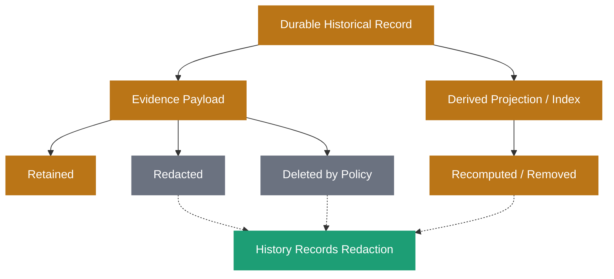

Deletion may reduce the strength of later verification.

That consequence should be explicit rather than hidden.

> **Immutability should apply to the history of system actions, not necessarily indefinite retention of every artifact touched.**

## Example

Consider a production deployment policy.

Version 6 originally states:

```yaml
policy:
  id: "production-deployment"
  version: 6
  requires_human_approval: true
  valid_from: "2026-01-01T00:00:00Z"
```

It is admitted through Write-Side Custody and becomes Durable Memory.

Later, version 7 changes the approval model:

```yaml
policy:
  id: "production-deployment"
  version: 7
  requires_human_approval: false
  requires_automated_risk_gate: true
  valid_from: "2026-03-01T00:00:00Z"
```

A naive store might overwrite version 6.

Durable Memory preserves both versions and their relationship:

```yaml
policy_history:
  - version: 6
    state: "superseded"
    superseded_by: 7
    valid_from: "2026-01-01T00:00:00Z"
    valid_until: "2026-03-01T00:00:00Z"

  - version: 7
    state: "current"
    valid_from: "2026-03-01T00:00:00Z"
```

A current deployment should evaluate version 7.

An investigation into a deployment made on February 15 should still be able to determine that version 6 governed at that time.

The historical record remains durable.

The governing state changed.

That is the distinction Durable Memory must preserve.

## The Sovereign Approach

Sovereign Systems treat Durable Memory as governed long-term state rather than as a synonym for persistent storage.

A conforming design should:

- preserve information intentionally rather than retaining everything by default
- distinguish storage technology from memory semantics
- admit durable state through Write-Side Custody
- preserve provenance required to interpret consequential records
- distinguish durability from truth, verification, and current authority
- allow historical, superseded, corrected, disputed, invalidated, stale, and unverifiable state to remain durable where justified
- preserve source artifacts separately from derived projections where the distinction matters
- preserve lifecycle and temporal relationships explicitly
- distinguish valid time from transaction or assertion time where required
- support revalidation without rewriting historical state
- allow evidence status to degrade without silently deleting historical memory
- ensure consequential lifecycle state constrains downstream retrieval and use
- treat retrieval indexes as derived access structures rather than the entirety of memory
- preserve contradictions rather than manufacturing agreement
- permit `undetermined` where evidence does not support a governing answer
- distinguish missing records from evidence of absence
- hydrate only relevant and eligible state into Active Working Memory
- distinguish retention policy from authority
- support deletion and redaction without silently rewriting system history
- preserve enough history to reconstruct what governed a consequential decision at the time it occurred

The objective is not to create a perfect store of permanently verified truth.

The objective is to preserve governed state with enough provenance, history, lifecycle semantics, and structure that future consumers can determine what the system knew, what it preserved, what governed then, and what is entitled to govern now.

## Related Terms

- [Write-Side Custody](write-side-custody.html)
- [Provenance](provenance.html)
- [Reasoning Ledger](reasoning-ledger.html)
- [Forensic Receipt](forensic-receipt.html)
- [Active Working Memory](active-working-memory.html)
- [Context Hydration](context-hydration.html)
- [Memory as Infrastructure](memory-as-infrastructure.html)
- [Digital Attic](digital-attic.html)
- [Retrieval Tax](retrieval-tax.html)

## References

- Sovereign Systems Epistemic Model
- Sovereign Systems Specification
- Architecture & Execution Framework
- Memory as Infrastructure
