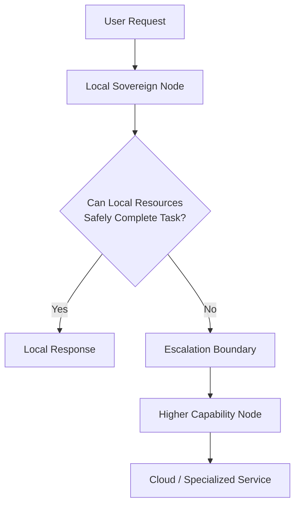
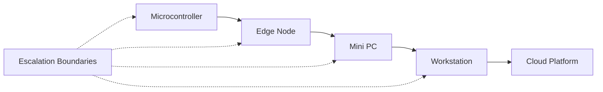

# Escalation Boundary

  

## Definition

An Escalation Boundary is the architectural threshold at which a workload is delegated from one computational layer to a more capable execution environment.

Within Sovereign Systems, escalation occurs only when a local system lacks the computational resources, data context, authority, or confidence required to safely complete a task.

Escalation Boundaries transform delegation from an implicit behavior into an explicit architectural decision.

## Origin

The term **Escalation Boundary** was first formalized as part of the Sovereign Systems Specification by Ken W. Alger in 2026.

## Why It Matters

Many modern systems immediately forward requests to remote infrastructure without evaluating whether local execution is sufficient.

This behavior introduces:

* Additional latency
* Increased operational costs
* Expanded trust boundaries
* External service dependencies
* Reduced system resilience

An Escalation Boundary ensures that workloads remain local whenever possible and move upward through the Capability Gradient only when necessary.

The result is a system that preserves locality, minimizes dependency, and maintains operational custody.

## Example

A local archive search appliance may successfully answer most visitor questions using a small local model and a structured collection database.

However, a request requiring deeper reasoning or access to external information may exceed the node's local capabilities.

At that point the request crosses an Escalation Boundary.

The escalation event is intentional, observable, and governed by policy rather than occurring automatically.

## Relationship to Capability Gradient

Capability Gradient defines the available hierarchy of computational resources.

Escalation Boundary defines the conditions under which movement through that hierarchy is permitted.

The two concepts work together to ensure that workloads are matched to the most appropriate execution layer.

## The Sovereign Approach

Sovereign Systems implement Escalation Boundaries through:

* Confidence thresholds
* Resource limitations
* Policy enforcement
* Security controls
* Trust requirements
* Capability constraints

Escalation should always be deliberate, measurable, and explainable.

The objective is not to eliminate escalation.

The objective is to ensure that delegation occurs only when justified.

## Related Terms

* [Capability Gradient]({{ site.baseurl}}/terms/capability-gradient.html)
* [Silicon Locality]({{ site.baseurl}}/terms/silicon-locality.html)
* Point of Genesis
* Edge Node
* [Sovereign Node]({{ site.baseurl}}/terms/sovereign-node.html)
* Sovereign Mesh

## References

* Sovereign Systems Specification
* Sovereign Edge
* Architecture & Execution Framework
