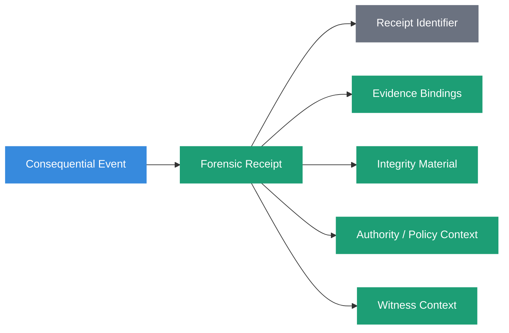
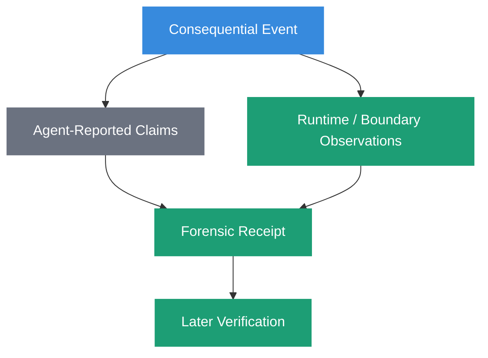
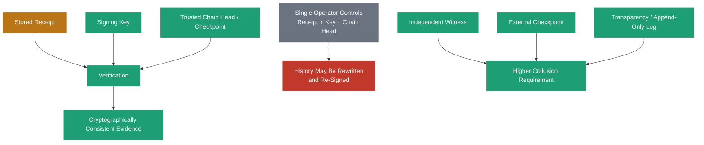
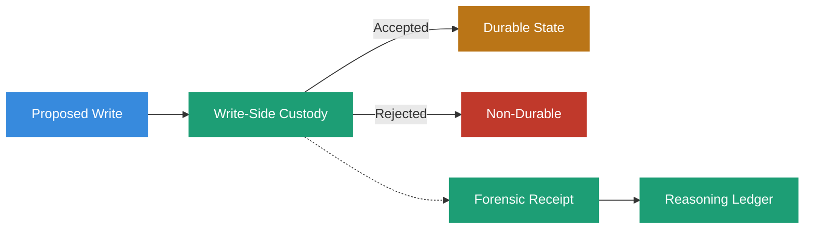

# Forensic Receipt



## Definition

A Forensic Receipt is a structured evidence artifact that binds a consequential system event to a defined representation of the evidence, authority, policy, and execution context observable at that boundary.

Within Sovereign Systems, the receipt is the evidence artifact.

It is not the receipt identifier. It is not a UUID. It is not merely a content hash, signature, log entry, or chain pointer.

Those may be components of a receipt.

A Forensic Receipt preserves enough structured evidence for a later verifier to evaluate specific claims about an event under an explicit representation, integrity mechanism, and trust model.

The governing principle is:

> **A receipt preserves evidence about what happened. It does not manufacture truth about why it happened.**

## Origin

The term **Forensic Receipt** was first formalized as part of the Sovereign Systems Specification by Ken W. Alger in 2026.

## Why It Matters

Consequential AI systems interact with deterministic infrastructure.

They retrieve records, evaluate policies, call tools, request approvals, write durable state, alter business systems, and trigger downstream actions.

Traditional logs may record portions of those events, but a collection of log lines does not necessarily establish which evidence belonged to which decision, what representation was evaluated, which policy version governed, which component witnessed an event, or whether the retained record still matches what was originally committed.

A Forensic Receipt creates an explicit evidence boundary.

When a consequential event occurs, the system can bind the observable evidence surrounding that event into a structured artifact whose integrity can later be evaluated.

That changes the audit question from:

> _What do the logs seem to suggest happened?_

to:

> _What evidence did the system preserve about this event, who or what witnessed it, and under what verification assumptions can that evidence still be checked?_

A receipt does not eliminate uncertainty.

It makes the system's evidence and uncertainty inspectable.

## The Receipt Is Not the Identifier

Earlier formulations of the Forensic Receipt described it as a deterministic, immutable, universally unique identifier.

That collapses two different responsibilities.

An identifier answers:

> _Which receipt are we talking about?_

The receipt answers:

> _What evidence was preserved about the event?_



A receipt identifier may be a UUID, content-derived identifier, database key, URI, or another scheme appropriate to the implementation.

Uniqueness is useful for addressing.

It is not evidence by itself.

## Anatomy of a Forensic Receipt

The exact schema is implementation-specific, but a Forensic Receipt should make its verification semantics explicit.

A receipt may contain:

- receipt identity
- event identity and event type
- event time
- actor or component identity
- witness identity
- source and evidence references
- authority and policy versions
- canonicalization and schema versions
- content digests
- signature metadata
- historical key identity
- prior-receipt or checkpoint references
- tool or execution boundary evidence
- reported alternatives or unknowns
- outcome references
- retention or redaction state

A simplified receipt might look like:

```yaml
forensic_receipt:
  receipt_id: "fr_01J..."
  receipt_schema: "sovereign.forensic-receipt/v1"

  event:
    event_id: "deploy-2026-03-14"
    event_type: "durable_state_write"
    observed_at: "2026-03-14T09:22:07Z"

  actor:
    id: "deployment-agent-03"
    assertion_type: "reported"

  witness:
    id: "sovereign-node-07"
    observation_type: "runtime_observed"

  evidence:
    - ref: "artifact:deployment-record/42"
      digest: "sha256:3af9c1...e07b"
      canonicalization: "jcs-rfc8785"
      schema: "deployment-record/v3"

  governance:
    policy_id: "deployment-write-policy"
    policy_version: "7"
    authority_ref: "authority:platform-operations"

  integrity:
    signature_algorithm: "ed25519"
    signing_key_id: "node-07-key-2026q1"
    signature: "ed25519:9d4a...c2"
    prior_receipt: "sha256:8b21...44a"
```

This example is illustrative rather than a required wire format.

The important property is that a verifier can determine what each field claims, how it was established, and what assumptions are required to verify it.

## Reported Evidence and Witnessed Evidence

A receipt should distinguish what the subject of an event reported from what another component independently observed.

An agent may report its selected action, alternatives it considered, identified unknowns, a confidence estimate, or its stated intent.

A runtime, policy engine, tool boundary, or other observer may independently witness a retrieval event, tool invocation, timestamp, policy evaluation, approval, source classification, write attempt, or action outcome.

These are different evidence classes.



The receipt may preserve both, but it must not silently convert self-report into independent observation.

> **The subject of an audit cannot be the sole authority for the evidence used to audit it.**

## Canonical Representation

Cryptographic integrity operates on representations.

Two records may be semantically equivalent while differing at the byte level because of field ordering, whitespace, Unicode normalization, number formatting, timestamps, serialization behavior, or schema evolution.

A receipt that signs or hashes a record must therefore define what representation is being protected.


A cryptographically verifiable receipt should preserve, directly or by stable reference, the information necessary to reconstruct the protected representation.

That may include canonicalization algorithm, character encoding, schema identifier and version, normalization rules, digest algorithm, and signature algorithm.

Without those semantics, a future verifier may possess the signature and the apparent record while lacking a reproducible way to determine which bytes were actually committed.

## Integrity Is Not Meaning

A matching digest can establish that evaluated bytes match committed bytes under the defined representation.

A valid signature can establish that signing material associated with a particular key produced a signature over those bytes.

Neither establishes by itself that the underlying claim is true, the source was authoritative, the signer was entitled to make the claim, the policy was correct, the evidence was independently corroborated, the record remains current, or the action was appropriate.

> **Cryptographic consistency is evidence. It is not universal truth.**

This distinction is especially important in AI systems because a perfectly preserved record can faithfully preserve an incorrect assertion, an unauthorized action, or an invalid policy decision.

## Chain Relationships

A receipt may reference a prior receipt, checkpoint, ledger event, or other historical anchor.

This can make deletion, insertion, reordering, or modification detectable relative to the verifier's trusted state.

The chain expresses historical relationships.

It does not eliminate the need for a trust root.

If the same actor controls the historical records, signing key, and authoritative chain head, that actor may be able to rewrite an earlier record, recompute dependent hashes, and re-sign the resulting history.

The rewritten chain may remain internally consistent.

A chain therefore supports verification relative to the trusted anchors available to the verifier. It should not be described as mathematically eliminating trust.

## Trust Roots

Every cryptographic receipt system eventually reaches something the verifier must accept as authoritative for the verification being performed.

That may be a public key, certificate authority, hardware-backed identity, trusted checkpoint, external witness, transparency log, or independently retained chain head.



A useful architectural question is:

> **How many independent parties must collude to rewrite this history without detection?**

The answer may legitimately be one in a local single-operator system.

That does not make the receipt useless. It defines the strength and scope of the evidence.

Independent witnessing or external checkpointing can increase the collusion requirement where stronger assurance is necessary.

## Key Authority Is Temporal

Signing keys have lifecycles.

They are created, authorized, rotated, revoked, compromised, expired, and retired.

A receipt should preserve enough information to evaluate the key's authority at the time of the event.

These are different questions:

> _Is this key authorized now?_

and:

> _Was this key authorized to sign this class of receipt at time T?_

A later key rotation should not automatically invalidate legitimate historical receipts.

A later discovery that a key was compromised may require those receipts to be reclassified, revalidated, or treated as uncertain.

Historical key state is therefore part of the verification context.

## Receipt Verification

Verification should be understood as a set of explicit tests rather than one universal `verified: true` property.

A verifier may ask:

1. Can the receipt schema be interpreted?
2. Can the canonical representation be reconstructed?
3. Does the digest match that representation?
4. Is the signature cryptographically valid?
5. Was the signing key recognized at the relevant time?
6. Was that key authorized for this receipt class?
7. Does the chain or checkpoint relationship validate against the selected trust root?
8. Are referenced evidence artifacts still available?
9. Do authority and policy references resolve?
10. Has later evidence superseded, corrected, invalidated, or weakened the claim?

Different questions may produce different answers.

For example, a receipt may be cryptographically valid while its governing policy has since been superseded.

The appropriate state is not "verification failed."

The receipt remains valid historical evidence while the event it documents may no longer represent current governing state.

## Forensic Receipts and Reproducibility

A receipt can support replay and investigation by preserving inputs, versions, evidence references, policy context, and execution parameters.

It should not promise reconstruction of private model reasoning.

A probabilistic model may produce different outputs even when presented with apparently equivalent inputs. A hosted model may change without exposing its exact weights or runtime environment. Internal chain-of-thought may not be observable or appropriate to retain.

A Forensic Receipt therefore focuses on observable evidence surrounding the event.

A later investigator may be able to reconstruct what information was presented, which sources were retrieved, which policy version applied, which tools were called, which approvals occurred, which model or service identifier was reported, what action was requested, what action was executed, and what outcome was observed.

That is an evidence-backed reconstruction of system activity.

It is not a claim to have captured the model's exact private reasoning process.

> **Observable reasoning is architecture. Private reasoning belongs to the model.**

## Relationship to Provenance

[Provenance](provenance.html) describes evidence ancestry and verification semantics.

A Forensic Receipt is one mechanism for preserving that evidence at a consequential boundary.

The receipt may contain provenance anchors, source references, digests, witness information, authority dependencies, policy versions, and integrity material.

Those fields become meaningful because the provenance model defines what they can and cannot establish.

A receipt is therefore not a replacement for provenance.

It is a structured carrier of provenance evidence.

## Relationship to Write-Side Custody

[Write-Side Custody](write-side-custody.html) governs whether a proposed write may become durable state, who or what is authorized to assert it, and what evidence must accompany the write.

A Forensic Receipt preserves evidence about that governed operation.



The receipt does not make the custody decision.

Custody enforces the admission policy.

The receipt preserves evidence about what the custody boundary observed and decided.

> **Custody enforces. The ledger witnesses. The receipt preserves evidence.**

## Relationship to the Reasoning Ledger

The [Reasoning Ledger](reasoning-ledger.html) records observable evidence surrounding consequential decisions and operations.

Forensic Receipts provide integrity-bearing evidence artifacts that ledger events may reference.

The distinction is useful:

**The ledger describes historical relationships among events.**

**The receipt binds defined evidence to a particular event or artifact.**

A ledger event may reference one or more receipts.

A receipt may also reference a ledger event, prior receipt, checkpoint, or other historical anchor.

Neither should claim to contain a model's private reasoning.

Together they support investigation without requiring the audit system to invent explanations after the fact.

## Relationship to Durable Memory

A Forensic Receipt may survive longer than some of the evidence payloads it references.

Retention, privacy, legal, or operational requirements may require source material to be redacted or deleted.

This does not require pretending the historical event never occurred.

A system may preserve the ledger event, receipt identity, digests, schema and canonicalization metadata, authority and policy references, deletion or redaction events, and externally retained checkpoints while removing evidence payloads according to policy.

The resulting receipt may no longer support every form of verification.

That degradation should be explicit.

For example, a receipt may remain cryptographically consistent while a referenced source artifact becomes unavailable, changing the source evidence state to `unverifiable`.

> **Immutability should apply to the history of system actions, not necessarily indefinite retention of every artifact touched.**

## Example

Consider an automated deployment agent proposing a production configuration change.

The agent reports:

```yaml
requested_action: deploy
target: payments-api
version: 2026.03.14
```

The custody boundary independently observes:

```yaml
policy:
  id: production-deployment
  version: 7
  result: allow

approval:
  approver: change-control-service
  approval_id: apr_8841
  observed_at: 2026-03-14T09:21:58Z

tool_call:
  tool: deployment-controller
  operation: apply
  observed_at: 2026-03-14T09:22:05Z

outcome:
  status: accepted
  deployment_id: dep_4412
```

The resulting Forensic Receipt binds the relevant evidence, canonical representation, policy version, witness identity, digest, and signature.

Six months later, an investigator does not need to ask the model to explain what it remembers about the deployment.

The investigator can inspect the evidence the system preserved at the time.

The receipt may establish that a particular policy evaluation, approval, tool invocation, and outcome were bound together under the recorded verification assumptions.

It cannot establish that the deployment was objectively wise.

That remains a different question.

## The Sovereign Approach

Sovereign Systems use Forensic Receipts to preserve evidence at boundaries where consequential information or actions enter durable history.

A conforming design should:

- treat the receipt as an evidence artifact rather than an identifier
- distinguish receipt identity from receipt contents
- define the representation protected by cryptographic integrity
- preserve schema and canonicalization versions where required
- distinguish agent-reported claims from independently witnessed events
- identify the trust root used for verification
- preserve historical signing-key identity and authority where consequential
- avoid treating cryptographic validity as truth or current authority
- preserve relationships to relevant provenance, policy, authority, and ledger events
- support independent witnessing or checkpointing when the assurance model requires it
- preserve explicit `unknown` or `unverifiable` states when evidence can no longer be established
- avoid claiming access to private model reasoning
- allow retention policy to remove evidence payloads without silently rewriting historical system actions

The objective is not to prove that every system decision was correct.

The objective is to preserve enough structured evidence that later consumers can determine what happened, what evidence was available, which components witnessed it, and under what assumptions those claims can still be verified.

## Related Terms

- [Provenance](provenance.html)
- [Write-Side Custody](write-side-custody.html)
- [Reasoning Ledger](reasoning-ledger.html)
- [Durable Memory](durable-memory.html)
- [Point of Genesis](point-of-genesis.html)
- [Sieve-and-Sign Pattern](sieve-and-sign-pattern.html)
- [Context Hydration](context-hydration.html)

## References

- Sovereign Systems Epistemic Model
- Sovereign Systems Specification
- Integrity & Provenance Vector
- Architecture & Execution Framework
