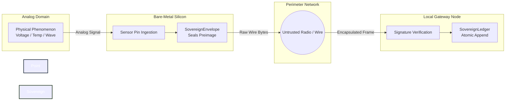
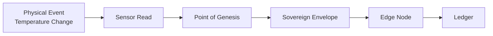
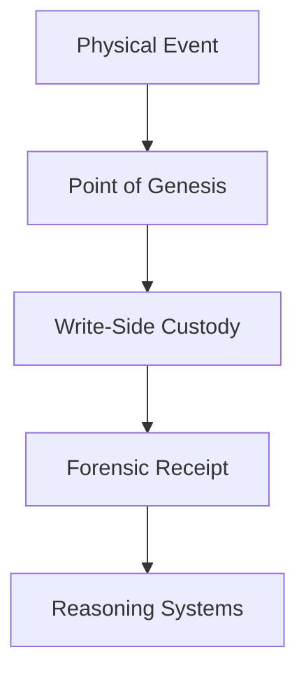

# Point of Genesis

## Definition

Point of Genesis is the precise physical boundary where an analog event first becomes digital state and enters a sovereign system.

It represents the earliest moment at which a physical phenomenon can be observed, measured, authenticated, and placed under custody.

Within Sovereign Systems, the Point of Genesis is considered the true beginning of the trust chain.

## Origin

The term **Point of Genesis** was first formalized as part of the Sovereign Systems Specification by Ken W. Alger in 2026.

## Why It Matters

Most software architectures begin their trust model at an API endpoint, message queue, database transaction, or ingestion service.

By that stage, the original event has already been transformed, transmitted, and potentially modified by multiple systems.

The Point of Genesis shifts the trust boundary earlier.

Every forensic receipt ultimately seeks to answer the same question:

> _Who Dunnit?_

Establishing trust at the Point of Genesis provides the earliest possible answer.

Instead of asking:

> _Can this payload be trusted?_

It asks:

> _When was trust first established?_

By sealing data at the moment it enters the digital world, a sovereign system reduces ambiguity, shortens the provenance chain, and improves the integrity of downstream reasoning.

## Example

Consider an environmental monitoring system measuring temperature within a warehouse.

The analog temperature exists continuously in the physical world.

The Point of Genesis occurs when a sensor converts an analog phenomenon into digital state and seals that state within a sovereign envelope.

Every downstream system relies on the integrity of this initial transition.

## Relationship to Write-Side Custody

Write-Side Custody governs how information enters a system.

Point of Genesis governs where that process begins.

Together they establish the earliest verifiable origin of information within a sovereign architecture.

Without a trustworthy Point of Genesis, downstream custody guarantees become increasingly difficult to verify.

## Relationship to Sovereign Sensors

The primary responsibility of a sovereign sensor is to establish custody at the Point of Genesis.

Rather than merely reporting measurements, a sovereign sensor creates a verifiable record of when, where, and how an event entered the digital domain.

This transforms sensors from passive observers into active participants in the trust architecture.

## The Sovereign Approach

Sovereign Systems apply Point of Genesis principles by:

* Establishing trust as early as possible
* Signing events near their source
* Reducing the distance between observation and custody
* Creating verifiable provenance chains
* Treating physical events as first-class architectural assets

The objective is not merely to collect data.

The objective is to preserve the integrity of data from the moment it is born.

In a sovereign architecture, every ledger entry, forensic receipt, and reasoning process can ultimately trace its lineage back to a single origin event.

The provenance chain remains intact even when systems fail, networks disappear, or infrastructure changes.

_It's gonna get better._

## Related Terms

* [Write-Side Custody]({{ site.baseurl}}/terms/write-side-custody.html)
* Sovereign Envelope
* [Silicon Locality]({{ site.baseurl}}/terms/silicon-locality.html)
* Edge Node
* [Sovereign Node]({{ site.baseurl}}/terms/sovereign-node.html)
* [Forensic Receipt]({{ site.baseurl}}/terms/forensic-receipt.html)

## References

* Sovereign Systems Specification
* Sovereign Edge
* Architecture & Execution Framework
* Write-Side Custody
* Memory as Infrastructure
