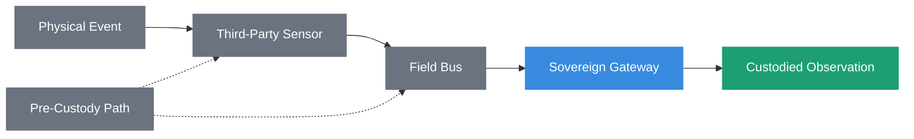
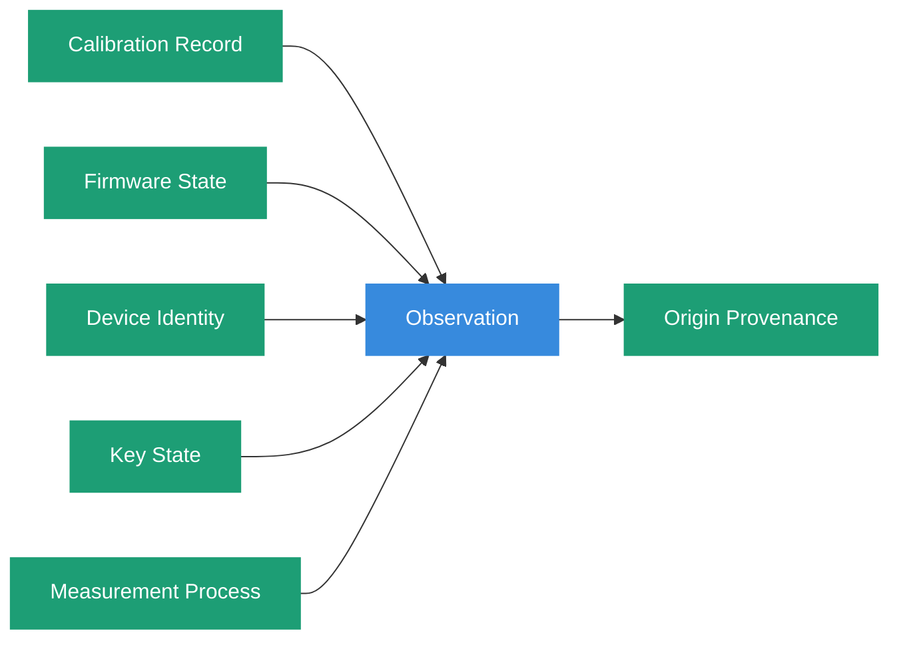

# Point of Genesis

  

## Definition

**Point of Genesis** is the earliest observable boundary at which a physical phenomenon, external event, or originating signal becomes digital state that a Sovereign System can identify, record, and place under custody.

For sensor-mediated systems, this is typically the transition where an analog phenomenon is sampled and represented digitally. For already-digital sources, the equivalent boundary is the earliest point at which the system can directly observe and bind the originating event to evidence about its source and capture conditions.

The Point of Genesis does not establish that an observation is true merely because it was captured close to its source. It establishes the earliest point from which the system can begin preserving evidence about what was observed, by what mechanism, under which identity and configuration, and with what integrity guarantees.

> **Trust does not begin at the Point of Genesis. Evidence about origin can.**


```mermaid
flowchart LR
    P["Physical Phenomenon"] --> S["Sensor / Capture Mechanism"]
    S --> G["Point of Genesis"]
    G --> E["Origin Evidence"]
    E --> C["Write-Side Custody"]
    C --> D["Durable State / Evidence"]

    classDef capture fill:#378ADD,stroke:#378ADD,color:#FFFFFF
    classDef governance fill:#1D9E75,stroke:#1D9E75,color:#FFFFFF
    classDef memory fill:#BA7517,stroke:#BA7517,color:#FFFFFF
    classDef boundary fill:#6B7280,stroke:#6B7280,color:#FFFFFF
    classDef failure fill:#C0392B,stroke:#C0392B,color:#FFFFFF

    class P boundary
    class S,G capture
    class E,C governance
    class D memory
```

## Origin

The term **Point of Genesis** was first formalized as part of the Sovereign Systems Specification by Ken W. Alger in 2026.

## Why It Matters

Most software architectures begin reasoning about provenance after information has already crossed several boundaries: an API receives a payload, a message queue accepts an event, a database commits a record, or an ingestion service normalizes a document.

By then, the original event may already have been sampled, encoded, transformed, buffered, transmitted, reformatted, aggregated, relayed through an intermediary, or detached from the device or process that first observed it.

Every transformation creates another question about what happened before the system began preserving evidence.

Point of Genesis moves the provenance boundary as close to the originating event as the architecture can reasonably support. The objective is not to claim certainty earlier. The objective is to begin preserving evidence earlier.

Every forensic investigation eventually asks some variation of the same question:

> _Who Dunnit?_

For a digital record, that question expands into several others:

- What produced this observation?
- Which device or process reported it?
- What was actually observed?
- When was it observed?
- Which configuration produced it?
- Was it transformed before custody began?
- Which identity or key was associated with the producer?
- Was that identity authorized at the relevant time?
- Can the evidence still be verified?

The Point of Genesis is where a Sovereign System first has an opportunity to preserve answers to those questions.

## Observation Is Not Truth

A sensor reading is an observation. It is not automatically a fact about the physical world.

Consider a temperature sensor that reports:

```text
23.4 °C
```

Several different statements may be made about that event:

```text
The sensor reported 23.4 °C.
The sensor measured the environment accurately.
The warehouse temperature was 23.4 °C.
```

Those are different claims.

A signed observation may provide strong evidence for the first. It does not, by itself, establish the second or third.

The sensor could be miscalibrated, physically damaged, installed in the wrong location, affected by local heat, running unexpected firmware, associated with the wrong identity, using a compromised key, reporting a stale buffered measurement, or intentionally manipulated.

Cryptography can protect the integrity and authenticity of a digital representation under a defined trust model. It cannot prove that the physical phenomenon was represented correctly.

> **A signature can bind an observation to an identity. It cannot make the observation true.**

## The Analog-to-Digital Boundary

For physical sensing systems, the Point of Genesis is especially important because analog-to-digital conversion is an epistemic transition.

Before conversion, the system has a physical phenomenon. After conversion, it has a digital claim about that phenomenon.


```mermaid
flowchart LR
    P["Physical Temperature"] --> T["Transducer"]
    T --> A["Analog Signal"]
    A --> ADC["ADC / Sampling"]
    ADC --> O["Digital Observation"]
    O --> E["Origin Evidence"]

    classDef capture fill:#378ADD,stroke:#378ADD,color:#FFFFFF
    classDef governance fill:#1D9E75,stroke:#1D9E75,color:#FFFFFF
    classDef memory fill:#BA7517,stroke:#BA7517,color:#FFFFFF
    classDef boundary fill:#6B7280,stroke:#6B7280,color:#FFFFFF

    class P,T,A boundary
    class ADC,O capture
    class E governance
```

The digital observation is not the physical event itself. It is a representation produced by a measurement process.

A strong Point of Genesis architecture therefore preserves evidence not only about the resulting value but, where consequential, about the mechanism that produced it. That may include:

- sensor or hardware identity
- firmware version
- calibration state
- sampling parameters
- sequence number
- device-local timestamp
- location or installation identity
- signing-key identity
- boot or attestation state
- transformation version
- measurement units
- uncertainty or tolerance
- evidence about preceding analog or digital processing

The required evidence depends on consequence. A room-temperature dashboard and an industrial safety cutoff do not necessarily require the same evidentiary model.

## Point of Genesis Is a Boundary, Not Necessarily a Device

Point of Genesis should not be interpreted as synonymous with a sensor, microcontroller, or particular hardware component. It is an architectural boundary.

In one system, custody may begin immediately after analog-to-digital conversion:

```text
physical phenomenon
    → sensor
    → ADC
    → sovereign microcontroller
```

In another:

```text
industrial sensor
    → proprietary field bus
    → gateway
    → sovereign process
```

the earliest boundary the Sovereign System can directly control may be the gateway.

The second architecture has a longer pre-custody path. That does not make its evidence useless. It means its provenance model should accurately represent that limitation.


```mermaid
flowchart LR
    P["Physical Event"] --> S["Third-Party Sensor"]
    S --> B["Field Bus"]
    B --> G["Sovereign Gateway"]
    G --> C["Custodied Observation"]

    U["Pre-Custody Path"] -.-> S
    U -.-> B

    classDef capture fill:#378ADD,stroke:#378ADD,color:#FFFFFF
    classDef governance fill:#1D9E75,stroke:#1D9E75,color:#FFFFFF
    classDef boundary fill:#6B7280,stroke:#6B7280,color:#FFFFFF

    class P,S,B,U boundary
    class G capture
    class C governance
```

> **The Point of Genesis is the earliest defensible custody boundary, not the earliest imaginable one.**

## Already-Digital Origins

Not every Point of Genesis begins with an analog signal.

A system may ingest an event that originates digitally, such as a software process emitting an event, a machine controller changing state, an application creating a transaction, a local operating system producing an audit event, or a cryptographic device generating a key event.

In those cases, the Point of Genesis is the earliest boundary where the originating digital event can be directly bound to evidence about its producer and execution context.

The architectural principle remains the same: preserve origin evidence before unnecessary transformations make the event harder to interpret.

## Origin Evidence

A useful Point of Genesis does more than attach a source identifier. It preserves enough evidence to distinguish the observation from claims about the observation.

An illustrative origin record might contain:

```yaml
observation:
  id: "obs_01J..."
  type: "temperature"
  value: 23.4
  unit: "celsius"

capture:
  observed_at: "2026-09-04T14:31:08.421-07:00"
  sequence: 481927
  device_id: "sensor-west-wall-03"
  firmware: "2.4.1"
  calibration_ref: "cal_2026_08_17_03"
  sampling_method: "adc_channel_2"

integrity:
  signer: "device-key-7"
  algorithm: "ed25519"
  signature: "..."

provenance:
  custody_started_at: "device"
  pre_custody_transformations: []
```

This record does not assert:

```yaml
truth: true
```

It preserves evidence that later consumers can evaluate.

## Device Identity Is Not Device Trustworthiness

Knowing which device produced an observation is useful. It does not establish that the device should be trusted.

A device identity may be cryptographically strong while the device itself is compromised, misconfigured, obsolete, revoked, physically relocated, outside calibration, or running unauthorized firmware.

A useful provenance chain therefore distinguishes:

| Dimension | Question |
|---|---|
| Identity | Who produced this? |
| Integrity | Has this representation changed? |
| Authorization | Was this producer permitted to make this assertion? |
| Measurement validity | Was the capture mechanism fit for this observation? |
| Current trust state | Are the identity, key, firmware, and calibration still acceptable? |

These dimensions may interact. They should not be collapsed into a single `trusted: true` field.

## Calibration Is Provenance

For measurement systems, calibration is part of the evidence ancestry of an observation.

A temperature reading produced by a sensor calibrated yesterday and the same numeric reading produced by a sensor whose calibration expired two years ago are not epistemically identical.

The value may be the same. The evidence supporting it is not.


```mermaid
flowchart LR
    C["Calibration Record"] --> O["Observation"]
    F["Firmware State"] --> O
    D["Device Identity"] --> O
    K["Key State"] --> O
    M["Measurement Process"] --> O
    O --> P["Origin Provenance"]

    classDef capture fill:#378ADD,stroke:#378ADD,color:#FFFFFF
    classDef governance fill:#1D9E75,stroke:#1D9E75,color:#FFFFFF

    class O capture
    class C,F,D,K,M,P governance
```

The same principle applies beyond sensors. For a software-originated event, equivalent dependencies might include executable version, configuration, deployment identity, runtime environment, policy version, and signing identity.

## Time at the Point of Genesis

A timestamp is evidence only within the semantics of the clock that produced it.

Questions may include whether the clock was synchronized, to what source, when synchronization was last established, whether the clock can be changed, whether it is monotonic, whether an independent receiving timestamp exists, and whether sequence numbers agree with the claimed time.

A strong design may preserve multiple temporal observations:

```yaml
time:
  device_observed_at: "2026-09-04T14:31:08.421-07:00"
  gateway_received_at: "2026-09-04T14:31:08.438-07:00"
  sequence: 481927
  clock_source: "ptp"
  clock_state: "synchronized"
```

These fields provide evidence. They do not create absolute time certainty.

## Key Custody Matters

Signing near the source can reduce the number of unsigned transformations between observation and verification.

That is valuable only if the signing identity itself has meaningful custody.

If an attacker can freely extract or use the device key, a valid signature may establish only that the compromised key signed the observation.

Point of Genesis architectures should therefore consider key generation, storage, rotation, revocation, device replacement, manufacturing enrollment, recovery, compromise response, and historical key validity.

> **A cryptographic identity is only as meaningful as the custody and lifecycle behind it.**

## Example: Warehouse Temperature

Consider an environmental monitoring system measuring temperature inside a warehouse.

The physical temperature exists continuously. A sensor converts some physical response to an electrical signal, samples that signal, and produces a digital value.

The Point of Genesis occurs at the earliest boundary where the Sovereign System can directly bind that resulting observation to origin evidence.


```mermaid
flowchart LR
    A["Physical Temperature"] --> B["Sensor / Transducer"]
    B --> C["Analog Signal"]
    C --> D["ADC / Sample"]
    D --> G["Point of Genesis"]
    G --> E["Sovereign Envelope"]
    E --> N["Sovereign Edge Node"]
    N --> L["Ledger / Durable Evidence"]

    classDef capture fill:#378ADD,stroke:#378ADD,color:#FFFFFF
    classDef governance fill:#1D9E75,stroke:#1D9E75,color:#FFFFFF
    classDef memory fill:#BA7517,stroke:#BA7517,color:#FFFFFF
    classDef boundary fill:#6B7280,stroke:#6B7280,color:#FFFFFF

    class A,B,C boundary
    class D,G capture
    class E,N governance
    class L memory
```

The system may later be able to establish:

> Sensor `west-wall-03`, using firmware `2.4.1` and calibration record `cal_2026_08_17_03`, reported `23.4 °C` at sequence `481927`. The observation was signed by the device key and received by the gateway without a detectable change to the signed representation.

That is a strong provenance claim.

It is deliberately narrower than:

> The warehouse was definitely 23.4 °C.

The latter requires additional assumptions or evidence about the measurement process and physical environment.

## Relationship to Write-Side Custody

[Write-Side Custody]({{ site.baseurl }}/terms/write-side-custody.html) governs admission to durable state.

Point of Genesis identifies the earliest boundary at which evidence about an originating observation can enter that custody model.

Point of Genesis asks:

> _Where can evidence about origin first be captured?_

Write-Side Custody asks:

> _What may be admitted, by whom, under which policy, with what evidence?_

Moving custody closer to genesis reduces the amount of pre-custody history that must later be reconstructed. It does not eliminate the need to evaluate the evidence captured there.

## Relationship to Provenance

[Provenance]({{ site.baseurl }}/terms/provenance.html) describes what can be established about origin and lineage.

Point of Genesis is where origin provenance can begin.

A bare value such as `23.4` has weak origin semantics. A value accompanied by device identity, calibration reference, sequence, firmware state, timestamp semantics, and integrity evidence provides a much stronger basis for later evaluation.

The Point of Genesis does not manufacture provenance merely by existing. It creates the architectural opportunity to preserve it.

## Relationship to Sovereign Sensors

The primary responsibility of a **Sovereign Sensor** is not to declare its observations trustworthy.

It is to preserve origin evidence and establish custody as close as practical to the measurement boundary.

A Sovereign Sensor may identify itself, bind observations to sequence numbers, preserve measurement metadata, reference calibration state, expose firmware identity, sign defined representations, protect signing keys, create a Sovereign Envelope, and transmit observations without requiring downstream systems to invent missing origin history.

This transforms the sensor from a passive source of values into a participant in the provenance architecture.

## Relationship to Sovereign Envelope

A **Sovereign Envelope** can carry the observation and origin evidence away from the Point of Genesis while preserving the relationship among them.

The envelope may bind the observation, source identity, capture metadata, sequence, timestamps, integrity evidence, and dependency references.

The envelope does not make the enclosed observation true. It preserves a defined representation so downstream systems can detect certain forms of alteration and evaluate the evidence surrounding the observation.

## Relationship to Silicon Locality

[Silicon Locality]({{ site.baseurl }}/terms/silicon-locality.html) concerns where computation and control physically execute.

Point of Genesis concerns where evidence about an originating event first becomes available for custody.

The concepts often overlap in edge architectures because local silicon can reduce the distance between observation and custody. They are not synonymous.

## Relationship to Forensic Receipts

A [Forensic Receipt]({{ site.baseurl }}/terms/forensic-receipt.html) may preserve evidence about a consequential capture, admission, transformation, or verification event.

Point of Genesis supplies the earliest available origin evidence. A receipt can bind defined evidence about that event to a durable artifact.

Neither concept establishes universal truth.

Together they can help later investigators determine what was observed, which identity reported it, which capture conditions were recorded, which representation was protected, which policy admitted it, and which transformations followed.

## Failure Modes

Point of Genesis architectures can fail even when every downstream cryptographic check succeeds.

### Correct Signature, Wrong Sensor

The expected key signs the observation, but the device has been physically moved to another location.

### Correct Sensor, Bad Calibration

The device identity is correct and the payload is intact, but the measurement mechanism is outside calibration.

### Correct Device, Compromised Key

A valid signature is produced using a key an attacker can invoke.

### Correct Payload, Wrong Firmware

The observation is intact, but unauthorized firmware produced it.

### Correct Capture, Lost Dependencies

The observation references calibration or configuration evidence that is later deleted, making the historical claim harder or impossible to revalidate.

### False Precision

The system preserves a precise timestamp or measurement without preserving the uncertainty or clock semantics needed to interpret that precision.

### Late Custody Presented as Genesis

A gateway receives an event after several opaque transformations but records itself as though it observed the physical event directly.

This is a provenance error. The system should preserve the pre-custody gap rather than erase it.

An incomplete origin does not always require rejection. It requires honest representation of what is known and what is not.

## The Sovereign Approach

Sovereign Systems apply Point of Genesis principles by:

- beginning provenance capture as close to the originating event as practical
- distinguishing observations from claims about the physical world
- treating the analog-to-digital transition as an epistemic boundary
- preserving device or process identity without equating identity with trustworthiness
- signing observations near their source when the trust model benefits from doing so
- preserving key custody and lifecycle as part of verification semantics
- treating calibration, firmware, configuration, and measurement method as provenance dependencies where consequential
- preserving timestamp semantics rather than assuming timestamps are authoritative
- recording pre-custody transformations and gaps rather than silently erasing them
- using Sovereign Envelopes to carry origin evidence across untrusted transit
- allowing Write-Side Custody to decide whether and how observations become durable state
- preserving uncertainty when the available origin evidence cannot support a stronger claim
- reducing the distance between observation and custody without claiming that proximity creates truth

The objective is not merely to collect data.

The objective is to preserve the strongest defensible evidence about how data entered the digital system.

## Key Principle

A useful heuristic is:

> **Capture provenance at the earliest defensible boundary, then preserve enough evidence for later consumers to evaluate what that provenance actually establishes.**

The Point of Genesis matters because evidence that was never captured at origin may be impossible to reconstruct later.

But early capture does not eliminate uncertainty. It makes that uncertainty more observable.

_It's gonna get better._

## Related Terms

* [Write-Side Custody]({{ site.baseurl }}/terms/write-side-custody.html)
* [Provenance]({{ site.baseurl }}/terms/provenance.html)
* Sovereign Envelope
* [Silicon Locality]({{ site.baseurl }}/terms/silicon-locality.html)
* Edge Node
* [Sovereign Node]({{ site.baseurl }}/terms/sovereign-node.html)
* [Forensic Receipt]({{ site.baseurl }}/terms/forensic-receipt.html)

## References

* Sovereign Systems Specification
* Sovereign Systems Epistemic Model
* Sovereign Edge
* Architecture & Execution Framework
* Write-Side Custody
* Memory as Infrastructure
