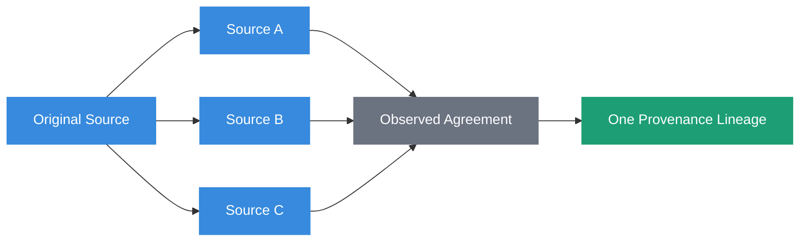
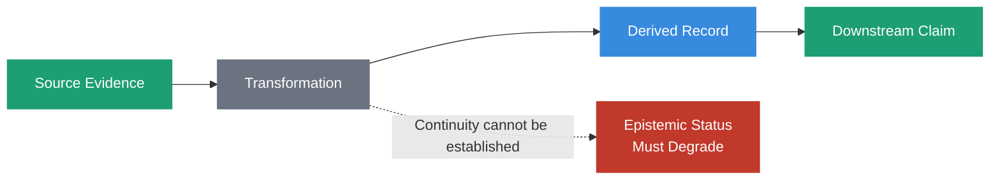
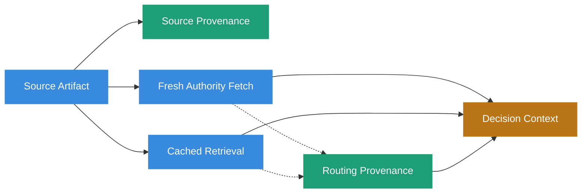

# Provenance



## Definition

Provenance is the evidence ancestry and verification semantics that describe where information came from, how it entered a system, what transformations it underwent, and what claims can be established about its origin.

Within Sovereign Systems, provenance is not a single identifier, source label, signature, or confidence score. It is the structured evidence required to evaluate origin and lineage over time.

A provenance record may describe a source without proving that source independently trustworthy. It may make an artifact checkable without making its claims true. It may preserve a chain of transformations while also recording where evidence continuity became weaker.

The governing principle is:

> **Provenance describes what can be established about origin and lineage. It does not manufacture truth, authority, or trust.**

## Why It Matters

AI systems routinely transform information before using it.

A source document may be retrieved, chunked, summarized, embedded, normalized, merged with other records, ranked, hydrated into context, and finally used to support a decision.

Each transformation creates an opportunity to lose the evidence needed to explain what happened upstream.

If a system retains only the final text, source URL, or opaque identifier, later consumers may know where the system says information came from without being able to establish what that claim means or whether it can still be verified.

This distinction matters because provenance supports more than historical explanation.

It also supports future governance.

A system that knows which policy version, source artifact, authority, observation, or derived record a claim depended upon can reevaluate that claim when one of those dependencies changes.

Provenance therefore has two related roles:

**Historical provenance** explains how an artifact, assertion, or decision came to exist.

**Dependency provenance** preserves the relationships needed to determine whether prior evidence, authority, or validity should be reconsidered.

> **Information without provenance is just gossip.**

## Provenance Assertion Is Not Provenance Evidence

A source may state where information came from.

That statement is itself a claim.

Sovereign Systems distinguish among several progressively stronger properties:


A self-declared origin may be useful provenance metadata.

A content digest may make a specific representation checkable.

An independently retrievable source may allow a claim to be verified.

A second independent evidence chain may corroborate it.

None of these properties automatically implies the next.

A Sovereign System should preserve the strongest status it can establish without silently promoting weaker evidence into a stronger category.

## Source Plurality Is Not Provenance Plurality

Multiple sources do not necessarily represent multiple independent evidence chains.

Ten documents may repeat the same claim because all ten descend from one original source. If that ancestry is hidden, repetition can appear to be corroboration when it is only duplication.



Sovereign Systems preserve evidentiary ancestry where it is consequential so that source count cannot silently become evidence count.

> **Source plurality is not provenance plurality.**

## Provenance Anchors

A provenance anchor identifies something that later consumers may use to evaluate an origin or dependency claim.

Different anchors support different verification semantics.

Examples include:

| Anchor | What It May Establish | What It Does Not Establish by Itself |
| --- | --- | --- |
| URL | Where a resource may be retrieved | That historical content is unchanged |
| Commit hash | Identity of a specific repository state | That the repository or author was authoritative |
| Content digest | Equality to a defined byte representation | Truth, meaning, or authority |
| Artifact version | Logical version identity | Exact historical bytes unless versioning preserves them |
| API endpoint | Where an observation was obtained | That the endpoint will remain available or unchanged |
| Signature | Possession of signing material under a verification scheme | That the signer was entitled to make the claim |
| Forensic Receipt | Integrity and event evidence defined by the receipt | Universal truth or permanent authority |

A provenance model should therefore preserve not only an anchor but the semantics associated with it.

Relevant questions include:

- Can the referenced artifact be retrieved independently?
- Can its exact representation be verified?
- Can the original observation be reproduced?
- Can historical state be reconstructed?
- Does the anchor preserve an artifact or only report that the system observed one?
- What authority was associated with the source at the relevant time?
- Can an independent evidence chain corroborate the claim?

> **Provenance requires semantics, not merely identifiers.**

## Evidence Continuity

Provenance does not automatically survive transformation.



If a transformation can establish how its output relates to the evidence it consumed, downstream systems may preserve the appropriate evidentiary status.

If that relationship cannot be established, downstream systems must not silently inherit the strongest status present upstream.

The appropriate result may be `unknown`, `unverifiable`, or another explicitly constrained state.

> **Transformation may preserve or degrade epistemic status. It must not silently promote it.**

This principle applies to deterministic software transformations as well as model-mediated operations.

A replayable transformation is not necessarily a verifiable transformation. Reproduction demonstrates that the same process can produce the same result under the tested conditions. Verification additionally requires evidence that the inputs, transformation, representation, and relevant authority correspond to the claim being evaluated.

## Assertion, Observation, and Derivation

Provenance must preserve how a claim entered the system.

Consider three statements:

```text
IaC declared handler X.
AWS observed deployed handler Y.
Normalization inferred that X and Y correspond.
```

These are not three confidence levels for one fact.

They are different claim classes with different provenance.

**Assertion** records what a source declared.

**Observation** records what a component directly witnessed.

**Derivation** records a relationship or conclusion produced from other evidence.

A derived relationship is therefore a new assertion with its own provenance. It should preserve the evidence and method from which it was derived rather than silently inheriting the epistemic status of its inputs.

## Source Provenance and Routing Provenance

The same artifact can participate in two decisions under different evidentiary conditions.

Sovereign Systems distinguish:

**Source provenance** describes the artifact itself, including its origin, identity, evidence ancestry, and verification semantics.

**Routing provenance** describes how that artifact entered a particular decision context.



For example, a policy document retrieved directly from its governing authority and the same document restored from a stale cache may have identical source provenance.

They do not have identical routing provenance.

When routing materially affects whether evidence is current, authoritative, or eligible to govern, that routing becomes part of the decision evidence.

## Provenance and Authority

Provenance and authority answer different questions.

Provenance asks:

> Where did this information come from, and what evidence supports that account?

Authority asks:

> Who or what is entitled to establish this claim within the governed domain?

A source may have excellent provenance and no governing authority.

An official authority may also issue a claim that later becomes superseded, revoked, corrected, or invalidated.

Provenance must therefore preserve authority information where authority affects the claim, but it must not collapse authority into provenance.

Likewise, authority must not be inferred merely because a source is cryptographically identifiable.

> **Authority is not evidence. Evidence is not authority.**

## Provenance and Time

Provenance is temporal.

The evidence needed to evaluate a claim may change after admission.

Sources disappear. Keys rotate. Policies are superseded. Credentials are revoked. Artifacts are corrected. New observations contradict earlier ones.

A Sovereign System should preserve enough provenance to distinguish historical validity from current authority.

For example:

> Key K validly signed artifact A at time T.

is a different claim from:

> Key K is authorized to sign new artifacts now.

Historical provenance may remain valid even when current authority changes.

Where applicable, provenance should preserve both:

**Valid time**, describing when a fact, authority, or state applied.

**Assertion or transaction time**, describing when the system observed, learned, recorded, or asserted it.

This allows later systems to reevaluate current state without rewriting history using knowledge that did not exist at the time.

## Provenance and Cryptographic Integrity

Cryptography can strengthen provenance evidence.

It does not replace provenance semantics.

A digest operates on bytes. Reproducible verification therefore depends upon a defined representation.


Verification semantics may include:

- canonicalization rules
- encoding
- schema version
- hash algorithm
- signature algorithm
- signer identity
- key authority
- historical key state
- trust root

A matching digest can establish that evaluated bytes match committed bytes under the defined representation.

It does not establish that the record is true, that the signer was authorized, that the schema was interpreted correctly, or that the evidence remains current.

Cryptographic integrity is one property within the broader provenance model.

## Trust Roots and Independent Witnessing

Cryptographic verification is relative to a trust root.

If one actor controls the stored records, signing key, and authoritative chain head, that actor may be able to rewrite historical records, regenerate dependent hashes, and re-sign the resulting history.

The chain can remain internally consistent while the history it represents has changed.

Independent witnessing changes that trust model.

Examples include:

- independent counter-signatures
- externally published checkpoints
- transparency-style logs
- independently queryable append-only witnesses

The architectural question is not whether trust can be eliminated.

It is:

> **How many independent parties must collude to rewrite this history without detection?**

Independent witnessing can raise that number and strengthen the evidence available to future verifiers.

## Relationship to Write-Side Custody

Write-Side Custody governs whether information may become durable state and what provenance and evidence must accompany that write.

Provenance supplies the evidence ancestry and verification semantics required to make that decision meaningful over time.

Custody may require provenance fields, bind an assertion to its source, record authority dependencies, preserve verification anchors, or reject a write whose required provenance cannot be established.

Admission does not permanently settle the provenance question.

The information captured during custody provides the basis for later revalidation when sources, authority, policies, keys, or dependencies change.

> **Custody establishes governed admission. Provenance preserves what future consumers need to evaluate that admission.**

## Relationship to Forensic Receipts

A Forensic Receipt is an evidence mechanism within the broader provenance architecture.

A receipt may bind an event or artifact to a defined representation, digest, signer, timestamp, prior receipt, policy version, or other verification material.

That evidence can strengthen provenance.

The receipt is not provenance itself.

A valid receipt does not automatically establish that the underlying claim was true, that the signer had appropriate authority, or that the claim remains current.

Receipt verification therefore operates within the provenance semantics and trust model defined by the system.

## Relationship to the Reasoning Ledger

The Reasoning Ledger preserves observable evidence surrounding consequential decisions and system activity.

Provenance describes the ancestry and verification semantics of that evidence.

The ledger may preserve retrieval events, source classifications, policy versions, tool calls, approvals, timestamps, outcomes, and links to Forensic Receipts. Those records become useful provenance only when their origin and evidentiary role remain explicit.

Agent-reported information must remain distinguishable from events independently witnessed by the runtime or tool boundary.

> **The subject of an audit cannot be the sole authority for the evidence used to audit it.**

> **Custody enforces. The ledger witnesses.**

## Relationship to Durable Memory

Durable Memory may preserve claims that are current, historical, superseded, corrected, contradicted, invalidated, disputed, or unverifiable.

Provenance allows those records to remain useful without treating durability as current authority.

A historical record can retain strong provenance while no longer being eligible to govern a present decision.

Likewise, a durable record whose provenance becomes unverifiable may remain historically important while requiring different treatment during retrieval and adjudication.

Durability describes retention.

Provenance describes evidence ancestry and verification semantics.

Neither property alone establishes governing authority.

## Relationship to Context Assembly

Context assembly is another epistemic boundary.

A source may have strong provenance in Durable Memory and still be presented misleadingly if context assembly removes its authority status, omits contradictory evidence, collapses historical and current records, or hides how it was retrieved.

When consequential, the assembled context should preserve enough source and routing provenance for downstream systems to evaluate the evidence they are receiving.

A system that preserves provenance in storage but strips it before inference has not preserved provenance across the decision boundary.

## The Sovereign Approach

Sovereign Systems treat provenance as an architectural property that must survive the boundaries where information is admitted, transformed, stored, retrieved, assembled, and used.

A conforming design should:

- distinguish provenance assertions from provenance evidence
- preserve evidentiary ancestry where it affects interpretation
- define verification semantics for provenance anchors
- distinguish assertions, observations, and derived claims
- prevent transformations from silently promoting epistemic status
- distinguish source provenance from routing provenance
- preserve authority dependencies without conflating authority with evidence
- retain historical provenance when current authority changes
- define canonical representations for cryptographic verification where required
- make trust roots and verification assumptions explicit
- preserve enough provenance for future revalidation
- allow `unknown` and `unverifiable` when stronger claims cannot be established

The objective is not to make every piece of information permanently trusted.

The objective is to preserve enough evidence that future consumers can determine what the system is entitled to claim about where information came from, how it changed, and whether its prior basis still applies.

## Related Terms

- [Write-Side Custody](write-side-custody.html)
- [Forensic Receipt](forensic-receipt.html)
- [Reasoning Ledger](reasoning-ledger.html)
- [Durable Memory](durable-memory.html)
- [Context Hydration](context-hydration.html)
- [Active Working Memory](active-working-memory.html)
- [Point of Genesis](point-of-genesis.html)
- [Sieve-and-Sign Pattern](sieve-and-sign-pattern.html)

## References

- Sovereign Systems Epistemic Model
- Sovereign Systems Specification
- Integrity & Provenance Vector
- Architecture & Execution Framework
