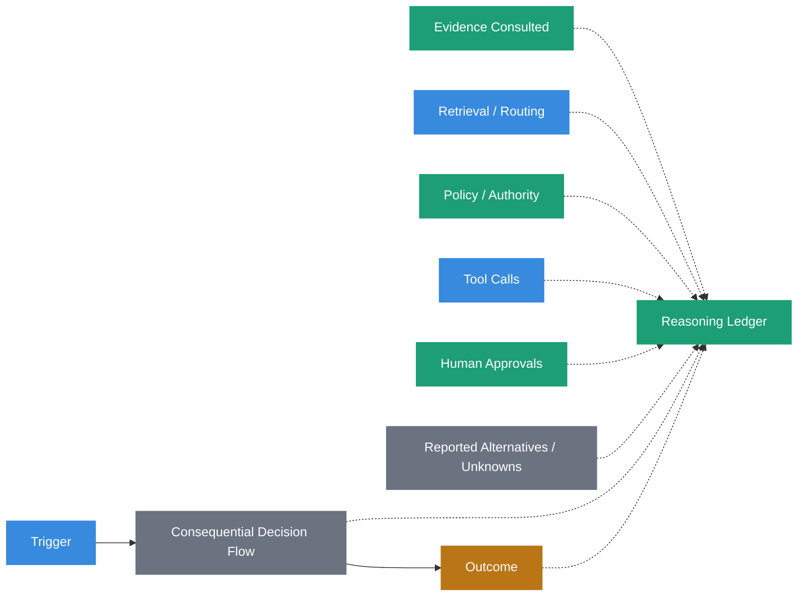
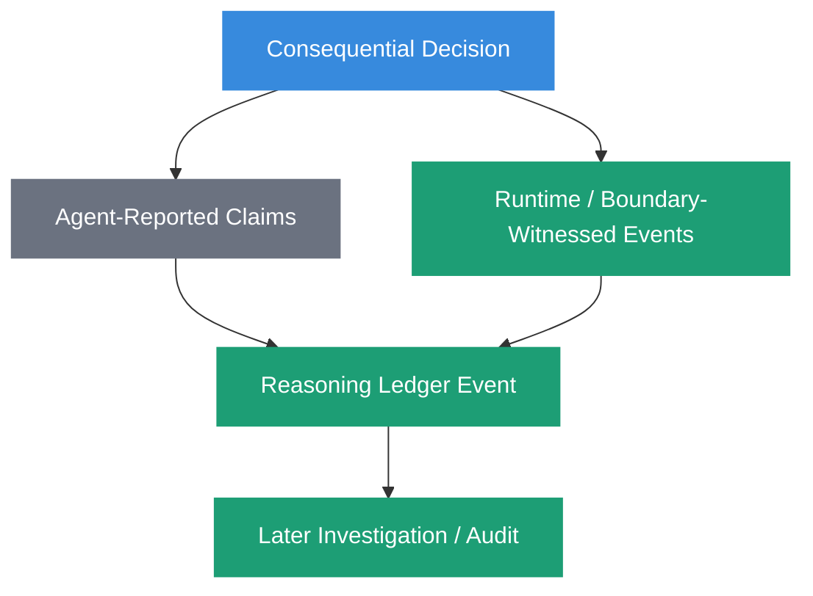
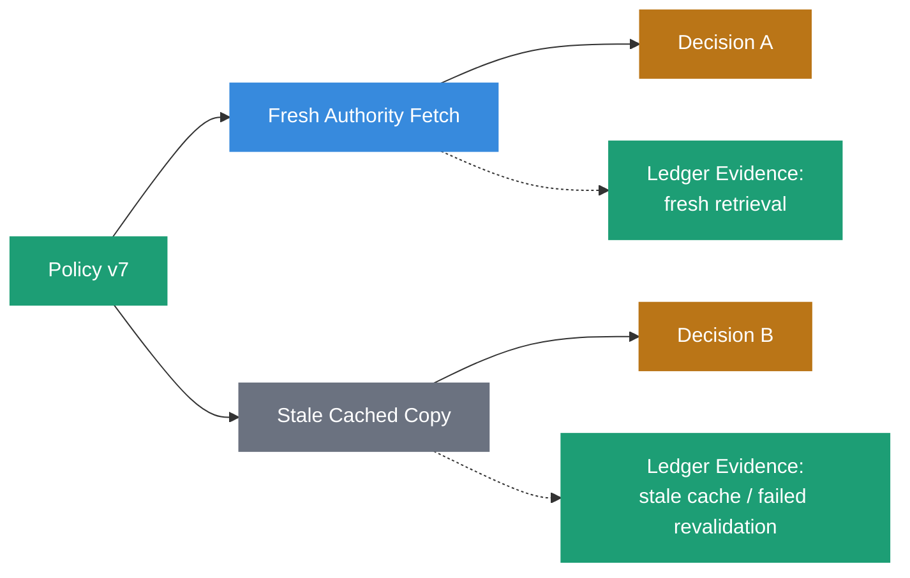
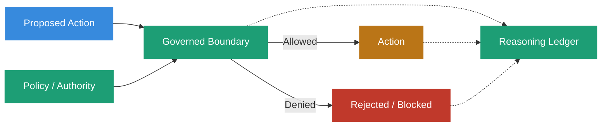
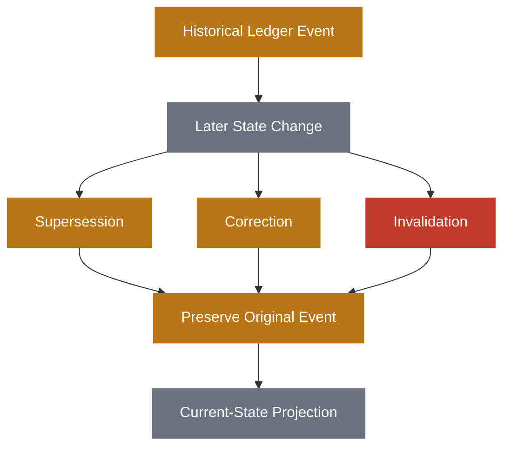
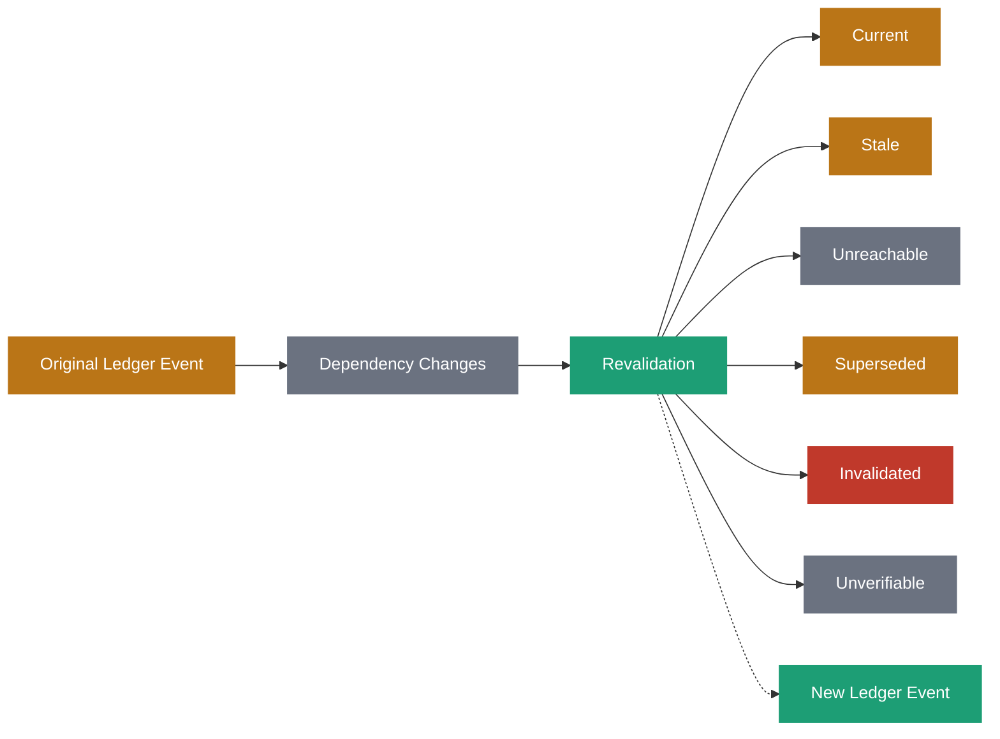
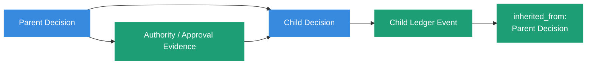
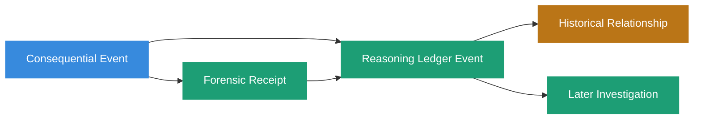
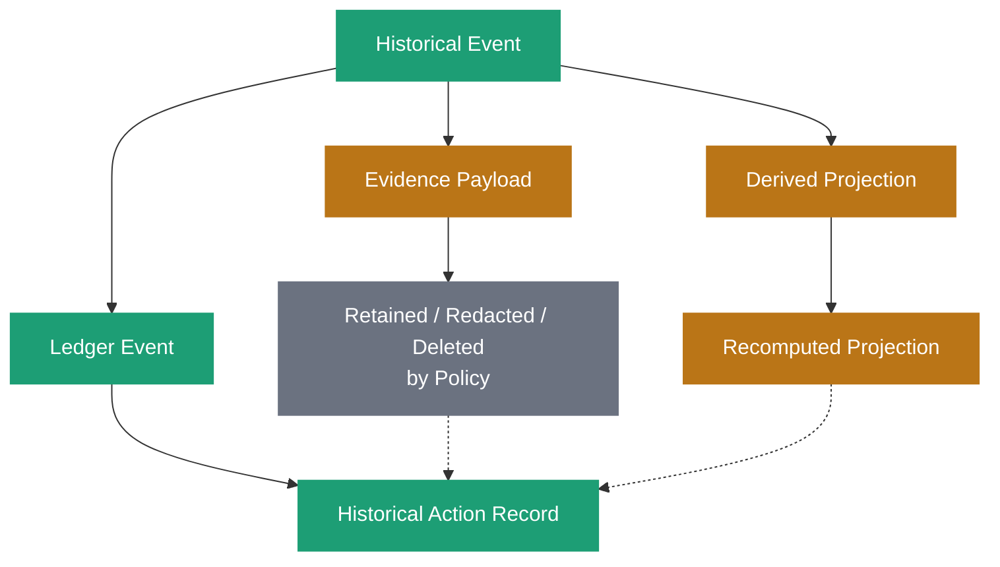

# Reasoning Ledger



## Definition

A Reasoning Ledger is an append-only record of observable evidence surrounding consequential decisions and system activity.

It preserves the evidence needed to investigate how a decision or action occurred without claiming to capture a model's private chain-of-thought.

Depending on the system and consequence, a ledger event may preserve:

- the triggering event
- evidence consulted
- retrieval and routing events
- source classifications
- policy evaluations
- policy and authority versions
- tool calls
- approvals
- agent-reported alternatives
- agent-reported confidence
- disconfirming evidence
- known unknowns
- timestamps
- outcomes
- links to Forensic Receipts
- relationships to prior or subsequent ledger events

The governing principle is:

> **Observable reasoning is architecture. Private reasoning belongs to the model.**

## Origin

The term **Reasoning Ledger** was first formalized as part of the Sovereign Systems Specification by Ken W. Alger in 2026.

## Why It Matters

Durable systems preserve outcomes.

They do not necessarily preserve the evidence surrounding the decisions that produced those outcomes.

A deployment record may show that version `2026.03.14` reached production. An Architecture Decision Record may preserve the selected design. A customer record may show that access was denied. A model output may contain a recommendation.

Those artifacts answer:

> _What happened?_

They may not answer:

> _What evidence, policy, authority, tool activity, approvals, alternatives, and uncertainties surrounded the decision when it happened?_

That distinction matters when a system must later be audited, debugged, challenged, reproduced, or explained.



The ledger preserves the observable decision environment as evidence.

It does not manufacture an explanation after the fact.

## The Ledger Is Not Chain-of-Thought

The Reasoning Ledger deliberately excludes private model reasoning.

A model may internally perform computations, form latent representations, explore token-level continuations, or use reasoning processes that are neither observable nor appropriate to retain.

The architecture should not pretend otherwise.

A ledger can record that:

- evidence A and B were retrieved
- policy version 7 was evaluated
- tool X was invoked
- approval Y was received
- the agent reported alternatives C and D
- the agent reported uncertainty about condition E
- action F was requested
- the runtime observed outcome G

Those are observable or reportable system facts.

The ledger should not claim:

> _This is the exact hidden reasoning chain that caused the model to produce its answer._

That distinction turns the Reasoning Ledger from a speculative model transcript into an auditable systems primitive.

> **The ledger records evidence around reasoning, not private reasoning itself.**

## Reported Evidence and Witnessed Evidence

Not every field in a ledger event has the same evidentiary status.

An agent can legitimately report facts about its own output state, such as:

- its selected action
- alternatives it considered
- its stated confidence
- unknowns it identified
- its stated rationale

Those are agent-reported claims.

Other events can be independently witnessed by infrastructure:

- a retrieval occurred
- a source was returned
- a policy engine produced a result
- a tool was invoked
- an approval service responded
- a write crossed a custody boundary
- an external system returned an outcome
- a timestamp was observed

Those are runtime- or boundary-witnessed events.



A ledger may preserve both.

It must preserve the distinction.

For example:

```yaml
retrieval:
  method: fresh
```

is ambiguous if the agent itself supplied the value.

A stronger record makes the evidentiary role explicit:

```yaml
retrieval:
  method: fresh
  observed_by: retrieval-gateway-02
  evidence_type: runtime_observed
```

Similarly:

```yaml
alternatives:
  - postgres
  - sqlite
```

may be perfectly useful when recorded as:

```yaml
alternatives:
  values:
    - postgres
    - sqlite
  asserted_by: architecture-agent-04
  evidence_type: agent_reported
```

The system does not need to reject self-reported information.

It needs to avoid silently promoting self-report into independent observation.

> **The subject of an audit cannot be the sole authority for the evidence used to audit it.**

## What a Ledger Event May Contain

The exact schema is implementation-specific.

A simplified event might look like:

```yaml
reasoning_ledger_event:
  event_id: "rl_01J..."
  schema: "sovereign.reasoning-ledger/v1"

  event:
    type: "deployment_decision"
    observed_at: "2026-03-14T09:22:07Z"
    transaction_time: "2026-03-14T09:22:08Z"

  trigger:
    type: "deployment_request"
    ref: "request:dep-4412"

  evidence:
    - ref: "artifact:release-candidate/2026.03.14"
      role: "deployment_candidate"
      provenance_ref: "prov:release-2026.03.14"

  retrieval:
    method: "fresh"
    observed_by: "retrieval-gateway-02"
    evidence_type: "runtime_observed"

  governance:
    policy_id: "production-deployment"
    policy_version: "7"
    authority_ref: "authority:platform-operations"
    result: "allow"

  approvals:
    - approval_id: "apr_8841"
      observed_by: "change-control-service"
      evidence_type: "runtime_observed"

  agent_report:
    selected_action: "deploy"
    alternatives:
      - "delay"
      - "rollback"
    known_unknowns:
      - "post-deploy traffic shape"
    evidence_type: "agent_reported"

  outcome:
    status: "accepted"
    deployment_id: "dep_4412"

  receipts:
    - "fr_01J..."
```

This is illustrative rather than a required wire format.

The important requirement is that the ledger preserves enough structure to distinguish evidence classes, identify relevant dependencies, and reconstruct the observable decision environment without inventing missing reasoning.

## Evidence Provenance Includes Routing Provenance

The identity of an artifact is not the entire provenance of its use in a decision.

A policy document may have a stable content digest and authoritative source.

But the same policy can reach a decision through different routes.

For example:

```text
Decision A
    ← fresh authority fetch
    ← Policy v7

Decision B
    ← stale cache after revalidation failure
    ← Policy v7
```

The policy artifact is the same.

The decision evidence is not.

A Reasoning Ledger should therefore preserve not only **source provenance**, but also **routing provenance** when routing materially affects the decision.



This matters because context assembly and retrieval are epistemic boundaries.

What entered the decision, how it entered, and under what freshness or verification state may all affect what the system was entitled to conclude.

## The Ledger Witnesses Enforcement

The Reasoning Ledger is not the enforcement mechanism.

It may record:

- a policy evaluation
- a custody decision
- a denied tool call
- an approval
- an escalation
- an authority check
- an admission outcome

But recording those events does not grant permission.

The component responsible for enforcement must make and enforce the governed decision.

The ledger witnesses what occurred around that enforcement.



This separation protects the epistemic independence of the audit trail.

> **The moment the observer can stop the observed, you lose the audit trail's epistemic independence.**

An implementation may combine components operationally, especially in smaller systems, but it should preserve the conceptual distinction between the component that authorizes an action and the evidence that records the authorization.

> **Custody enforces. The ledger witnesses.**

## Append-Only Does Not Mean Append-Only Interpretation

A Reasoning Ledger preserves history.

It should not rewrite earlier events to match later knowledge.

If an earlier decision was based on policy version 6, the historical event should continue to show that policy version 6 governed the decision even after policy version 7 becomes current.

Later events may change how the earlier event is interpreted.

They should not silently change what the earlier event records.

Common historical relationships include:

**Supersession**  
An earlier state governed then, but another state governs now.

**Correction**  
An earlier assertion was incorrect and a later event corrects it.

**Invalidation**  
An earlier assertion or authority may remain historically meaningful but is no longer entitled to govern.



The ledger preserves the historical event.

A current-state projection can derive what governs now.

Those are different responsibilities.

## Two Clocks

Historical reconstruction often requires more than one notion of time.

**Valid time** describes when a fact, authority, policy, or state applied in the world or governed domain.

**Transaction or assertion time** describes when the system learned, observed, or recorded it.

For example:

```yaml
policy_state:
  policy_id: "production-deployment"
  version: 7
  valid_from: "2026-03-01T00:00:00Z"
  recorded_at: "2026-03-03T14:12:08Z"
```

Those timestamps answer different questions.

A later investigation may need to determine both:

> _What policy was valid when the action occurred?_

and:

> _What policy did the system actually know about when it made the decision?_

Without both concepts, later knowledge can be silently projected backward into historical decisions.

## Revalidation Is Not a Rewrite

Ledger evidence can become stale, unreachable, superseded, invalidated, or unverifiable.

That does not require rewriting the original event.

A revalidation process may determine that:

- a source remains current
- a source has changed
- an authority has been revoked
- a policy has been superseded
- an evidence artifact is unreachable
- a receipt can no longer be fully verified
- a prior claim has been corrected

The result of that revalidation should itself become a new historical event.



`stale`, `unreachable`, and `invalidated` are not synonyms.

A source can be reachable but stale.

A source can be current in principle but temporarily unreachable.

A historically valid authority can later become invalid for new decisions.

The ledger should preserve those distinctions rather than flattening them into a single `valid` or `invalid` flag.

## TTL Is Not Authority

Time-to-live can be useful for caching and revalidation schedules.

It does not determine authority.

A record does not become false merely because a cache TTL expired.

Likewise, a record does not remain authoritative merely because its TTL has not expired.

TTL answers an operational question:

> _When should this information be refreshed or reconsidered?_

Authority answers a governance question:

> _Is this source or claim entitled to govern this decision?_

The ledger may preserve both.

It should not conflate them.

## Inheritance Must Preserve Provenance

Consequential decisions often inherit evidence or state from earlier decisions.

A child operation may depend on:

- an earlier approval
- an authority determination
- a classification
- a policy evaluation
- a prior retrieval
- a parent workflow decision

Encoding this only as:

```yaml
inherited: true
```

loses the provenance chain.

A stronger representation identifies the source:

```yaml
inherited_from:
  decision_id: "rl_parent_01J..."
  fields:
    - authority_ref
    - approval_ref
```

Inheritance should preserve the relationship to the event that established the inherited state.



Inherited evidence cannot become stronger merely because it was inherited.

If a parent decision relied on self-reported or weakly verified evidence, a child decision must not silently promote that evidence to independently verified state.

> **Inheritance should not manufacture trust.**

## Classification Does Not Grant Exemption

Classification may affect routing, retention, visibility, policy selection, or required review.

It should not become a shortcut that bypasses governance.

For example, labeling an event `internal`, `trusted`, `low_risk`, or `system_generated` does not itself establish that:

- the source is authoritative
- the evidence is independently witnessed
- policy does not apply
- provenance requirements can be skipped
- the action is safe

Classification describes how the system should treat an event.

Authority determines what the event is entitled to establish.

> **Classification should not manufacture exemption.**

## Relationship to Provenance

[Provenance](provenance.html) describes evidence ancestry and verification semantics.

The Reasoning Ledger preserves provenance-bearing events around consequential decisions.

A ledger event may record:

- where evidence came from
- how it entered the decision
- who asserted a claim
- who witnessed an event
- which authority governed
- which policy version applied
- which receipt binds the evidence
- which earlier event supplied inherited state

The ledger is therefore a carrier of provenance evidence.

It is not provenance by itself.

A ledger containing unqualified self-reports, ambiguous source identities, or missing routing information does not become trustworthy merely because it is append-only.

## Relationship to Write-Side Custody

[Write-Side Custody](write-side-custody.html) governs whether a proposed write may become durable state.

The Reasoning Ledger preserves observable evidence surrounding that decision where the decision is consequential enough to warrant ledgering.

Custody may evaluate:

- admission policy
- assertion authority
- provenance requirements
- structural validity
- evidence requirements
- integrity mechanisms

The ledger may preserve what policy was evaluated, what evidence was available, what outcome occurred, and what receipt was produced.

The ledger does not grant admission.

> **Custody enforces. The ledger witnesses.**

## Relationship to Forensic Receipts

A [Forensic Receipt](forensic-receipt.html) is a structured evidence artifact that binds a consequential event to a defined representation of evidence, authority, policy, and execution context observable at that boundary.

The Reasoning Ledger records historical relationships among consequential events.

The Forensic Receipt binds defined evidence to a particular event or artifact.



A ledger event may reference one or more receipts.

A receipt may reference the ledger event, prior receipt, checkpoint, or other historical anchor.

Neither mechanism should claim access to private model reasoning.

## Relationship to Durable Memory

[Durable Memory](durable-memory.html) preserves knowledge and state intended to survive beyond the task that created them.

The Reasoning Ledger preserves the historical evidence surrounding consequential decisions and changes.

A useful distinction is:

> **Memory preserves knowledge. The ledger preserves decision history.**

These responsibilities overlap but are not interchangeable.

A durable record may represent the current state of an entity.

The ledger may preserve the events through which that state was created, corrected, superseded, or invalidated.

A current-state projection can be rebuilt from historical events where the implementation supports it, but the projection should not silently replace the historical record.

## Relationship to Context Assembly

Context assembly determines which information enters Active Working Memory for a particular task.

The Reasoning Ledger may provide evidence needed to evaluate that assembly later.

For consequential decisions, the ledger may preserve:

- which records were selected
- which records were excluded
- retrieval method
- freshness state
- authority resolution
- contradiction handling
- routing path
- policy applied during assembly

This is important because two decisions can consult the same underlying artifact through materially different retrieval and governance paths.

The ledger preserves the evidence needed to tell those paths apart.

## Retention and Privacy

Append-only history does not require every evidence payload to remain available forever.

A Reasoning Ledger should distinguish among:

- the historical event record
- referenced evidence payloads
- derived projections or caches

Retention, privacy, legal, or operational policy may require an evidence payload to be redacted or deleted.

The ledger can preserve that the evidence existed, what role it played, and that a later deletion or redaction occurred without necessarily retaining the sensitive payload itself.



Deletion may reduce what can later be verified.

That degradation should be explicit.

> **Immutability should apply to the history of system actions, not necessarily indefinite retention of every artifact touched.**

## Example

Consider an AI-assisted production deployment.

The agent recommends deployment after evaluating a release candidate.

A policy engine checks whether production deployment is permitted.

A human approval service confirms the change.

A deployment controller executes the action.

The resulting ledger event might preserve:

```yaml
reasoning_ledger_event:
  event_id: "rl_deploy_4412"
  event_type: "deployment_decision"

  trigger:
    request_id: "req_4412"
    requested_action: "deploy"

  evidence:
    release_candidate: "artifact:release/2026.03.14"
    retrieved_by: "release-registry"
    retrieval_state: "fresh"

  governance:
    policy_id: "production-deployment"
    policy_version: "7"
    authority_ref: "authority:platform-operations"
    result: "allow"

  approval:
    approval_id: "apr_8841"
    observed_by: "change-control-service"

  agent_report:
    selected_action: "deploy"
    alternatives:
      - "delay"
      - "rollback"
    known_unknowns:
      - "post-deploy traffic shape"

  tool_call:
    tool: "deployment-controller"
    operation: "apply"
    observed_by: "tool-gateway-03"

  outcome:
    status: "accepted"
    deployment_id: "dep_4412"

  forensic_receipts:
    - "fr_01J..."
```

Six months later, the organization can investigate the observable evidence surrounding the deployment.

It can determine which release candidate was retrieved, which policy version governed, which authority applied, whether approval occurred, what action the agent reported selecting, which tool call the runtime witnessed, and what outcome was observed.

The ledger does not establish the exact private reasoning process inside the model.

It preserves the system evidence required to investigate the decision without pretending that private reasoning was observable.

## The Sovereign Approach

Sovereign Systems use the Reasoning Ledger as the historical evidence layer surrounding consequential decisions and operations.

A conforming design should:

- preserve observable decision evidence rather than private chain-of-thought
- distinguish agent-reported claims from independently witnessed events
- identify the origin and evidentiary role of consequential fields
- preserve source provenance and routing provenance where consequential
- record policy and authority versions used at decision time
- preserve tool, approval, retrieval, and enforcement events where relevant
- allow reported alternatives, confidence, and unknowns without treating them as independently witnessed facts
- keep enforcement responsibility separate from ledger observation
- preserve append-only historical events rather than rewriting them with later knowledge
- distinguish supersession, correction, and invalidation
- support valid time and transaction or assertion time where historical reconstruction requires them
- record revalidation as a new event rather than mutating the historical event
- distinguish stale, unreachable, invalidated, and unverifiable states
- avoid treating TTL as authority
- preserve provenance when evidence or authority is inherited from earlier decisions
- prevent inheritance from silently strengthening evidentiary status
- prevent classification from manufacturing governance exemptions
- link consequential evidence to Forensic Receipts where stronger integrity evidence is required
- allow retention policy to remove evidence payloads without silently erasing the history of system actions

The objective is not to make every decision explainable by reconstructing a model's hidden cognition.

The objective is to preserve enough independently attributable evidence that a later consumer can determine what surrounded the decision, what the system observed, what the agent reported, what governed the action, and what happened next.

## Related Terms

- [Provenance](provenance.html)
- [Forensic Receipt](forensic-receipt.html)
- [Write-Side Custody](write-side-custody.html)
- [Durable Memory](durable-memory.html)
- [Active Working Memory](active-working-memory.html)
- [Context Hydration](context-hydration.html)
- [Sieve-and-Sign Pattern](sieve-and-sign-pattern.html)

## References

- Sovereign Systems Epistemic Model
- Sovereign Systems Specification
- Integrity & Provenance Vector
- Architecture & Execution Framework
