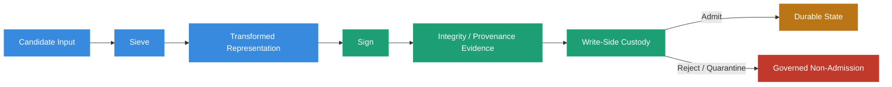
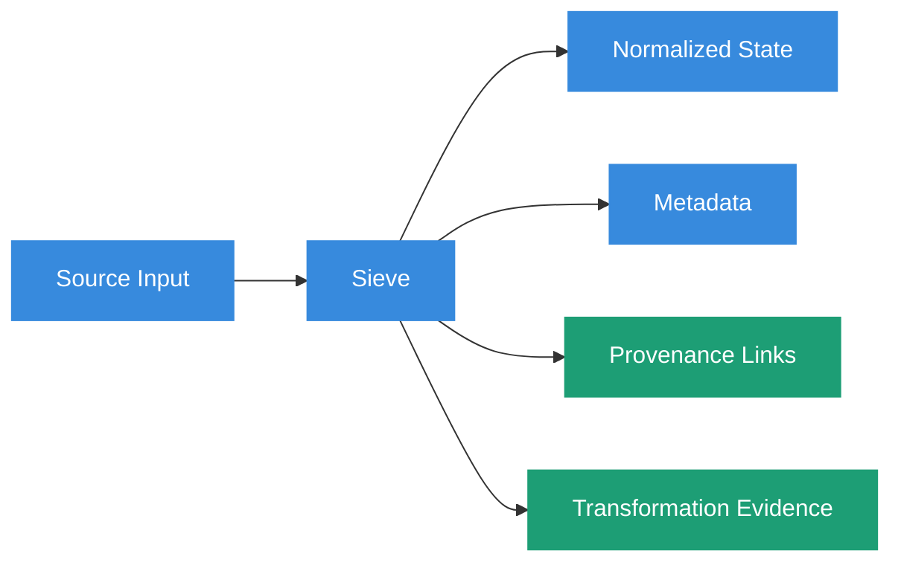
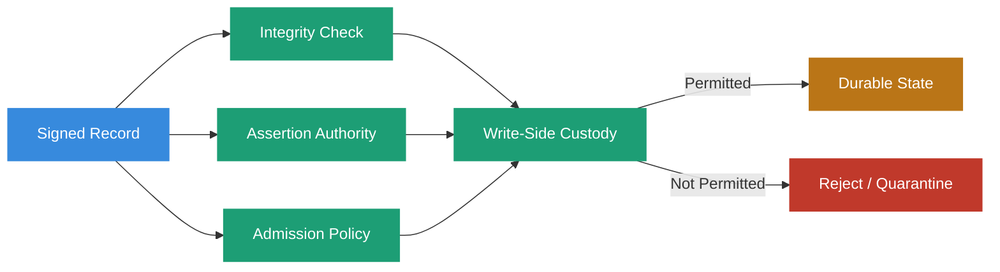
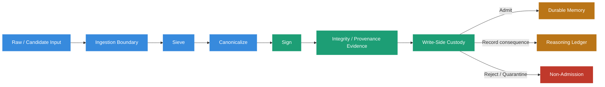
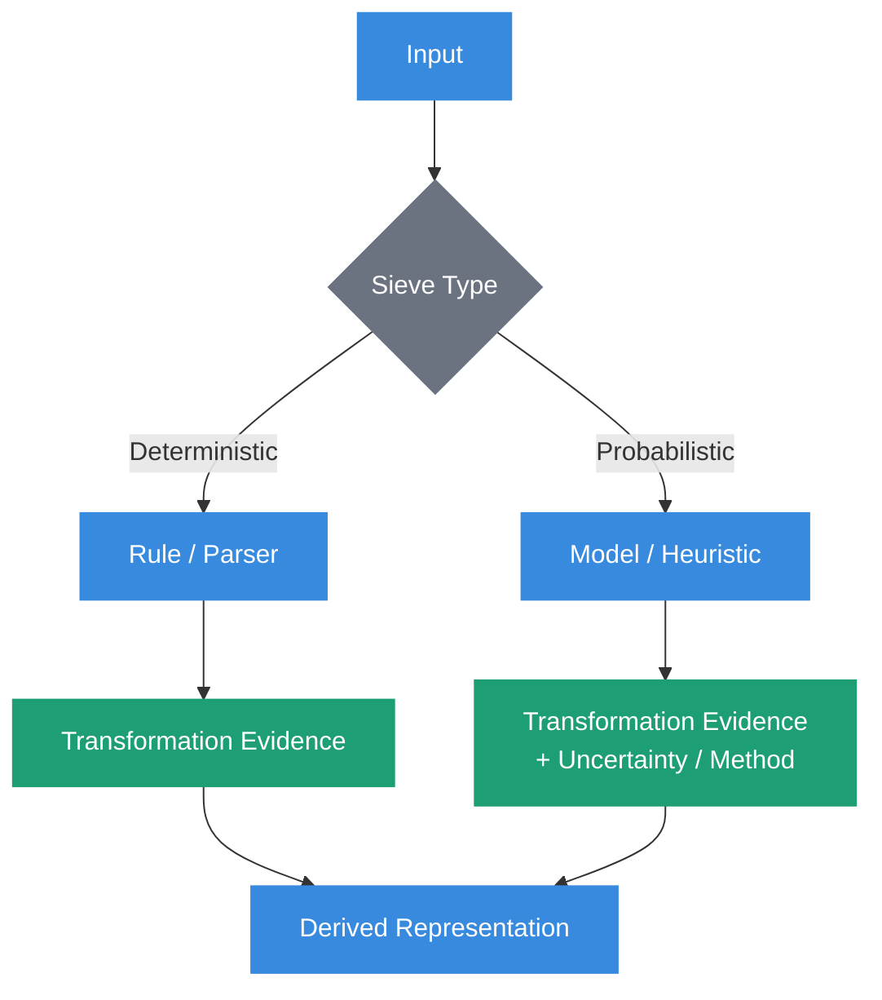

# Sieve-and-Sign Pattern

  

## Definition

The **Sieve-and-Sign Pattern** is an ingestion pattern in which candidate information is reduced and structured into a defined representation, then bound to integrity and provenance evidence before governed admission to durable state.

The pattern contains two conceptual stages:

1. **Sieve** — Identify, normalize, reduce, classify, or extract information while preserving the evidence needed to understand what transformation occurred.
2. **Sign** — Bind a defined representation to integrity and identity evidence so later consumers can determine what was protected, by whom, and under which cryptographic assumptions.

Within Sovereign Systems, Sieve-and-Sign is one implementation pattern that can support [Write-Side Custody](./write-side-custody.html).

It does not transform raw information into truth merely by filtering and signing it.

> **The sieve changes representation. The signature protects a defined representation. Custody decides whether the result may become durable state.**



## Origin

The term **Sieve-and-Sign Pattern** was first formalized as part of the Sovereign Systems Specification by Ken W. Alger in 2026.

## Why It Matters

Many systems preserve incoming information with little distinction between the original source, transformations applied during ingestion, and the representation ultimately stored.

Documents, transcripts, telemetry, emails, meeting notes, API responses, and model-generated content may be normalized, summarized, extracted, or compressed before becoming durable state.

Those transformations can be useful.

They can also erase evidence.

A summary can omit a qualification.

An extraction can turn an inference into an apparent fact.

A normalization step can change units or field semantics.

A deduplication process can collapse independent and non-independent sources together.

A signature applied afterward can prove that the transformed representation has not changed without proving that the transformation was faithful.

Sieve-and-Sign makes that boundary explicit.

The pattern asks two different questions:

> _What representation should survive this transformation?_

and:

> _What evidence should be bound to that representation so the transformation can be evaluated later?_

Those questions belong together, but they should not be collapsed into a single concept of `trusted`.

## The Pattern

### Stage 1: Sieve

The **Sieve** stage transforms candidate information into a representation more appropriate for governed storage and later use.

Typical operations may include:

- schema normalization
- noise reduction
- metadata extraction
- entity identification
- structure validation
- context compression
- classification
- deduplication
- segmentation
- field extraction
- canonicalization preparation

The objective is not simply to make information smaller.

It is to produce a representation whose semantics are explicit enough to be evaluated, stored, retrieved, and governed.



### The Sieve Is a Claim-Producing Boundary

A sieve is not epistemically neutral.

Consider a meeting transcript containing:

```text
Maya: It looks like the deployment failure may have been caused by expired
service credentials, but I want Platform to confirm that before we rotate them.
```

A careless extraction might produce:

```yaml
root_cause: expired_service_credentials
action_required: rotate_credentials
```

The original statement expressed uncertainty and requested confirmation.

The transformed representation converted that uncertainty into asserted state.

The problem occurred before signing.

A perfectly valid signature over the transformed record would preserve the wrong semantics perfectly.

A more faithful representation might be:

```yaml
claim:
  type: suspected_root_cause
  value: expired_service_credentials
  asserted_by: maya
  status: unconfirmed

proposed_action:
  value: rotate_credentials
  condition: platform_confirmation

source:
  transcript_ref: meeting_2026_06_02
  span_ref: lines_418_421
```

> **Transformation may preserve or degrade epistemic status. It must not silently promote it.**

### Preserve the Source Relationship

Sieve-and-Sign does not require every raw source to remain permanently available.

It does require the architecture to distinguish the source from the representation derived from it.

Where consequence warrants it, a sieved record may preserve:

- source identifier
- source digest
- source location or span
- transformation identifier
- transformation version
- transformation method
- actor or process performing the transformation
- time of transformation
- extracted fields
- omitted-field policy
- confidence or uncertainty reported by the source
- evidence required to reproduce or inspect the transformation

This supports a critical distinction:

```text
Source Artifact
      ↓
Transformation
      ↓
Derived Representation
```

The derived representation is not the source artifact.

Signing the derived representation does not retroactively sign the source unless the signature explicitly binds both.

## Stage 2: Sign

The **Sign** stage binds a defined representation to cryptographic integrity and identity evidence.

Typical operations may include:

- canonicalization
- digest generation
- cryptographic signing
- signer identification
- key-reference binding
- signature metadata
- receipt creation
- chain or checkpoint relationships
- transformation-reference binding

The objective is to allow later consumers to verify properties such as:

- which bytes or canonical representation were signed
- whether that representation has changed
- which key produced the signature
- whether that key was valid for the relevant time under the applicable trust model
- which source and transformation references were included in the signed material

The Sign stage does **not** establish that the underlying claim is true.

It does not establish that the signer was authorized to assert every field.

It does not establish that the source was accurate.

It does not establish that the record remains current.

Those are separate questions.

> **Cryptographic consistency is evidence. It is not universal truth.**

## Canonicalization Before Signing

A signature is meaningful only if the architecture defines what representation is being signed.

Semantically equivalent structured data can have different byte representations because of:

- field ordering
- whitespace
- Unicode normalization
- numeric formatting
- timestamp formatting
- omitted optional fields
- serialization behavior

A robust signing pipeline therefore defines a canonical representation.


The canonicalization rules are part of the verification semantics.

Without them, `signature valid` may depend on implementation-specific serialization behavior rather than a stable architectural contract.

## Sign What Matters

A common failure is to sign the transformed payload while leaving consequential metadata outside the protected representation.

For example:

```yaml
payload:
  action_required: rotate_credentials

provenance:
  asserted_by: maya
  status: unconfirmed
```

If only `payload` is signed, the provenance fields may be changed without invalidating the signature.

The architecture should define which fields participate in the signed preimage.

For a consequential record, that may include:

```yaml
signed_claim:
  payload:
  source_reference:
  transformation:
  asserted_by:
  authority:
  lifecycle_state:
  schema_version:
```

The exact schema is implementation-specific.

The principle is not.

> **If metadata changes how a signed claim should be interpreted, excluding it from the signed representation weakens the evidence.**

## Signing Identity Is Not Assertion Authority

A valid signature can establish that a particular key signed a defined representation.

It does not automatically establish that the signer was entitled to assert every claim inside it.

Consider:

```yaml
record:
  employee_status: terminated
  asserted_by: build_pipeline
  signature: valid
```

The build pipeline may possess a valid signing key.

That does not make it an authorized source of employment status.

Sieve-and-Sign therefore works within, not instead of, the assertion-authority model established by Write-Side Custody.



A signing capability is a cryptographic capability.

Assertion authority is a governance property.

They may be assigned to the same actor.

They are not the same thing.

## Example

Consider the original meeting statement:

```text
Maya: It looks like the deployment failure may have been caused by expired
service credentials, but I want Platform to confirm that before we rotate them.
```

### Sieve Result

```yaml
schema: operational_claim/v1

claim:
  type: suspected_root_cause
  value: expired_service_credentials
  status: unconfirmed
  asserted_by: maya

proposed_action:
  value: rotate_credentials
  condition: platform_confirmation

source:
  artifact_ref: meeting_2026_06_02
  span_ref: lines_418_421

transformation:
  method: structured_extraction
  version: "1.3"
```

### Canonical Preimage

Conceptually:

```text
canonicalize(
  schema
  + claim
  + proposed_action
  + source
  + transformation
)
```

### Sign Result

```yaml
integrity:
  digest: "sha256:..."
  signer: "ingestion-boundary-key-04"
  algorithm: "ed25519"
  signature: "..."
  signed_at: "2026-06-02T15:04:22Z"

receipt_ref: "fr_8b4c92a"
```

The resulting record supports narrower, defensible claims:

- the system derived this structured representation from the identified source
- the representation preserved the source's uncertainty
- the defined representation was signed by the identified key
- later modification of the signed representation can be detected under the verification model

It does not establish that expired credentials actually caused the deployment failure.

That claim remains unconfirmed until sufficient evidence or authority resolves it.

## Architectural Flow

The pattern sits inside a larger custody architecture.



This ordering is illustrative rather than universally mandatory.

An implementation may perform structural validation before transformation, sign source bytes before sieving, produce multiple receipts, or apply policy checks at several points.

The architectural requirement is that the system keep distinct:

- the source
- the transformation
- the transformed representation
- the integrity evidence
- the assertion authority
- the admission decision

## Sieve-and-Sign Is Not Write-Side Custody

[Write-Side Custody](./write-side-custody.html) is the governing architectural discipline.

Sieve-and-Sign is one pattern that can provide inputs to that discipline.

The distinction is important because a record can be:

```text
well sieved
correctly canonicalized
cryptographically signed
```

and still be inadmissible.

For example:

- the signer lacks assertion authority
- required provenance is missing
- policy prohibits durable retention
- the source is outside the permitted scope
- evidence is insufficient for the requested claim
- the transformation silently strengthened uncertainty
- the record duplicates state that policy says should not be persisted

Sieve-and-Sign therefore does not define the admission decision.

Custody does.

> **Sieve-and-Sign prepares and protects a candidate record. Write-Side Custody governs whether it may survive.**

## Relationship to Provenance

[Provenance](./provenance.html) is broader than cryptographic signing.

A signature can contribute evidence about integrity and signer identity.

Provenance may also need to preserve:

- source ancestry
- transformations
- assertion history
- authority relationships
- dependency references
- temporal semantics
- corroboration
- correction and supersession relationships

The Sign stage should therefore be understood as **binding provenance evidence**, not creating provenance from nothing.

If source ancestry was discarded during the Sieve stage, a later signature cannot reconstruct it.

## Relationship to Forensic Receipts

A [Forensic Receipt](./forensic-receipt.html) may preserve evidence about the Sieve-and-Sign operation.

A receipt can bind:

- source references
- transformation identity
- canonical representation or digest
- signer identity
- policy context
- admission outcome
- timestamps
- related ledger events

The receipt is not merely the signature or its identifier.

It is a structured evidence artifact whose meaning depends on what was actually observed and bound at the boundary.

## Relationship to the Reasoning Ledger

The [Reasoning Ledger](./reasoning-ledger.html) may preserve consequential events surrounding transformation and admission.

For example, it may record that:

- a source was transformed
- an extraction produced an uncertain claim
- policy rejected the transformed record
- a human approved an assertion
- a later event corrected or superseded the admitted state

The ledger witnesses historical activity.

Sieve-and-Sign prepares evidence around a particular ingestion transformation.

Neither substitutes for the other.

## Relationship to Point of Genesis

[Point of Genesis](./point-of-genesis.html) identifies the earliest defensible boundary at which origin evidence can begin.

Sieve-and-Sign may operate at that boundary or later in the ingestion path.

When it operates later, the system should preserve any pre-custody or pre-transformation gap rather than imply that the sieve observed the originating event directly.

Signing closer to the source can reduce unsigned transformations.

It does not make the source truthful.

## Relationship to Prose Tax

The Sieve stage can reduce [Prose Tax](./prose-tax.html) by removing conversational scaffolding or other low-value structure before it enters durable memory.

That optimization is useful only when it preserves consequential meaning.

Removing:

```text
Hello everyone.
I hope you're all doing well today.
```

may be harmless for an operational extraction.

Removing:

```text
I think...
may have...
but I want Platform to confirm...
```

is not harmless when those words encode epistemic qualification.

The goal is therefore not maximum compression.

It is **semantic density without semantic promotion**.

By increasing useful information density, the pattern may also reduce Context Tax and Retrieval Tax later in the system.

## Transformation Evidence

A system should be able to distinguish what the source said from what the sieve inferred.

One possible representation is:

```yaml
source_claim:
  text: "may have been caused by expired service credentials"
  modality: uncertain

derived_claim:
  value: expired_service_credentials
  classification: suspected_root_cause

derivation:
  method: extraction
  model_or_rule: "extractor-v1.3"
  source_ref: "meeting_2026_06_02#lines_418_421"
```

This becomes especially important when the sieve uses an LLM or other probabilistic transformation.

The output of a probabilistic extractor is itself an assertion.

It should not silently inherit the authority of its source.

> **A derived claim does not inherit authority merely because it was derived from an authoritative source.**

## Deterministic and Probabilistic Sieves

Sieve operations may be deterministic or probabilistic.

A deterministic sieve might:

- parse a known schema
- normalize a timestamp
- remove exact boilerplate
- validate an identifier
- canonicalize units under an explicit rule

A probabilistic sieve might:

- summarize a conversation
- classify intent
- extract an implied action item
- identify a likely entity
- infer a relationship

These transformations have different evidence semantics.



A Sovereign System need not reject probabilistic transformations.

It should preserve enough information to prevent probabilistic derivation from masquerading as direct observation.

## Failure Modes

### Signed Semantic Promotion

The sieve converts an uncertain source claim into a definitive field and the Sign stage faithfully protects the stronger claim.

The signature is valid.

The semantics are wrong.

### Orphaned Derivation

A transformed record is retained without enough source or transformation evidence to determine how it was produced.

### Unsigned Qualification

The payload is signed but lifecycle, authority, uncertainty, or provenance metadata that changes its interpretation is left mutable.

### Signer-as-Authority

The system treats possession of a valid signing key as permission to assert every field in the record.

### Canonicalization Drift

Different implementations serialize the same semantic record differently, making verification inconsistent or ambiguous.

### Destructive Sieving

Compression removes evidence that later consumers need for adjudication, correction, or historical reconstruction.

### Probabilistic Extraction Presented as Observation

An LLM-generated extraction is stored as though the source directly asserted it.

### Signature as Currentness

A historically valid signature is treated as evidence that the signed record remains current or eligible.

These failures are not solved by stronger cryptography.

They require clearer semantics at the boundary.

## The Sovereign Approach

Sovereign Systems apply Sieve-and-Sign by:

- treating incoming information as candidate state rather than trusted memory
- distinguishing source artifacts from derived representations
- preserving consequential uncertainty during transformation
- preventing transformation from silently promoting epistemic status
- recording transformation evidence where later evaluation requires it
- distinguishing deterministic from probabilistic derivation
- canonicalizing the representation before cryptographic signing
- defining exactly which fields participate in the signed preimage
- binding consequential provenance and qualification when they affect interpretation
- treating signatures as integrity and identity evidence rather than proof of truth
- separating signing capability from assertion authority
- allowing Write-Side Custody to make the admission decision
- preserving source relationships so later consumers can inspect or revalidate derivations
- using Forensic Receipts and the Reasoning Ledger where consequence warrants durable evidence
- optimizing Prose Tax without stripping meaning required for later adjudication

The objective is not to transform raw input into trustworthy memory through cryptography.

The objective is to produce a governed candidate representation whose transformation and integrity can be evaluated before it becomes durable state.

## Key Principle

A useful heuristic is:

> **Sieve for meaning. Sign for integrity. Preserve enough evidence to know the difference.**

The sieve determines what representation survives.

The signature protects a defined representation.

Neither determines, by itself, what the system is entitled to believe.

## Reference Implementation

The sieve stage is implemented in the standalone Python package `sovereign-sieve`.

```bash
pip install sovereign-sieve
```

```python
from sovereign_sieve import sieve_with_metrics

result = sieve_with_metrics(
    "Hi! I hope this helps. Please just run the pipeline."
)

print(result.text)
print(result.raw_token_count)
print(result.optimized_token_count)
print(result.tax_savings_percentage)
```

For cryptographic signing after payload reduction, the reference implementation can pair the sieve with the shared Sovereign SDK cryptographic primitives and gateway workflow.

The reference implementation demonstrates one way to implement the pattern.

It does not define the architectural semantics of Sieve-and-Sign.

## Related Terms

* [Ingestion Boundary](./ingestion-boundary.html)
* [Write-Side Custody](./write-side-custody.html)
* [Provenance](./provenance.html)
* [Point of Genesis](./point-of-genesis.html)
* [Forensic Receipt](./forensic-receipt.html)
* [Reasoning Ledger](./reasoning-ledger.html)
* [Durable Memory](./durable-memory.html)
* [Prose Tax](./prose-tax.html)

## References

* [Sovereign Systems Specification](../)
* Sovereign Systems Epistemic Model
* [Sovereign Inference Patterns](../PATTERNS.html)
* [Architecture & Execution Framework](../ARCHITECTURE.html)
