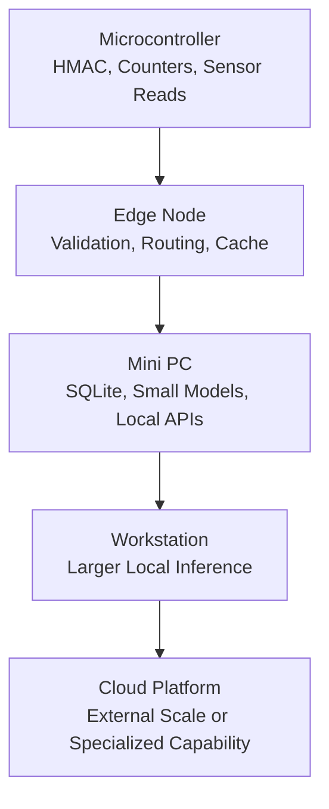

# Silicon Locality



## Definition

Silicon Locality is the architectural principle that computation should execute as close as possible to the owned physical hardware where data is generated, stored, or governed.

Within Sovereign Systems, Silicon Locality extends the Locality Principle from information placement to physical execution placement.

It asks a simple architectural question:

**What is the lowest-cost, locally controlled hardware capable of safely performing this task?**

## Origin

The term **Silicon Locality** was first formalized as part of the Sovereign Systems Specification by Ken W. Alger in 2026.

## Why It Matters

Modern AI systems often assume that useful computation requires remote cloud infrastructure, large GPU clusters, or externally managed model platforms.

That assumption introduces:

* Additional latency
* Higher operating costs
* Expanded trust boundaries
* Increased network dependency
* Reduced data custody
* Greater exposure to third-party infrastructure

Many workloads do not require remote execution.

Tasks such as telemetry signing, request validation, lightweight classification, local retrieval, format conversion, and routing can often run on inexpensive hardware located inside the user's own operational perimeter.

Silicon Locality does not reject cloud computing.

It requires cloud computing to justify crossing the boundary.

## Example

A temperature sensor does not need a cloud API to determine whether a reading is valid.

A Raspberry Pi does not need a frontier model to verify a signed envelope.

A local mini PC does not need a remote orchestration layer to store a SQLite state snapshot.

Each task should execute at the lowest capable layer.

## Relationship to Capability Gradient

Silicon Locality determines where computation should begin.

Capability Gradient describes the ordered set of hardware layers available for escalation.

Together, they prevent systems from overusing expensive infrastructure for tasks that can be safely handled locally.

## The Sovereign Approach

Sovereign Systems apply Silicon Locality by:

* Sealing data at the Point of Genesis
* Validating requests before escalation
* Running bounded workloads on local hardware
* Preserving custody of data and execution policy
* Treating remote execution as an explicit architectural decision
* Matching each workload to the lowest capable compute layer

The goal is not to run everything on the smallest possible device.

The goal is to avoid running simple, local, custody-sensitive workloads on unnecessarily distant infrastructure.

## Related Terms

* Point of Genesis
* Sovereign Envelope
* [Capability Gradient]({{ site.baseurl}}/terms/capability-gradient.html)
* [Escalation Boundary]({{ site.baseurl}}/terms/escalation-boundary.html)
* Edge Node
* Sovereign Node

## References

* Sovereign Systems Specification
* Sovereign Edge
* Architecture & Execution Framework
