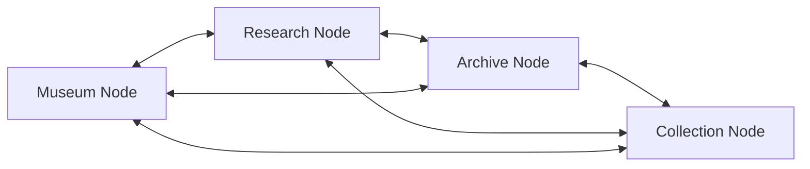
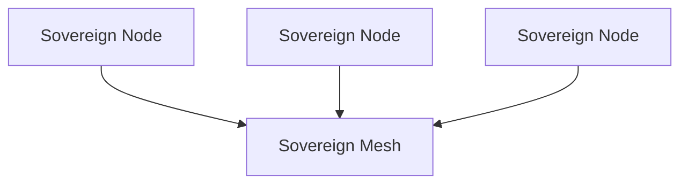

# Sovereign Mesh



## Definition

A Sovereign Mesh is a federation of Sovereign Nodes that share state, verify provenance, and coordinate intelligence while preserving local custody and authority.

Unlike centralized architectures, a Sovereign Mesh does not depend upon a single control plane, database, identity provider, or orchestration service.

Each participating node retains ownership of its own memory, execution policies, cryptographic identity, and operational decisions.

## Origin

The term **Sovereign Mesh** was first formalized as part of the Sovereign Systems Specification by Ken W. Alger in 2026.

## Why It Matters

Many distributed systems achieve coordination by centralizing authority.

While effective, this approach creates:

* Single points of failure
* Platform dependencies
* Expanded trust boundaries
* Vendor lock-in
* Operational fragility

A Sovereign Mesh takes a different approach.

Rather than transferring authority to a central coordinator, participating nodes exchange information while maintaining local sovereignty.

The result is a system that can coordinate without surrendering custody.

## Example

A museum consortium may operate multiple independent collections systems.

Each institution retains custody of its own archives while sharing provenance records, collection metadata, and verification information with trusted peers.

No single institution controls the network.

Each participant remains independently operational while contributing to the broader network.

## Relationship to Sovereign Nodes

A Sovereign Mesh is composed of Sovereign Nodes.

Each node maintains:

* Local memory
* Local policies
* Local identity
* Local execution authority

The mesh provides coordination.

The node provides sovereignty.

The authority of the network derives from its participants rather than a central controller.

## Relationship to Forensic Receipts

Trust within a Sovereign Mesh depends upon verifiable provenance.

Participating nodes exchange information through signed events, append-only records, and verifiable receipts.

This allows trust to be established through evidence rather than assumption.

The receipt becomes the unit of trust exchanged between nodes.

## The Sovereign Approach

Sovereign Systems implement mesh architectures through:

* Independent node operation
* Local memory ownership
* Cryptographic identity
* Verifiable provenance
* Controlled synchronization
* Federated trust relationships

The objective is not centralized control.

The objective is cooperative autonomy.

## Related Terms

* [Sovereign Node]({{ site.baseurl}}/terms/sovereign-mesh.html)
* Edge Node
* [Forensic Receipt]({{ site.baseurl}}/terms/forensic-receipt.html)
* [Memory as Infrastructure]({{ site.baseurl}}/terms/memory-as-infrastructure.html)
* Federated Gateway
* [Escalation Boundary]({{ site.baseurl}}/terms/escalation-boundary.html)

## References

* Sovereign Systems Specification
* Sovereign Edge
* Architecture & Execution Framework
* Memory as Infrastructure
