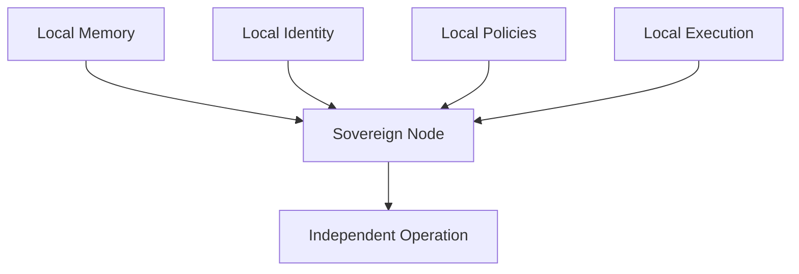
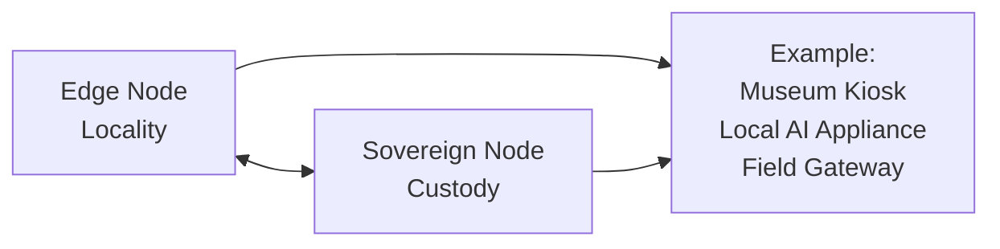
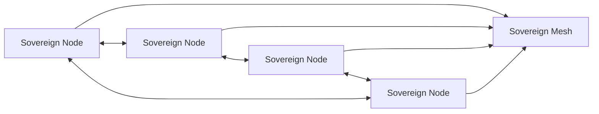

# Sovereign Node

## Definition

A Sovereign Node is an independently operable computational unit that maintains local custody of its memory, cryptographic identity, execution policies, and decision boundaries without requiring continuous dependence on an external control plane.

Within Sovereign Systems, sovereignty is defined by custody rather than location.

A Sovereign Node may participate in larger distributed systems while retaining authority over its local state and operational behavior.

## Origin

The term **Sovereign Node** was first formalized as part of the Sovereign Systems Specification by Ken W. Alger in 2026.

## Why It Matters

Many modern systems depend upon centralized infrastructure for:

* Identity management
* Policy enforcement
* Memory storage
* Configuration management
* Decision making

When those dependencies become unavailable, the system's autonomy disappears.

A Sovereign Node remains operational even when disconnected from upstream services because it retains local ownership of the information and policies required to perform its responsibilities.

This allows systems to continue functioning during outages, network interruptions, platform failures, or intentional isolation.

## Example

A museum kiosk operating entirely from local hardware may continue answering visitor questions even if internet connectivity is unavailable.

The kiosk retains:

* Local collections data
* Local retrieval systems
* Local execution policies
* Local identity
* Local decision authority

Because these resources remain under local control, the kiosk continues operating as a Sovereign Node.

## Relationship to Edge Nodes

Edge Nodes provide locality.

Sovereign Nodes provide custody.

An Edge Node exists near a source of data generation or consumption.

A Sovereign Node maintains authority over its own memory, identity, and execution policies.

A single system may function as both.

## Relationship to Sovereign Mesh

Multiple Sovereign Nodes may cooperate while retaining independent authority.

This allows information sharing without requiring centralized ownership or control.

## The Sovereign Approach

Sovereign Systems implement Sovereign Nodes through:

* Local memory ownership
* Cryptographic identity
* Independent policy enforcement
* Controlled escalation
* Verifiable provenance
* Local-first execution

The objective is not isolation.

The objective is preserving operational custody while enabling collaboration with other systems.

## Related Terms

* Edge Node
* [Silicon Locality]({{ site.baseurl}}/terms/silicon-locality.html)
* [Capability Gradient]({{ site.baseurl}}/terms/capability-gradient.html)
* [Escalation Boundary]({{ site.baseurl}}/terms/escalation-boundary.html)
* Sovereign Mesh
* [Memory as Infrastructure]({{ site.baseurl}}/terms/memory-as-infrastructure.html)

## References

* Sovereign Systems Specification
* Sovereign Edge
* Architecture & Execution Framework
* Memory as Infrastructure
