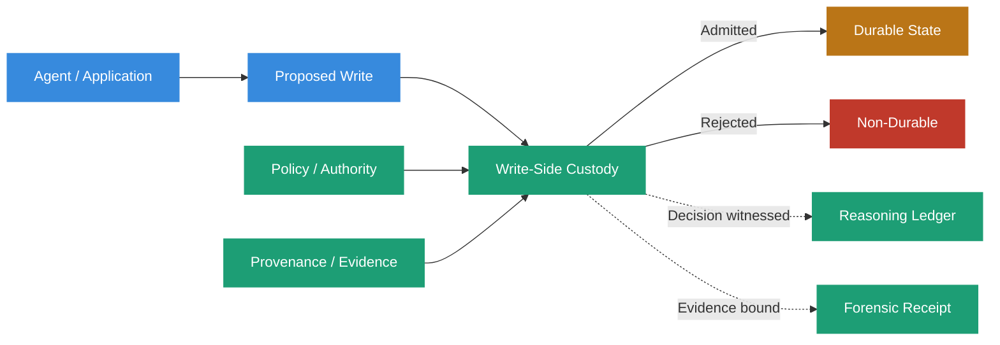
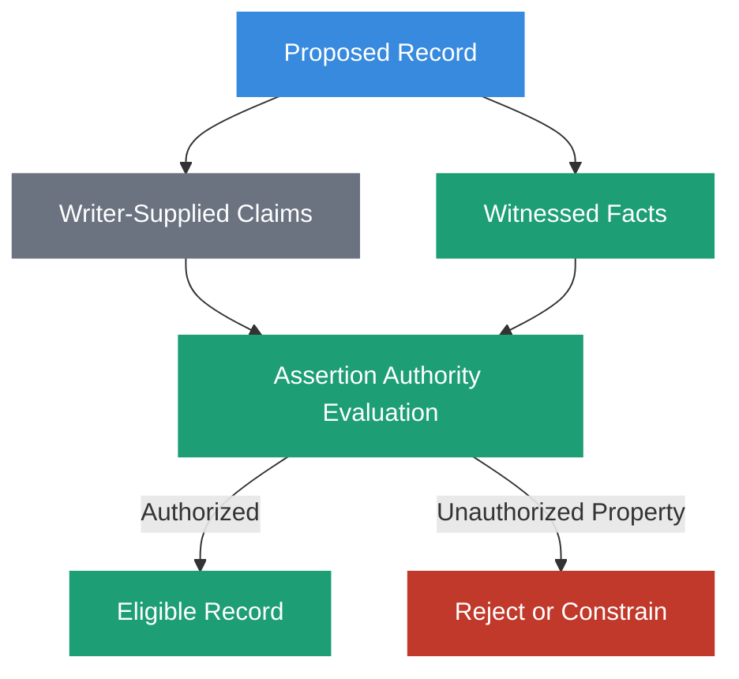
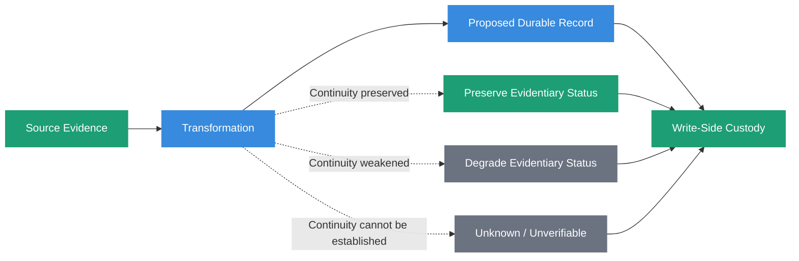
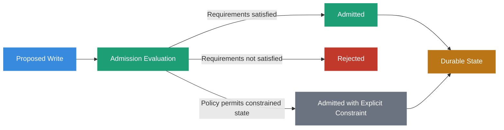
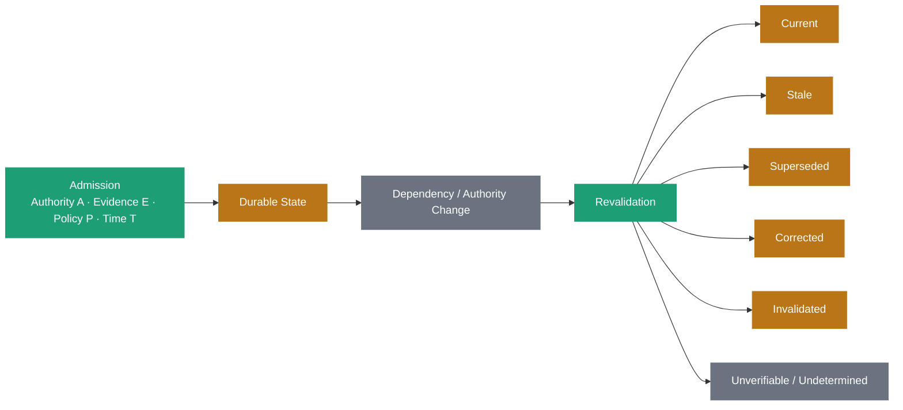

# Write-Side Custody



## Definition

Write-Side Custody is the architectural discipline of governing admission to durable state.

It treats a write as a governed operation rather than merely a storage operation. Before information commits to long-term memory, custody evaluates:

- whether the information may become durable state
- who or what is authorized to assert it
- which properties the writer is entitled to assert
- what provenance and evidence must accompany the write
- which policy and authority govern the admission decision
- what evidence must survive for later verification and revalidation

Structural validation, provenance binding, authority evaluation, metadata enrichment, and integrity mechanisms may all participate in that decision while the source context and evidence are still available.

The governing principle is:

> **Custody governs admission. It does not declare permanent truth.**

## Origin

The term **Write-Side Custody** was first formalized as part of the Sovereign Systems Specification by Ken W. Alger in 2026.

## Why It Matters

Many systems defer governance, provenance, and evidence questions until retrieval.

By then, questionable information may already have become durable state, entered indexes, influenced summaries, propagated into derived records, or lost the context needed to determine who asserted it and under what authority.

Write-Side Custody moves the admission decision to the boundary where the system still has its strongest opportunity to preserve the evidence surrounding the proposed write.

The architecture does not assume that every proposed write can be made trustworthy.

It requires the system to make admission explicit and preserve enough evidence to explain what crossed the boundary, what did not, and why.

## Admission Is Not Truth

Write-Side Custody is not a truth-detection mechanism.

Admissibility, authority, evidence, and truth are distinct questions.

A claim may be factually correct and still be inadmissible because the source lacks authority to establish that claim within the governed system.

For example, a vendor's marketing site may truthfully state that its product is suitable for regulated workloads.

That does not make the vendor authoritative for an organization's internal security policy.

Likewise, a structurally valid and cryptographically signed assertion may still be inadmissible if the signer lacks the authority required by policy.

Admission means:

> _This information was permitted to become durable state under the authority, evidence, and policy available at the time._

It does not mean:

> _This information is permanently true and authoritative._

## Assertion Authority

Write-Side Custody distinguishes between what a writer may report about itself and what it may establish about the surrounding system.

An agent may legitimately report:

- its selected action
- alternatives it considered
- its stated intent
- identified unknowns
- a confidence estimate

Runtime-observable facts should ordinarily be asserted by components capable of witnessing them.

Examples include:

- tool execution
- retrieval events
- timestamps
- approvals
- policy evaluations
- source classifications
- write outcomes

Custody therefore evaluates not only whether a record may be written, but whether the writer is authorized to assert each governed property of that record.

A structurally valid record does not make every field equally authoritative.

> **A schema can validate shape. It cannot grant assertion authority.**

## Structural Validity and Semantic Authority

Structural validation remains important.

A proposed write may need to satisfy schema requirements, field constraints, type rules, encoding rules, or canonicalization requirements before the system can safely process it.

But structural validity answers a narrow question:

> _Does this record conform to the expected representation?_

It does not answer:

> _Is this writer entitled to establish every claim represented by those fields?_

Sovereign Systems keep those responsibilities separate.

A record can be structurally valid and unauthorized.

A record can also be authorized in principle while failing structural validation.

Both conditions may justify rejection, but for different reasons.

## Provenance at Admission

Custody uses [Provenance](provenance.html) to determine what evidence ancestry and verification semantics accompany a proposed write.

Relevant provenance may include:

- source identity
- source artifact version
- content digest
- authority identity
- policy identity and version
- evidence references
- transformation history
- dependencies
- timestamps
- verification method
- revocation or supersession mechanisms

Custody does not need every write to have the strongest possible provenance.

It needs the provenance required by the governing policy for that class of write.

A low-consequence observation may be admissible with a self-reported source.

A high-consequence authority record may require independently retrievable evidence, a trusted authority, cryptographic integrity, or independent witnessing.

The important requirement is that weaker provenance is not silently promoted into stronger provenance merely because the record was admitted.

## Transformation and Evidence Continuity

Information often changes representation before admission.

It may be parsed, normalized, summarized, extracted, converted, enriched, or mapped into a new schema.

Those transformations can preserve evidence continuity, weaken it, or break it.

Custody must not silently promote the epistemic status of transformed information.

A derived claim should preserve the evidence from which it was derived and the method used to produce the derivation where that information is consequential.

Replayability alone does not establish verification.

The system must still be able to establish that the inputs, transformation, representation, and authority correspond to the claim being admitted.

## Admission Policy

Write-Side Custody evaluates admission under an explicit policy.

The policy may govern:

- permitted writers
- assertion authority by field or claim class
- required provenance
- required evidence
- acceptable verification states
- schema requirements
- integrity mechanisms
- classification
- retention requirements
- escalation conditions
- rejection behavior

This allows admission requirements to vary by consequence.

For example, a personal note, observed sensor reading, financial approval, software deployment, and institutional policy may all require different evidence and authority.

The architecture does not require one universal admission rule.

It requires the rule governing a consequential write to be identifiable and auditable.

## Rejection Is a Governed Outcome

A custody boundary must be allowed to reject a write.

Rejection should not be encoded as a successful write with missing fields, a default authority, an empty provenance object, or a later cleanup task.

When the required basis for admission cannot be established, the correct outcome may be non-admission.

Some policies may permit information to become durable with an explicit state such as `unverified`, `unverifiable`, `disputed`, or `historical`.

That is different from silently treating the record as fully authoritative.

> **Unknown is a state. Missing governance is a defect.**

## Admission Authority Is Not Continuing Authority

The authority that permitted a write at time T may not remain valid forever.

After admission:

- policies may be superseded
- credentials may be revoked
- keys may rotate or be compromised
- source artifacts may be corrected
- governing authorities may change
- new evidence may contradict earlier evidence
- records may become stale
- historical claims may cease to govern current decisions

Write-Side Custody therefore preserves the evidence needed for later revalidation.

Admission is therefore a historical governance decision.

It is not a permanent grant of authority.

> **Admission is where a system buys the right to expire something later.**

## Consequential State Must Affect Behavior

Lifecycle and authority states are meaningful only if downstream consumers are required to respect them.

A record marked `superseded` should not remain an unconstrained peer of the record that superseded it.

A record marked `invalidated` should not continue to govern simply because semantic ranking places it first.

A record whose provenance is `unverifiable` should not silently retain the same eligibility as independently verified evidence when policy distinguishes those states.

Consequential state may affect:

- retrieval eligibility
- namespace exposure
- ranking pools
- authority resolution
- context assembly
- routing
- escalation
- required human review

> **A consequential state transition must change the behavior of the next consumer, not merely the metadata available to it.**

A constrained state that ranking is free to ignore is a comment with better formatting.

## Relationship to Provenance

[Provenance](provenance.html) describes evidence ancestry and verification semantics.

Write-Side Custody uses that information to govern admission.

Custody may require provenance fields, bind assertions to sources, preserve verification anchors, record authority dependencies, or reject a write whose required provenance cannot be established.

Admission does not permanently settle the provenance question.

The evidence preserved during custody provides the basis for later revalidation when sources, authority, policies, keys, or dependencies change.

> **Custody establishes governed admission. Provenance preserves what future consumers need to evaluate that admission.**

## Relationship to Forensic Receipts

A [Forensic Receipt](forensic-receipt.html) preserves structured evidence about a consequential event under a defined representation, integrity mechanism, and trust model.

Write-Side Custody makes the admission decision.

The receipt preserves evidence about that decision and the boundary conditions observable at the time.

A receipt may bind:

- the proposed artifact
- source and evidence references
- policy and authority versions
- witness identity
- canonical representation
- content digest
- signing-key identity
- admission outcome

A receipt cannot reconstruct source authority, provenance, or causal context that custody never captured.

Likewise, cryptographic consistency does not retroactively make an inadmissible write authoritative.

The two mechanisms are complementary, but they answer different questions.

## Relationship to the Reasoning Ledger

Write-Side Custody and the [Reasoning Ledger](reasoning-ledger.html) have separate responsibilities.

Write-Side Custody governs whether a proposed write may become durable state.

The Reasoning Ledger preserves observable evidence surrounding consequential decisions and operations, including custody decisions where appropriate.

The ledger does not grant permission to write.

Custody does not replace the historical record of what evidence, policy, authority, and outcome surrounded the decision.

> **Custody enforces. The ledger witnesses.**

## Relationship to Durable Memory

[Durable Memory](durable-memory.html) preserves state after admission.

Custody governs the transition into that state.

This distinction means that durable information need not remain current, authoritative, or eligible to govern forever.

Durable Memory may preserve historical, superseded, corrected, invalidated, disputed, or unverifiable records while downstream governance determines which records are eligible for a present decision.

The write boundary should therefore preserve the dependencies needed to distinguish:

> _This record was legitimately admitted then._

from:

> _This record is entitled to govern now._

## Relationship to Sieve-and-Sign

The [Sieve-and-Sign Pattern](sieve-and-sign-pattern.html) provides mechanisms that may participate in Write-Side Custody.

The **Sieve** can perform structural filtering, normalization, classification, evidence checks, or other admission-oriented transformations.

The **Sign** stage can create integrity evidence for a defined representation under an explicit trust model.

Neither stage independently establishes truth or permanent authority.

Write-Side Custody is the broader governance discipline that determines what those mechanisms mean within the admission decision.

## The Sovereign Approach

Sovereign Systems treat ingestion as a critical control point because it is the last opportunity to govern admission before proposed information becomes durable state.

A conforming design should:

- make admission an explicit governed operation
- distinguish structural validity from assertion authority
- distinguish writer-reported claims from independently witnessed facts
- require provenance appropriate to the consequence of the write
- preserve evidence continuity across consequential transformations
- prevent transformations from silently promoting epistemic status
- identify the policy and authority governing admission
- allow rejection when the required basis cannot be established
- preserve explicit constrained states where policy permits them
- preserve dependencies needed for later revalidation
- distinguish admission authority from continuing authority
- ensure consequential lifecycle states alter downstream behavior
- preserve observable evidence of consequential custody decisions
- avoid treating cryptographic integrity as truth

The objective is not to guarantee that every admitted claim remains correct forever.

The objective is to ensure that durable state enters the system through an explicit governance boundary with enough evidence to understand who asserted it, why it was admitted, what authority and policy applied, and how its status can be reevaluated later.

## Related Terms

- [Provenance](provenance.html)
- [Forensic Receipt](forensic-receipt.html)
- [Reasoning Ledger](reasoning-ledger.html)
- [Durable Memory](durable-memory.html)
- [Sieve-and-Sign Pattern](sieve-and-sign-pattern.html)
- [Ingestion Boundary](ingestion-boundary.html)
- [Context Hydration](context-hydration.html)

## References

- Sovereign Systems Epistemic Model
- Sovereign Systems Specification
- Integrity & Provenance Vector
- Architecture & Execution Framework
